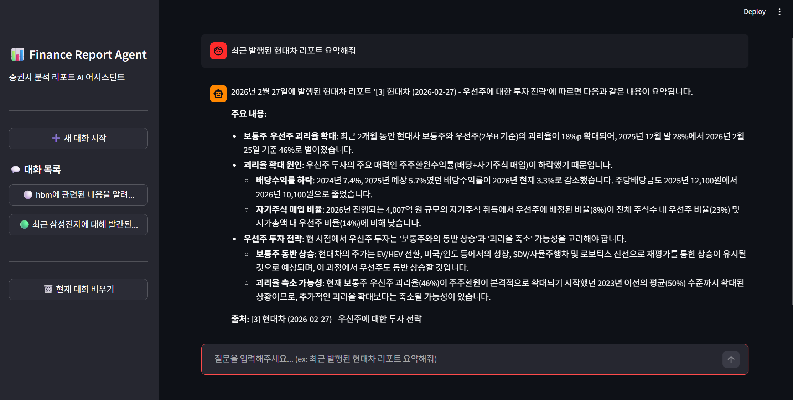
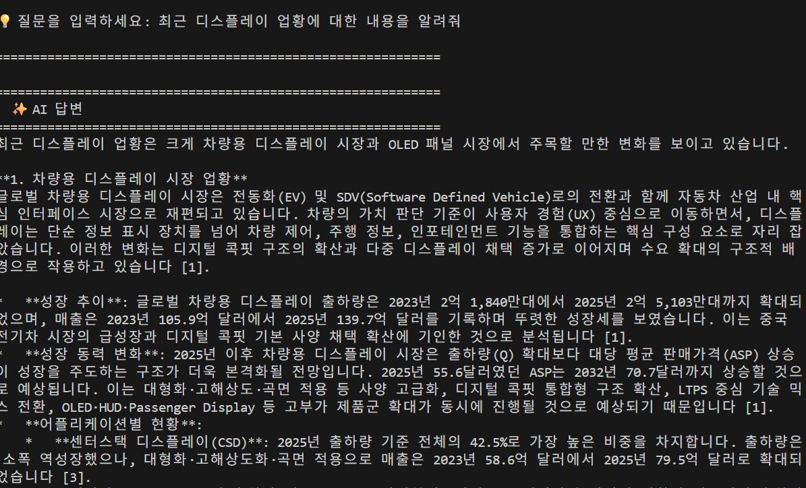

# 📊 Finance Report Agent: 증권사 리포트 분석용 LangChain, LangGraph AI Agent

폴더에 저장된 증권사 종목/산업/경제 분석 리포트(PDF)를 정제하여 FAISS 벡터 DB에 저장하고, 자연어 질의로 금융 데이터를 검색하는 LangChain, LangGraph 기반 AI Agent 입니다.

## 📸 실행 예시 (Screenshots)

|  |  |
|:---:|:---:|
| **GUI 실행 예시 (Streamlit)** | **CLI 실행 예시 (Terminal)** |

## 🎯 프로젝트 목적

매일 발간되는 수 십 개의 증권사 리포트를 일일히 다 모니터링 하기에는 많은 시간이 소요됩니다. 읽고 지나쳤지만 기억이 나지 않거나, 안 읽은 보고서에서도 내가 원하는 중요한 정보가 있을 수 있습니다. **Finance Report Agent**는 이런 부분에서 어려움을 겪고 있는 사용자들에게 도움을 주고자 개발되었습니다.

LangChain, LangGraph를 활용하여 저장된 보고서를 RDB, Vector DB에 데이터화하고, 자연어 질문을 통해 원하는 정보를 정확하게 찾아낼 수 있는 지능형 금융 에이전트 구축을 목적으로 합니다.

## ⚠️ 주의사항 (Disclaimer)

본 프로젝트는 금융 분야의 LLM 활용 및 데이터 파이프라인 학습을 목적으로 작성된 프로젝트입니다. 제공되는 스크립트의 사용으로 인해 발생할 수 있는 모든 이슈에 대한 책임은 사용자 본인에게 있습니다. 특히, 데이터 소스의 이용 약관 및 저작권 정책을 반드시 확인하고 준수하여 사용하시기 바랍니다.

---

## 🗂️ 프로젝트 구조

```
finance_llm/
├── data/                 # 데이터 저장소 (다운로드 리포트, DB, 벡터 인덱스)
│   ├── downloaded/       # 분석 대상 PDF 저장 폴더
│   ├── vector_db/        # FAISS 인덱스 저장 폴더 (자동 생성)
│   └── reports.db        # SQLite DB (자동 생성)
├── src/                  # 메인 비즈니스 로직
│   ├── configs/          # 설정, 필터링 규칙 및 프롬프트
│   ├── core/             # 핵심 파이프라인 (db_manager.py, embed_pipeline.py 등)
│   ├── graphs/           # LangGraph 흐름 조립 및 상태 정의
│   ├── nodes/            # LangGraph의 개별 비즈니스 로직 모듈
│   ├── utils/            # 공통 유틸리티 (text_filters.py, ranker.py 등)
│   └── search.py         # 검색 로직 처리
├── apps/                 # 사용자 인터페이스 엔트리포인트
│   ├── cli/              # 터미널 기반 CLI (app.py)
│   └── gui/              # Streamlit 기반 웹 앱 (app.py)
├── scripts/              # 유틸리티 및 디버깅 스크립트
├── docs/                 # 시스템 설계 철학 및 연동 가이드 문서
├── logs/                 # 애플리케이션 로그
├── tests/                # 테스트 코드
├── requirements.txt      # 필요 패키지 목록
└── .env.example          # 환경 변수 템플릿
```

---

## ⚙️ 환경 설정

> ⚠️ **필수 요구사항:** 본 프로젝트는 최신 타입 힌트(`|` 문법 및 `TypedDict` 등)를 사용하므로 **`Python 3.10 이상`**의 환경이 권장됩니다. 하위 버전에서는 문법 에러가 발생할 수 있습니다.

### 1. 가상환경 생성 및 활성화 (권장)

프로젝트 의존성을 독립적으로 관리하기 위해 파이썬 가상환경(venv)을 사용하는 것을 강력히 권장합니다.

```bash
# 가상환경 생성 (.venv) - Python 3.10 이상 지정
# (Windows의 경우 환경 변수에 등록된 python 버전에 따라 python 또는 py -3.10 등을 사용하세요)
python -m venv .venv 
# 또는 Mac/Linux에서 특정 버전 지정 시: python3.10 -m venv .venv

# 가상환경 활성화 (Windows)
.venv\Scripts\activate

# 가상환경 활성화 (macOS/Linux)
source .venv/bin/activate
```

### 2. 패키지 설치

활성화된 가상환경 내에서 `requirements.txt`에 명시된 필수 패키지들을 설치합니다.

```bash
python -m pip install --upgrade pip
pip install -r requirements.txt
```

### 3. API 키 설정

프로젝트 루트의 `.env.example` 파일을 복사하여 `.env` 파일을 생성하고, 본인의 Gemini API 키를 입력합니다.

> 💡 **상세 연동 가이드:** API 키 발급 및 설정에 대한 구체적인 방법은 [🔑 API 연동 가이드(API_SETUP.md)](docs/API_SETUP.md) 문서를 확인해 주세요.

```bash
cp .env.example .env  # Linux/macOS
copy .env.example .env # Windows (cmd)
```

`.env` 파일 내용:

```env
GEMINI_API_KEY=your_gemini_api_key_here
```


---

## 🚀 사용 방법

### Step 1. 리포트 파일 준비 (⚠️ 파일명 규칙 엄수)

분석하고자 하는 PDF 파일을 `data/downloaded/` 폴더에 넣습니다. 본 파이프라인은 파일명을 기준으로 메타데이터를 파싱하므로 아래 **규칙을 반드시 지켜야 합니다.**

- **파일명 규칙:** `[유형]_[YYYY-MM-DD]_[대상]_[증권사]_[제목].pdf`
- **예시:** `company_2024-02-21_삼성전자_미래에셋증권_HBM 공급 확대 전망.pdf`
- **유형:** `company` (종목), `industry` (산업), `economy` (경제)
- 경제 리포트처럼 특정 대상이 없는 경우 대상 부분에 `null` 등을 기재합니다.

> **Note:** `src/core/report_crawler.py`를 사용하여 네이버 금융에서 자동으로 수집할 수도 있으나 이는 선택 사항(Optional)입니다. 다른 경로로 수집한 파일이라도 위 규칙대로 이름만 지정되어 있으면 정상적으로 처리됩니다.
> 
> 💡 **(현재 설정) 크롤러 수집 설정:**
> `src/core/report_crawler.py` 실행 시 수집되는 데이터는 `src/configs/config.py`의 설정을 따릅니다.
> - **LATEST 모드:** 오늘부터 역순으로 탐색하여 리포트가 발견되는 가장 최근 날짜의 데이터를 자동으로 수집합니다.
> - **SPECIFIC_DATE 모드:** `CRAWLER_TARGET_DATE`에 지정된 날짜의 리포트만 정밀 수집합니다.

---

### Step 2. 임베딩 파이프라인 실행

준비된 PDF들을 텍스트로 변환하고 벡터 DB에 저장합니다.

```bash
python -m src.core.embed_pipeline
```

- 파이프라인은 `data/downloaded/` 폴더를 스캔하여 새로운 파일을 발견하면 DB에 등록하고 처리를 시작합니다.
- 표 영역 제외, 재무 레이블 제거 등 금융 리포트에 특화된 전처리가 자동으로 수행됩니다.

> 💡 **(현재 설정) 임베딩 10건 제한 (테스트 모드) 안내:**
> ডাউন로드된 PDF가 수십 건 이상일 경우 단기간 내 API 허용량(Rate Limit)을 초과할 수 있어, 현재 `src/configs/config.py` 파일 내에 `TEST_LIMIT = 10` (최대 10개만 임베딩)으로 안전 설정이 걸려있습니다.
> **제한 해제 방법:** 토큰을 사용하는데 금전적인 제약이 적다면, `src/configs/config.py`에서 `TEST_LIMIT = 0`으로 변경하면 폴더 내의 **모든 리포트**를 개수 제한 없이 한 번에 임베딩할 수 있습니다.

---

### Step 3. 복합 검색 (RDB + 벡터 DB 대화형 챗봇)

저장된 내용을 바탕으로 자연어 검색 및 AI 답변을 받아볼 수 있습니다. 사용자의 취향에 따라 **웹 브라우저 기반의 모던 UI** 또는 **빠른 터미널 CLI** 환경 중 하나를 선택하여 진행할 수 있습니다. 두 환경 모두 질문의 의도에 따라 LangGraph가 자동으로 탐색 경로(Router)를 나눕니다.

#### 옵션 A: 모던 웹 브라우저 UI (Streamlit 환경 - 권장)
다중 쓰레드 대화 세션을 관리하며, 가장 직관적인 UI(ChatGPT 형태)를 제공합니다.

```bash
# 가상환경이 켜진 상태에서 아래 명령어 실행
python -m streamlit run apps/gui/app.py
```

> **💡 처음 실행 빈 화면 이메일 입력 관련 안내:**
> 코드를 처음 실행하면 터미널이나 브라우저에 "이메일을 입력하라"는 영문 안내(Welcome to Streamlit! If you'd like to receive helpful onboarding emails...)가 뜰 수 있습니다. 
> 이때 당황하지 마시고 **아무것도 입력하지 않은 빈칸(공란) 상태로 그냥 `Enter` 키를 누르시면** 이메일 등록 과정을 건너뛰고 정상적으로 UI 서버가 시작됩니다!

- **다중 쓰레드 (채팅방 관리) 지원:** 왼쪽 사이드바에서 `➕ 새 대화 시작` 버튼을 눌러 독립적인 대화방을 계속 추가할 수 있습니다. 방을 넘나들어도 각자의 대화 맥락(History)이 유지됩니다.

#### 옵션 B: 터미널 CLI 환경
명령어 환경에 익숙하거나 시스템 리소스를 최소화하여 파이프라인을 테스트하고 싶을 때 사용합니다.

```bash
python apps/cli/app.py
```

- 스크립트를 실행하면 터미널에 대화형 프롬프트가 나타납니다.
- 종료하려면 `q` 또는 `quit`를 입력하세요.
- 현재 대화 메모리를 초기화하려면 `c` 또는 `clear`를 입력하세요.

#### 💡 공통 파이프라인 기능 설명
- **⏳ 초기 실행 대기시간:** 애플리케이션 실행 후 LangGraph 상태 객체 컴파일 및 메모리 로딩 과정으로 인해 **약 10~20초 정도의 최초 대기 시간**이 발생할 수 있습니다.
- **메타데이터 질문 (RDB 처리):** *"저장된 산업 리포트는 모두 몇 개야?"*, *"미래에셋증권에서 나온 가장 최근 리포트는 언제 발간됐어?"* 와 같은 질문은 벡터 DB를 거치지 않고 직접 SQLite DB에 SQL 변환하여 빠르게 답변합니다. 모든 문서를 벡터 검색하고 LLM에 컨텍스트로 집어넣는 방식에 비해 토큰 사용량을 획기적으로 줄여 비용과 속도 측면에서 훨씬 효율적입니다.
- **문서 본문 질문 (Vector DB 처리):** *"삼성전자의 반도체 실적 전망 알려줘"* 와 같은 질문은 FAISS 벡터 DB를 검색하고 FlashRank를 통해 문서를 재평가(Reranking) 한 뒤, 참조 문서 출처 목록을 결과에 깔끔하게 첨부합니다.
- **실시간 주가 조회 (Tool Calling):** RDB 또는 Vector DB 처리 중 LLM이 현재 주가 데이터가 필요하다고 판단하면, `get_stock_price` tool을 **자율적으로 호출(Tool Calling)**하여 KRX 상장 종목의 최근 주가를 실시간으로 조회합니다. 라우터가 별도로 판단하지 않아도 되므로 "리포트 분석 + 현재 주가" 복합 질의를 자연스럽게 처리합니다.
- **이중 보안 가드레일 (Guardrail):** 데코레이터(`@sql_guardrail`)와 `sqlglot` 라이브러리를 통해 LLM이 생성한 위험한 SQL 명령어를 추상 구문 트리(AST) 레벨에서 사전 차단하고, DB 연결을 읽기 전용(`?mode=ro`)으로 강제하는 다중 보안을 적용하며, Pydantic Validator로 라우팅 응답 포맷을 검증합니다.

> **💡 Reranking (문서 재평가) 기능 활성화 방법**
> 기본적으로 빠른 응답 속도를 위해 Reranker 모델이 비활성화 되어 있습니다. 더 정확하고 문맥에 맞는 문서를 찾고 싶다면 `src/configs/config.py` 파일 상단의 `USE_RERANKER = False` 를 `True` 로 변경하세요. (최초 1회 실행 시 모델 다운로드로 인해 1~2분 정도 소요될 수 있습니다.)

---

## 🛡️ 백엔드 성능 및 보안 최적화 (Advanced Engineering)

본 프로젝트는 단순한 데모를 넘어 **실제 프로덕션 환경의 안정성**을 고려하여 설계되었습니다.

1. **이중 SQL 인젝션 방어 (AST 파싱 & Read-Only DB 커넥션)**
   - 가장 근본적인 방어를 위해 LLM이 RDB를 조회할 때 사용하는 SQLite 연결 정보를 읽기 전용(`?mode=ro`)으로 강제하여 물리적인 데이터 변조(UPDATE, DELETE, DROP 등)를 원천 차단합니다.
   - 이에 더해, `sqlglot` 모듈을 통한 애플리케이션 계층의 가드레일을 적용해 LLM이 작성한 쿼리를 **추상 구문 트리(AST)로 완벽 파싱**하여 검증합니다. 허락되지 않은 내부 테이블(`sqlite_master` 등) 접근을 차단하고 오직 `SELECT` 명령만 통과시키므로 난독화(Obfuscation)된 악의적 SQL 공격도 사전에 막아냅니다.
2. **배치(Batch) 처리를 통한 디스크 I/O 병목 제거**
   - 수백 개의 리포트를 DB에 동기화할 때 반복되는 `sqlite3.connect()` 열고 닫기로 인한 병목을 해소했습니다. (`src/core/db_manager.py`)
   - 파일을 순회하며 메모리(List)에서 메타데이터만 미리 파싱한 후, **단일 트랜잭션의 `.executemany()`**를 활용해 DB 쓰기(Write) 작업을 한 번에 처리합니다.
3. **중앙 집중형 로깅 시스템 (Centralized Logging)**
   - 단순한 `print()` 출력을 배제하고, `src/configs/config.py`에 파이썬 내장 `logging` 모듈을 전역으로 설정했습니다.
   - 터미널(Stream) 진행 상황과 함께, 모든 동작과 구체적인 에러 이력이 `logs/finance_llm.log` 파일에 영구 기록되어 백그라운드 서버 모드로 구동할 때의 관찰성(Observability)을 확보했습니다.

---

## 🔧 DB 초기화 방법

새로운 규칙을 적용하거나 DB를 처음부터 다시 구성하고 싶을 때 사용합니다.

```bash
# 1. FAISS 인덱스 삭제 (PowerShell 기준)
Remove-Item -Recurse -Force data/vector_db

# 2. SQLite 임베딩 상태 초기화
python -c "import sqlite3; con=sqlite3.connect('data/reports.db'); con.execute('UPDATE reports SET is_embedded=0'); con.commit(); print('완료')"
```

---

## 🧹 텍스트 정제 규칙 (Pre-processing)

증권사 리포트의 노이즈를 제거하기 위해 아래와 같은 규칙 기반 필터가 적용됩니다.

- **BBox 기반 표 제거:** PyMuPDF의 표 감지 기능을 사용해 표 영역과 겹치는 텍스트 블록 물리적 배제
- **재무 레이블 제거:** 손익계산서/재무상태표의 행 레이블(예: 지분법이익, 매출채권 등) 감지 및 제거
- **준법고지 제거:** 리포트 하단의 면책 조항 및 애널리스트 준법 확인 문구 섹션 절단
- **기타 노이즈:** 도표 캡션, 주석, 숫자 위주의 데이터 행 등 제거

---

## 📝 TODO

현재의 단방향 검색 구조(FAISS → LLM)를 넘어, LangChain 생태계의 장점을 살린 고도화 로드맵입니다.

- [x] **LangGraph 기반 질문 라우팅:** 사용자의 질의 의도에 따라 RDB(메타데이터)와 Vector DB(문서 본문)를 동적으로 분기(Router)하는 구조 구현 (토큰 효율성 최적화)
- [x] **대화형 챗봇 메모리 (History):** LangGraph 내장 `MemorySaver` 및 `Query Rewrite` 노드를 활용해 이전 질의응답 맥락 유지
- [x] **대화 메모리 초기화 기능 (CLI):** 특정 키워드(예: 'c' 또는 'clear') 입력 시 `thread_id`를 갱신하여 현재까지의 메모리를 초기화하고 새로운 세션 시작
- [x] **다중 대화 쓰레드(세션) 관리 기능:** 여러 개의 독립적인 대화 쓰레드(세션)를 동시에 유지 및 저장하고, 과거의 대화 세션을 불러오거나 관리할 수 있는 히스토리 기능 확장 도입(**GUI 한정**)
- [x] **GUI 환경 지원:** 현재의 CLI(터미널) 방식을 넘어, 나중에는 Streamlit 등을 활용해 누구나 쉽게 접근할 수 있는 사용자 인터페이스(UI) 개발
- [x] **Agent 및 툴 콜링 (Tool Calling):** AI가 스스로 판단하여 리포트 외의 최신·정량적 데이터를 수집하는 외부 API 호출 도입
  - [x] **실시간 주가 조회 Tool 통합:** `FinanceDataReader` 기반 `get_stock_price` 함수를 `@tool`로 등록하고 LangGraph `ToolNode`에 연결. `rdb_execute_node`와 `vectordb_node`의 LLM에 `bind_tools`로 바인딩하여 **LLM이 주가 조회가 필요하다고 판단하면 어느 경로에서든 자동으로 tool을 호출**하도록 구현 완료
- [ ] **프롬프트 엔지니어링 개선 (Prompt Engineering):**
  서비스 사용 과정에서 관찰된 오류 중 상당수가 LLM의 프롬프트 해석 방식에서 기인합니다. 아래 항목들을 중심으로 프롬프트를 체계적으로 점검하고 개선할 예정입니다.
  - **라우터 오분류 개선:** 질의 의도가 모호하거나 복합적인 경우(예: "가장 최근 리포트 개수와 거기서 언급된 목표 주가") `router_node`가 `rdb`와 `vectordb` 중 의도와 다른 경로로 라우팅하는 케이스 분석 및 Few-shot 예시 보강
  - **SQL 생성 품질 개선:** `RDB_SQL_GEN_PROMPT`에서 LLM이 존재하지 않는 컬럼을 포함한 쿼리를 생성하는 오류 방지를 위해 스키마 설명 방식과 예시 쿼리를 강화
  - **종목명 추출 정확도 향상:** `get_stock_price` tool 호출 시 약칭·영문 표기(예: "현대차" → "현대자동차") 처리 실패 케이스 식별 및 tool description 또는 system 프롬프트 내 정규화 지침 추가
- [ ] **데이터 수집·적재 자동화 파이프라인 (Automated Ingestion Pipeline):**
  현재 리포트 다운로드(`report_crawler.py`)와 벡터 임베딩(`embed_pipeline.py`)은 수작업으로 실행해야 하는 구조입니다. 이를 **매일 새벽 자동으로 실행**되도록 스케줄링하여, 항상 최신 리포트가 DB에 반영되는 상태를 유지합니다.
  - **크론잡 스케줄링 — `Python 패키지 활용 (schedule 또는 APScheduler 등)`:**
    - 별도의 무거운 프레임워크 도입 없이, 가벼운 파이썬 스케줄링 라이브러리를 사용해 매일 정해진 시간(예: 평일 새벽 3시)에 백그라운드에서 동작하도록 구성합니다.
    - 크롤링 → DB 적재 → 임베딩의 3단계 처리 로직을 하나로 묶어 순차적으로 실행하고, 에러 발생 시 재시도 및 로깅이 이루어지도록 파이프라인을 구축합니다.
---