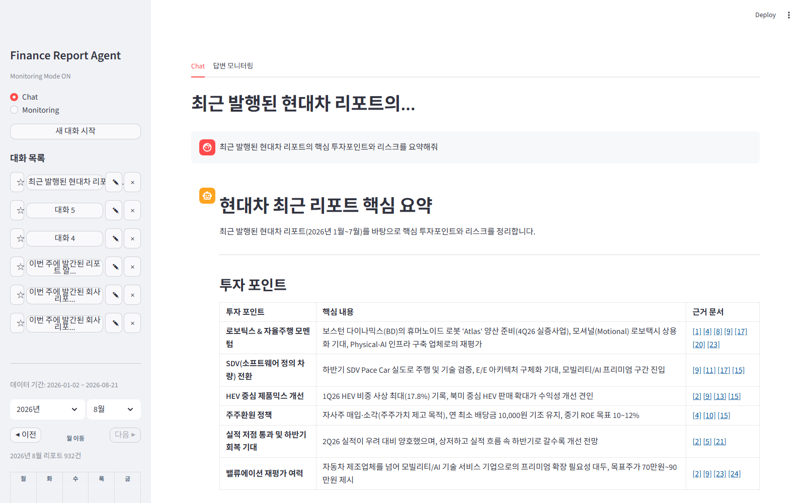

# Finance Report Agent

> Version: `0.6.1.1`

Finance Report Agent는 여러 증권사의 기업·산업·경제 리포트를 한곳에 모아 자연어로 검색하고 분석하는 로컬 리서치 도구입니다. 원하는 기간과 기업, 산업, 증권사를 말로 지정하면 관련 리포트의 목록과 통계, 핵심 내용을 대화형 답변으로 확인할 수 있습니다.

> 이 프로젝트는 투자 조언이나 매수/매도 추천을 제공하지 않습니다. 답변은 수집·색인된 리포트와 공개 데이터 기반의 참고 정보로만 사용하세요.

---

## 화면 예시

### Chat




## Quick Start: 간편하게 실행하기

Windows에서 처음 실행할 때는 `RUN_QUICKSTART.bat`을 더블클릭하면 설치, OpenRouter API 키 설정, 실행일 포함 이전 7일 범위(총 최대 8일)의 리포트 수집, 임베딩 생성, 웹 화면 실행까지 자동으로 진행됩니다.

1. [OpenRouter API 키 발급 방법](docs/OPENROUTER_API_KEY.md)을 따라 API 키와 크레딧을 준비합니다.
2. 프로젝트 폴더에서 `RUN_QUICKSTART.bat`을 더블클릭합니다.
3. 처음 실행 시 API 키를 붙여넣고 Enter를 누릅니다.
4. 브라우저가 열리면 바로 질문을 입력합니다.

초기 준비가 끝난 뒤 앱만 다시 열 때는 `RUN_APP.bat`을 사용하세요. 이 파일은 `.venv`와 `.env`를 확인하고 retrieval runtime의 catalog와 active snapshot을 검증한 뒤 Streamlit GUI를 실행합니다. 패키지 설치·리포트 수집·임베딩은 반복하지 않습니다.

Quick Start는 매번 실행하는 날짜를 기준으로 실행일과 그 이전 7일(총 최대 8일)의 리포트를 준비합니다. 자세한 실행 방법과 `RUN_APP.bat` 사용 구분은 [docs/QUICK_START.md](docs/QUICK_START.md)를 참고하세요.

일부 PDF가 PyMuPDF와 OpenDataLoader에서 모두 파싱되지 않아도 실패 파일만 V2 manifest에 제외 상태로 기록하고, 나머지 문서의 파싱·임베딩·snapshot 게시와 앱 실행은 계속합니다. OpenDataLoader가 한 PDF에서 5분 안에 반환하지 않는 경우도 추출 실패로 기록해 전체 작업이 무기한 멈추지 않게 합니다. 기록된 문서는 Monitoring Mode의 `운영 모니터링 → 검색 자료 준비 → DB에는 있지만 임베딩되지 않은 문서`에서 `모든 파싱 실패/미임베딩 문서 다시 처리`를 눌러 명시적으로 다시 시도할 수 있습니다.

## 주요 기능

현재 앱에 수집되어 검색 가능한 리포트를 바탕으로 다음과 같은 질문에 답할 수 있습니다.

| 하고 싶은 일 | 질문 예시 | 얻을 수 있는 답 |
| --- | --- | --- |
| 기간·종류별 리포트 찾기 | “지난주에 발간된 기업, 산업, 경제 리포트를 각각 알려줘.” | 기간과 카테고리별 리포트 목록, 발간 건수, 증권사와 대상 기업 |
| 특정 기업 분석하기 | “삼성전자 최근 리포트에서 실적 전망과 목표주가의 근거를 정리해줘.” | 여러 리포트에 나온 실적 전망, 주요 근거, 성장 요인과 위험 요인 |
| 산업·경제 흐름 파악하기 | “최근 반도체 산업 리포트의 공통 전망과 핵심 리스크는 무엇이야?” | 여러 증권사의 공통 관점, 주요 이슈, 전망이 갈리는 지점 |
| 리포트 비교하기 | “SK하이닉스에 대한 증권사별 전망 차이를 비교해줘.” | 리포트별 핵심 주장과 근거, 공통점과 차이점 |
| 발간 현황 집계하기 | “7월에 하나증권이 발간한 기업 리포트는 몇 건이야?” | 날짜·월·분기·연도, 리포트 종류, 기업, 증권사별 건수와 목록 |
| 섹터 관련 기업 찾기 | “반도체 섹터에 속한 기업 중 최근 리포트가 있는 회사를 알려줘.” | 해당 업종의 국내 상장기업과 현재 검색 가능한 관련 리포트 |
| 답변을 이어서 탐색하기 | “그중 산업 리포트만 자세히 설명해줘.” | 직전 답변의 기간과 범위를 이어받은 후속 분석 |
| 최근 주가와 함께 보기 | “삼성전자 리포트 내용과 최근 주가를 함께 알려줘.” | 리포트 분석과 필요한 경우 국내 상장사의 최근 주가 정보 |

### 사용자가 얻는 이점

- 여러 PDF를 하나씩 열지 않고도 필요한 리포트를 빠르게 찾고 핵심 내용을 한 번에 파악할 수 있습니다.
- 자연어로 기간, 기업, 산업, 리포트 종류, 증권사를 지정할 수 있어 복잡한 검색식을 만들 필요가 없습니다.
- 단순 목록과 건수는 구조화된 데이터로 확인하고, 전망과 근거처럼 본문을 읽어야 하는 질문은 리포트 내용을 바탕으로 분석할 수 있습니다.
- “그중 기업 리포트만”, “위 내용의 위험 요인을 더 자세히”처럼 후속 질문을 이어가며 탐색 범위를 좁힐 수 있습니다.
- 답변에 연결된 참고 문서에서 근거가 된 리포트를 확인하고 원본 PDF를 직접 열 수 있습니다.
- 대화 기록을 저장하고 답변 생성이나 데이터 업데이트를 백그라운드에서 진행해 다른 대화로 이동해도 작업을 이어갈 수 있습니다.

질문의 답변 범위는 현재 앱에 수집되고 색인된 리포트에 따라 달라집니다. 구현 구조와 검색 파이프라인은 [Architecture](docs/ARCHITECTURE.md), 모델과 검색 설정은 [API 설정 가이드](docs/API_SETUP.md), 운영 진단은 [Monitoring](docs/MONITORING.md), 기능 변경 내역은 [Changelog](docs/project/CHANGELOG.md)를 참고하세요.

## 기존 데이터 마이그레이션과 재구축

### 기존 V1 사용자는 먼저 마이그레이션하세요

V1의 `reports.db`와 `vector_db`를 사용 중인 기존 사용자는 업데이트된 앱을 실행하기 전에 프로젝트 루트의 `MIGRATE_V2.bat`을 실행하세요. 이 작업은 기존 청크와 FAISS 벡터를 그대로 재사용하므로 전체 PDF 재처리나 전체 재임베딩 비용이 발생하지 않습니다. 전환이 정상 완료되면 V1 `reports.db`와 `vector_db`는 삭제되며, 이후 업데이트와 재구축에 필요한 `downloaded` PDF는 유지됩니다. 이 일회성 마이그레이션은 PDF가 `DATA_ROOT/downloaded`에 있는 표준 V1 배치만 지원하며 `SAVE_DIR` override는 적용하지 않습니다. 자세한 내용은 [V1 → Native V2 사용자 마이그레이션](docs/migrations/v2/V2_MIGRATION_USER.md)을 참고하세요.

### `tools\recovery\REBUILD_V2.bat`은 언제 필요한가

> **대부분의 사용자는 `tools\recovery\REBUILD_V2.bat`을 실행할 필요가 없습니다.** 활성 Native V2 snapshot을 현재 추출·임베딩 설정으로 전체 재구축해야 할 때만 사용하세요.

| 하려는 작업 | 실행할 항목 |
| --- | --- |
| 처음 설치 | `RUN_QUICKSTART.bat` |
| 기존 V1 데이터를 그대로 전환 | 앱을 모두 닫고 `MIGRATE_V2.bat` |
| 리포트 추가·변경 | 앱의 일반 데이터 업데이트 — 재구축 불필요 |
| 파싱 실패·미임베딩 문서 재처리 | Monitoring Mode의 `운영 모니터링 → 검색 자료 준비 → DB에는 있지만 임베딩되지 않은 문서 → 모든 파싱 실패/미임베딩 문서 다시 처리` |
| 추출 정책을 바꿔 전체 재구축 | 먼저 `tools\recovery\REBUILD_V2.bat --check` |
| 모델·chunk 설정만 바꿔 전체 재구축 | `tools\recovery\REBUILD_V2.bat --force` |

현재 `--check`가 비교하는 범위는 primary/fallback PDF 추출 정책입니다. 추출 정책이 다르면 `tools\recovery\REBUILD_V2.bat`을 실행하세요. embedding model이나 parent/child chunk 설정만 바뀐 경우에는 추출 정책이 같아 `--check`가 `matches`를 표시할 수 있으므로 `tools\recovery\REBUILD_V2.bat --force`가 필요합니다. 두 명령 모두 전체 PDF를 다시 처리하므로 시간과 API 비용이 발생합니다. 자세한 내용은 [Native V2 전체 재구축](docs/migrations/v2/V2_REBUILD.md)을 참고하세요.

## 설치

```powershell
git clone <repository-url>
cd financial-report-agent
python -m venv .venv
.\.venv\Scripts\Activate.ps1
python -m pip install -r requirements.txt
```

Python 3.10 이상이 필요합니다. Quick Start는 3.10 미만에서 실행을 중단합니다.

## 환경 변수 설정

일반 실행에 사용하는 공개 설정의 기본값, 타입, 설명은 `src/configs/settings.py`에서 관리합니다. `.env.example`은 이 파일에서 자동 생성되는 템플릿이고, `.env`는 실제 실행값만 저장합니다. Native V2의 overlap은 별도 환경 변수 없이 parent·child·single chunk 크기의 10%로 계산됩니다. 따라서 chunk 크기를 바꾸면 overlap도 같은 비율로 바뀌며, 기존 `.env`에 남아 있는 `CHUNK_OVERLAP` 값은 읽지 않습니다.

`.env.example`의 **Optional path overrides** 섹션은 모두 선택 사항입니다. 표준 `data/` 구조를 사용하면 비워 두거나 실제 `.env`에서 생략해도 됩니다.

수동으로 환경을 준비할 때는 루트의 `.env.example`을 `.env`로 복사한 뒤 `OPENROUTER_API_KEY`를 채웁니다.

```powershell
Copy-Item .env.example .env
```

Quick Start와 배포용 `.env.example`의 주요 값은 다음과 같습니다.

```env
GENERATION_MODEL=deepseek/deepseek-v4-flash
EMBEDDING_MODEL=baai/bge-m3
USE_RERANKER=false
RERANK_PROVIDER=openrouter
RERANK_MODEL=cohere/rerank-v3.5
SEARCH_TOP_K=20
RECENCY_WEIGHT=0.15
VECTOR_RETRIEVAL_CONCURRENCY=5
PDF_EXTRACTION_ENGINE=pymupdf
PDF_EXTRACTION_FALLBACK_ENGINE=opendataloader
UNEMBEDDED_PDF_EXTRACTION_ENGINE=pymupdf
```

2~5개 기업의 VectorDB 본문 비교는 LangGraph `Send` fan-out을 사용합니다.
실제 동시성은 `min(질문의 기업 수, VECTOR_RETRIEVAL_CONCURRENCY)`로 정해지며,
기본값 5에서는 최대 5개 기업을 동시에 검색합니다. 5개를 초과하면 검색이나 주가
도구를 실행하지 않고 비교 범위를 줄여 달라고 안내합니다. 단일 기업과 비교 의도가
아닌 질문은 일반 VectorDB 경로를 사용합니다. 순차 실행은 운영 설정이 아니라 Send
결과와의 동등성을 검증하는 내부 회귀 테스트에서만 사용합니다.

현재 `langgraph==1.0.9`에서는 로컬 프로세스 내부 `MemorySaver`만 사용합니다.
checkpoint 입력과 실행 프로세스는 신뢰된 로컬 경계여야 하며, 영속 또는 외부 입력을
역직렬화하는 checkpointer를 도입해서는 안 됩니다. 그런 저장소를 도입하기 전에는
반드시 `langgraph>=1.0.10`으로 올리고 전체 graph/checkpoint 회귀 테스트를 다시
통과시켜야 합니다.

배포 템플릿은 일반 문서와 미임베딩 문서를 먼저 `pymupdf`로 추출하고, PyMuPDF가 실패한 문서만 `opendataloader`로 한 번 재시도합니다. fallback 실행에는 Java 11+와 `java` 명령의 `PATH` 등록이 필요하며 Quick Start는 Java를 자동 설치하지 않습니다. 이 새 키가 없는 기존 `.env`와 빈 값은 fallback을 비활성화하므로, 사용하려면 `PDF_EXTRACTION_FALLBACK_ENGINE=opendataloader`를 명시하세요.

과거 로컬 측정에서는 약 2,000건의 리포트를 임베딩하는 데 약 **$0.05**가 들었습니다. 이 수치는 재현 가능한 비용 보장이 아니며 문서 길이, 청크 수, 호출량, 모델 가격에 따라 달라집니다.

`.env.example`을 다시 생성해야 할 때는 아래 명령을 실행합니다.

```bash
python -m src.configs.generate_env_example
```

자세한 설정은 [`docs/API_SETUP.md`](docs/API_SETUP.md)를 참고하세요.

## PDF 파일명 규칙

다운로드된 PDF는 기본적으로 `data/downloaded/` 아래에 저장됩니다. 파일명은 DB 메타데이터 파싱에 사용하므로 아래 규칙을 따릅니다.

```text
[카테고리]_[YYYY-MM-DD]_[대상]_[증권사]_[제목].pdf
```

예시:

```text
company_2026-05-29_NAVER_미래에셋증권_기업 분석.pdf
industry_2026-05-20_반도체_신한투자증권_HBM 전망.pdf
economy_2026-05-15_null_한국투자증권_금리 전망.pdf
```

## 리포트 다운로드

```bash
python -m src.core.report_crawler
```

주요 옵션은 `src/configs/settings.py`와 `.env.example`에서 확인합니다. 기본 Quick Start 정책은 실행일을 기준일로 자동 설정하고, 실행일과 그 이전 7일(총 최대 8일) 범위의 리포트를 수집하는 것입니다.

```env
CRAWLER_MODE=LATEST
CRAWLER_CATEGORIES=company
CRAWLER_TARGET_DATE=
CRAWLER_TARGET_COUNT=0
CRAWLER_LOOKBACK_DAYS=7
CRAWLER_MAX_LOOKBACK_DAYS=7
```

- `CRAWLER_MODE=LATEST`: 실행 시점의 KST 기준일을 사용합니다.
- `CRAWLER_MODE=SPECIFIC_DATE`: `CRAWLER_TARGET_DATE`에 지정한 날짜를 사용합니다.
- `CRAWLER_CATEGORIES`: `company`, `industry`, `economy`, 쉼표 구분 목록, 또는 `all`을 사용할 수 있습니다.
- `CRAWLER_LOOKBACK_DAYS=7`: 기준일 포함 최대 8일 범위를 조회합니다.
- `CRAWLER_TARGET_COUNT=0`: 개수 제한 없이 가능한 리포트를 수집합니다.

## 상장기업 업종 데이터

섹터나 분야에 속한 기업을 묻는 질문은 레포에 포함된 KRX 상장법인 업종 CSV를 회사 universe lookup에 사용합니다. 원본 데이터는 KRX 상장법인목록 페이지에서 내려받은 Excel을 `company_name,industry,main_products` CSV로 변환한 것입니다.

- 출처: https://kind.krx.co.kr/corpgeneral/corpList.do?method=loadInitPage
- 기본 데이터 파일: `data/listed_company_industries.csv`
- 명시 설정: `.env`의 `COMPANY_INDUSTRY_DATA_PATH`에 CSV 경로를 지정합니다.

이 데이터는 리포트 본문 검색용 VectorDB가 아니라 `회사명/업종/주요제품` 구조화 lookup에 사용합니다. 예를 들어 “반도체 섹터에 속한 기업”은 먼저 업종 CSV에서 관련 회사를 찾고, 현재 날짜/report_type scope의 `reports` DB와 교집합을 낸 뒤 해당 `file_name` 범위로 VectorDB 검색을 좁힙니다.

## 임베딩 인덱스 생성

```bash
python -m src.core.embed_pipeline
```

파이프라인은 전체 PDF 목록의 변경 여부를 검사하며, 새 문서와 변경된 문서만 파싱·임베딩합니다. 성공한 문서는 작은 불변 업데이트 단위로 즉시 검색에 반영되므로 전체 작업 중에도 기존 검색을 계속 사용할 수 있습니다. 모든 문서 처리가 끝나면 기존 청크와 벡터까지 재사용해 완전한 snapshot을 한 번만 게시합니다. primary와 fallback이 모두 실패한 변경 문서는 이전 검색 가능 버전을 유지한 채 실패 상태로 기록하고 나머지를 계속 처리합니다. 같은 바이트의 기존 실패는 일반 업데이트에서 반복 파싱하지 않습니다. Monitoring Mode의 `모든 파싱 실패/미임베딩 문서 다시 처리` 버튼이나 `python -m src.core.embed_pipeline --retry-extraction-failures`를 명시적으로 실행할 때만 다시 처리합니다. 새 변경도 정리할 중간 상태도 없으면 publication을 만들지 않습니다. 자세한 동작과 복구 경계는 [`docs/CONTINUOUS_UPDATES.md`](docs/CONTINUOUS_UPDATES.md)를 참고하세요.

V2 활성 상태에서는 `DATA_ROOT/retrieval/v2`를 수동으로 삭제하거나 수정하지 마세요. V2 updater는 활성 embedding profile과 현재 모델·추출기·chunk 설정이 다르면 새 snapshot을 게시하기 전에 중단합니다. 추출 정책 변경은 `tools\recovery\REBUILD_V2.bat --check`로 확인한 뒤 `tools\recovery\REBUILD_V2.bat`을 실행하고, 추출 정책은 같지만 모델·chunk 설정이 달라진 경우에는 `tools\recovery\REBUILD_V2.bat --force`로 검증된 full-corpus successor를 만드세요.

PDF 추출 엔진 비교는 [`docs/PDF_EXTRACTION_COMPARISON.md`](docs/PDF_EXTRACTION_COMPARISON.md)를 참고하세요.

## 실행

### Streamlit GUI

권장 실행 방식입니다.

```bash
streamlit run apps/gui/app.py
```

### CLI (deprecated)

CLI 모드는 유지보수 전용입니다. 신규 기능 개발은 중단하며, 일반 사용은 Quick Start 또는 Streamlit GUI를 권장합니다. 기존 자동화 호환성을 위해 `--status` 등 최소 동작만 유지합니다.

```bash
python apps/cli/app.py --status
```


GUI 대화 이력은 `data/conversations.db`에 저장됩니다. deprecated CLI도 기존 호환성을 위해 같은 저장소를 사용합니다. Streamlit 사이드바의 대화 목록에서 각 대화 오른쪽의 연필 버튼으로 이름을 변경하고 `×` 버튼으로 삭제할 수 있습니다. 삭제 후에는 다음 대화가 자동 선택되고, 삭제 UI가 화면에 남지 않도록 즉시 rerun합니다. 이 파일은 로컬 상태 파일이며 일반적으로 Git에 포함하지 않습니다.

GUI 답변 생성은 백그라운드 thread에서 실행됩니다. 답변 생성 중인 대화는 입력창이 잠기고, 다른 대화로 이동해도 작업은 계속되며 완료/실패 상태가 toast와 대화 목록 배지로 표시됩니다.

채팅 입력창 아래의 `신고` 버튼은 별도 `.txt`/`.json` 신고 파일을 만들지 않습니다. 사용자가 각각 명시적으로 동의한 설명·선택 질문·응답과 제한된 진단값만 메모리에서 민감정보/로컬 경로 redaction한 뒤 Supabase 수신함으로 비동기 전송합니다. 원격 내용 동의는 모두 기본 해제이며 실제 redaction 결과를 제출 전에 미리 볼 수 있습니다. 다중 turn 재현이 필요하면 별도 동의로 최대 8개 turn의 질문과 라우팅·검색 필터·문서 범위를 포함할 수 있지만, 이전 답변 본문은 포함하지 않습니다. durable outbox 기록이 확인된 뒤에만 `신고가 접수되었습니다.`를 표시하며, 이후 HTTP POST·재시도·최종 전송 실패 상태는 백그라운드에서 처리합니다. 최초 전송 실패 후 최대 3회만 재시도하며, 전달 성공·영구 거절·재시도 소진·7일 만료 시 해당 outbox 행과 payload를 즉시 삭제합니다. 기본 배포의 공개 Supabase URL과 publishable key가 내장되어 있으며, `ISSUE_REPORT_REMOTE_ENABLED=false`로 설정하면 로컬 파일로 대체 저장하지 않고 제출을 비활성화합니다.

Supabase Free 호스팅 프로젝트를 사용할 때 로컬 Supabase 서버나 Docker는 필요하지 않습니다. 이 저장소의 `supabase/migrations/`와 `supabase/functions/`를 원격 프로젝트에 적용할 때만 Supabase CLI를 사용합니다. 배포와 보안 검증 절차는 [Issue report ingest deployment](docs/production/05_ISSUE_REPORT_INGEST_DEPLOYMENT.md)를 따릅니다.

참고 문서의 `열기` 버튼은 브라우저 링크가 아니라 Streamlit 서버가 실행 중인 PC에서 PDF를 직접 엽니다. 파일은 `REPORT_PDF_DIR` 환경 변수의 폴더와 참고 문서의 파일명을 조합해 찾습니다. 기본값은 `data/downloaded`이며, PDF 위치를 바꿨다면 `.env`에서 직접 갱신하세요. 로컬 사용에는 적합하지만 원격 배포에서는 서버 PC에서 파일이 열립니다.

사이드바 캘린더는 현재 base snapshot과 이미 반영된 업데이트를 합친 `active_reports`를 기준으로 검색 가능한 리포트 날짜를 표시합니다. 데이터 업데이트에서는 `company`, `industry`, `economy` 카테고리를 선택할 수 있고, 선택한 카테고리 중 하나라도 비어 있는 평일은 업데이트 대상으로 포함합니다. 필요한 다운로드와 임베딩은 백그라운드 작업으로 실행되며, 처리 완료 문서는 작업 종료 전에도 검색과 캘린더에 순차 반영됩니다.

### 대화 후속 질문과 참고 문서 표시

GUI 채팅은 성공한 assistant 답변의 검색 범위를 메시지 metadata에 저장합니다. 저장되는 범위에는 VectorDB 필터, 상대 날짜 해석 결과, 실제 답변에 사용된 참고 PDF 파일명, 답변 섹션별 `answer_scope_index`가 포함됩니다. 사용자가 "주요 내용 정리", "방금 내용 요약", "위 내용 핵심"처럼 직전 답변을 가리키는 후속 질문을 하면 같은 문서 범위를 재사용해 답변이 다른 리포트로 새지 않도록 합니다.

직전 답변의 특정 섹션을 더 자세히 묻는 질문도 별도로 처리합니다. 예를 들어 "개별 종목/주요 기업 리포트를 상세하게 정리해줘", "섹터 부분을 자세히 알려줘", "거시경제 내용을 더 알려줘" 같은 질문은 직전 답변의 날짜 범위를 유지하면서 `report_type=company|industry|economy` 필터를 추가합니다. 이때 직전 답변의 전체 PDF 파일명 목록은 섹션 범위를 과도하게 제한하지 않도록 제거하고, 어떤 섹션 alias와 필터가 적용됐는지는 `scope_decision` metadata로 남깁니다. 다만 "5월 주요 내용"처럼 새 날짜 조건을 명시한 질문은 현재 질문의 조건을 우선합니다.

참고 문서 목록은 답변 안의 citation 링크와 연결되지만, 화면에서는 기본적으로 접힌 상태로 표시됩니다. 필요한 경우 사용자가 직접 펼쳐서 문서명과 `열기` 버튼을 확인합니다.

## 검색 및 답변 흐름

1. `turn_prepare`가 이전 turn의 임시 출력과 도구 메시지를 비우고 이번 turn의 실행 ID를 만듭니다.
2. 질문 준비를 두 갈래로 병렬 실행합니다.
   - `query_rewrite`는 질문을 검색 친화적으로 정리하고 `followup_scope_intent`를 판단합니다. 직전 답변 섹션을 가리키는 deep-dive 질문은 `src/core/followup_scope.py`의 섹션 alias(`company`, `industry`, `economy`)로 감지합니다.
   - `search_scope_prepare → industry_lookup`은 현재 질문의 날짜·메타데이터 조건을 준비하고, 섹터 질문이면 KRX 업종 lookup으로 회사 universe를 계산합니다.
3. `search_scope_merge`가 두 결과를 합칩니다.
   - 후속 질문이고 새 날짜 조건이 없으면 직전 VectorDB 답변의 검색 필터, 날짜 범위, 실제 참고 파일명을 `prior_search_scope`로 재사용합니다.
   - 섹션 follow-up이면 직전 날짜 범위는 유지하고 섹션별 `report_type` 필터를 추가하며 `scope_decision`에 근거를 기록합니다. 이 경로는 "top company"류 rewrite가 끼어들어도 단일 기업으로 축소하지 않습니다.
   - 회사 후보 중 일부만 골라야 하는 질문은 선택형 `scope_selection`을 거친 뒤 `router`로 이동합니다.
4. `router`가 RDB와 VectorDB 경로를 고르고, 각 경로의 scope preflight가 실행 가능한 범위를 확정합니다.
   - RDB는 LLM이 SQL을 생성한 뒤 guardrail을 통과한 read-only `SELECT`만 실행합니다.
   - VectorDB는 `vector_dispatcher`에서 일반 검색, 2~5개 기업 `Send` 비교, 5개 초과 범위 축소 응답 중 하나를 선택합니다.
5. Native V2 VectorDB는 metadata scope를 먼저 compile하고 eligible chunk 수에 따라 `DIRECT`, `SELECTOR`, `ADAPTIVE` 전략을 선택합니다.
   - `DIRECT`는 필터가 없거나 전체가 eligible일 때 바로 검색합니다.
   - `SELECTOR`는 좁은 scope의 eligible ID만 FAISS에 전달합니다.
   - `ADAPTIVE`는 넓은 scope에서 FAISS 후보 수를 단계적으로 늘리면서 metadata 조건을 만족하는 결과를 모읍니다.
   - 검색 후에는 방어적 metadata 재검사, 선택적 rerank, 최신성 가중치와 문서 coverage를 적용합니다. 복수 문서 의도, 명시 파일 scope, 섹션 follow-up에서는 특정 PDF chunk에 결과가 쏠리지 않게 합니다.
6. `USE_RERANKER=true`이면 `RERANK_PROVIDER`에 따라 OpenRouter 또는 명시적 로컬 FlashRank adapter를 적용합니다. 기본값은 비용을 고려해 false입니다.
7. 답변 모델이 최신 주가를 요청한 경우에만 `stock_price_tools`를 실행하고 `final_response_node`에서 도구 결과를 합칩니다. 5개 초과 범위 축소 응답에서는 주가 도구를 호출하지 않습니다.
8. 일반 VectorDB 검색이 무결과이거나 비교 검색이 revision mismatch·전체 retrieval 실패처럼 retryable한 상태면 한 번만 재시도합니다. 재시도는 대화로 확장된 `rewritten_query`를 원질문으로 되돌리지만 날짜·기업·증권사·리포트 유형 같은 확정 metadata 조건은 유지합니다. 비교 대상에서 단순히 근거가 부족한 `insufficient` 결과는 재시도하지 않습니다.

## PDF 추출 엔진 비교

`PDF_EXTRACTION_ENGINE`은 `pymupdf`, `opendataloader`, `docling`, `pdf-to-markdown` 중 하나로 설정할 수 있으며 기본값은 `pymupdf`입니다. 배포용 `.env.example`은 `PDF_EXTRACTION_FALLBACK_ENGINE=opendataloader`를 명시하지만, 이 키가 없거나 빈 값이면 fallback을 사용하지 않습니다. `UNEMBEDDED_PDF_EXTRACTION_ENGINE`은 미임베딩 문서에 적용할 primary 엔진이며 배포 템플릿에서는 `pymupdf`를 사용합니다. 이 값이 primary와 다르면 명시적 override로 간주해 자동 fallback하지 않습니다. 모든 엔진 출력은 downstream 색인 전에 공통 표 제거 로직을 통과합니다. Native V2 incremental update는 active profile에 기록된 primary/fallback 정책과 현재 설정이 정확히 같을 때만 실행되며, 정책 변경에는 검증된 full-corpus successor가 필요합니다.

```bash
python -m src.core.compare_pdf_extractors --limit 10
python -m src.core.compare_pdf_extractors --engines pymupdf opendataloader --limit 5
# 선택형 엔진까지 비교하려면 런타임 요구사항을 설치한 뒤 실행합니다.
python -m src.core.compare_pdf_extractors --engines pymupdf opendataloader docling pdf-to-markdown --limit 5
```

자세한 내용은 [`docs/PDF_EXTRACTION_COMPARISON.md`](docs/PDF_EXTRACTION_COMPARISON.md)를 참고하세요.

## 테스트

```bash
python -m pytest -q
```

현재 테스트는 파일명 파싱, SQL guardrail, 상태 요약, metadata filter와 날짜 해석, query rewrite, 후속 질문 검색 범위 재사용, 답변 섹션 기반 follow-up scope 결정, 섹션 follow-up의 문서 coverage, OpenRouter embedding/rerank payload, PDF 추출 엔진/표 제거 계약, conversation store, citation 링크 변환, 문서 단위 citation 재번호, Quick Start, 백그라운드 데이터 업데이트, VectorDB no-result 재시도 로직을 검증합니다. 또한 Native V2 schema/catalog, snapshot publication·recovery, writer/update lock과 변경 문서만 처리하는 incremental vector reuse를 검증합니다.

## 주의사항

- 이 프로젝트는 투자 조언이나 매수/매도 추천을 제공하지 않습니다.
- 오래된 PDF와 잘못 추출된 표, 누락된 리포트는 답변 품질에 영향을 줄 수 있습니다.
- `.env`에는 실제 API 키가 들어가므로 커밋하지 마세요.
- 로컬 GUI에서 PDF `열기` 기능은 Streamlit 서버가 실행 중인 PC 기준으로 동작합니다. 원격 서버에 배포하면 서버 PC에서 파일을 열려고 시도합니다.

## Monitoring Mode

`MONITORING_MODE=true`는 로컬 `개별 Chat Monitoring`과 `개선 실험`을 엽니다. 이 가운데 최상위 `Monitoring`은 한 명의 운영자가 사용자의 Supabase 신고를 받아 같은 질문·검색 자료·릴리스 조건으로 재현하고, 개선 후보와 비교한 뒤 이슈를 분류하는 production 전용 화면입니다. production 설정이 일부만 있거나 인증 경계가 준비되지 않으면 운영자 `Monitoring` 메뉴만 노출하지 않습니다.

현재 구현의 저장 권위, 강제 gate, 권장 운영 순서, 알려진 제한은 [사용자 신고 기반 개선 루프](docs/IMPROVEMENT_LOOP.md)를 기준으로 합니다.

운영 화면은 세 작업공간만 제공합니다.

1. `작업함`: 신고 요약과 동의된 원문을 함께 봅니다. 신고를 선택하면 원문을 자동 조회하고 최초 표시를 audit event로 남기며 같은 로그인 session에서는 cache를 사용합니다.
2. `재현 케이스`: Fixture 초안, self-contained FixedSnapshot, 자료 대응(Lineage)을 묶어 변경 불가 `case_contract_id`를 만듭니다.
3. `버전 비교`: 신고 릴리스 Baseline과 개선 Candidate를 같은 Case로 필요할 때마다 실행하고, 답변·근거·검사·지연시간·runtime profile 차이를 보고 정성 판단을 저장합니다.

속도와 품질은 모두 표시하지만 고정 실행 횟수, 절대 점수, 자동 통과 임계값은 두지 않습니다. 각 Run과 Comparison은 덮어쓰지 않으며, 재실행과 재판단은 새 이력으로 남습니다.

### 실행 방법

로컬 Chat 진단과 개선 실험에는 `MONITORING_MODE=true`만 필요합니다. production 운영자 `Monitoring`에는 다음 값을 모두 설정해야 합니다. publishable key는 공개 클라이언트 키이며, service-role key·DB 비밀번호·refresh token은 앱에 저장하거나 입력하지 않습니다. `MONITORING_ARTIFACT_ROOT`는 릴리스 bundle, FixedSnapshot, Run artifact와 로컬 registry를 보존할 전용 절대 경로를 권장합니다.

```env
MONITORING_MODE=true
DEPLOYMENT_ENVIRONMENT=production
MONITORING_SUPABASE_URL=https://<project-ref>.supabase.co
MONITORING_SUPABASE_PUBLISHABLE_KEY=sb_publishable_...
MONITORING_OPERATOR_API_URL=https://<project-ref>.supabase.co/functions/v1/issue-report-operator
MONITORING_ARTIFACT_ROOT=C:\finance-llm-monitoring
```

operator Function URL은 같은 Supabase project origin의 정확한 `/functions/v1/issue-report-operator` 경로여야 합니다. 다른 host·port·경로 조합에는 access token을 보내지 않습니다.

이후 평소처럼 GUI를 실행합니다.

```bash
streamlit run apps/gui/app.py
```

활성화되면 사이드바에 `Chat`, `Monitoring`, `개선 실험`이 표시됩니다. Chat 안에는 `Chat`과 `개별 Chat Monitoring` 두 탭만 있으며, 개별 Chat Monitoring은 선택한 응답에 저장된 versioned graph manifest와 NodeRun을 좌측 그래프로 보여주고 우측에서 전체 지표 또는 선택 노드의 세부정보를 확인하게 합니다. graph snapshot이 없는 기존 응답은 6단계 호환 그래프로 표시합니다. `개선 실험`은 Chat 내부에 중복 노출하지 않고 사이드바의 독립 메뉴에서만 열리며, 현재 동일한 PDF 표본의 파싱 엔진별 추출 품질 비교만 제공합니다. Monitoring에 들어가 Supabase Auth의 email/password로 로그인하면 access token만 현재 Streamlit session 메모리에 보관하며 refresh token은 폐기합니다. 로그아웃하거나 session이 끝나면 열람한 원문 기반 재현 seed도 함께 제거합니다.

초기 운영자는 Supabase Dashboard에서 초대 또는 생성한 Auth 사용자 UUID를 `private.monitoring_admins`에 active 행으로 등록해야 합니다. 이 작업은 운영 DB 권한이 있는 배포 담당자가 migration 적용 후 한 번 수행하며, 앱 UI에서는 관리자 추가·권한 변경을 제공하지 않습니다.

운영 프로젝트의 Supabase Auth에서는 공개 email 가입을 끄고 관리자 계정을 초대 방식으로만 만드세요. 설령 다른 Auth 사용자가 존재하더라도 Edge Function은 활성 `monitoring_admins` 행을 다시 확인해 접근을 거부합니다.

```sql
insert into private.monitoring_admins (user_id)
values ('<auth.users.id>');
```

원격 적용 순서는 `supabase/migrations/`의 파일명 순서대로 migration 적용 → `issue-report-ingest`, `issue-report-operator` Function 배포 → admin 행 등록 → 비관리자 403, 관리자 목록 조회, 원문 열람 audit를 확인하는 순서입니다. hosted Supabase가 없으면 인증·원격 migration을 우회하지 않고 Monitoring은 비활성 상태로 둡니다.

### 테스트 방법

```bash
python -m pytest tests/monitoring_v8 tests/test_fixed_snapshot.py tests/test_release_assets.py tests/test_reproduction_runner.py tests/test_operator_monitoring_views.py tests/test_monitoring_admin_client.py tests/test_supabase_monitoring_operator.py tests/e2e -q
python -m pytest -q
```

### 자산과 라이프사이클 원칙

- Issue는 `OPEN`(미확인)에서 `IN_PROGRESS`(조치 중)로 진행하고, `RESOLVED`(해결됨) 또는 `NOT_ISSUE`(이슈 아님)로 종결합니다. 모든 상태 변경은 사유와 함께 event로 남기며, 기존 `CLOSED` 기록은 결과를 추정하지 않고 `종료(미분류)`로 표시해 재분류하거나 다시 열 수 있게 합니다. 새 `CLOSED` 전환은 허용하지 않으며 production 상태·감사 이력의 기준은 Supabase입니다. 로컬 registry는 재현 자산을 관리하되 같은 lifecycle 상태를 두 번째로 쓰지 않습니다.
- Fixture와 Case는 `DRAFT → READY`이며 READY 내용은 수정하지 않고 새 revision으로 이어갑니다.
- FixedSnapshot은 TEMP 검증을 통과한 READY만 등록합니다. 현재 base와 ready delta를 합친 실제 검색 범위를 투영하며 active DB/index로 fallback하지 않습니다.
- Release의 의미상 identity는 README의 app version과 full Git commit이다. 두 값은 운영자가 입력하지 않고 clean Git 상태에서 자동으로 읽으며, STAGED cache도 worktree 복사가 아니라 해당 commit의 추적 파일에서 생성한다. `.env`, private key, VCS metadata는 cache에 포함하지 않는다. runtime profile은 Release에 넣지 않고 현재 비밀이 아닌 모델·검색 설정 17개를 Run queue 시점에 불변 입력으로 저장하며, API 키는 실행 process에만 전달한다. `v0.6.1`의 공식 commit은 `aac850769e97388884e49c0068ea97f691e06d9e`이고 원격에 없는 `v0.6.0`은 baseline으로 등록하지 않는다. runner는 cache의 app import를 현재 checkout과 격리하지만 현재 Python interpreter와 site-packages를 사용하므로 dependency-hermetic 실행은 아니다.
- Run은 `QUEUED → RUNNING → terminal`이고 결과 artifact와 로컬 terminal record를 먼저 저장한 뒤 원격 terminal projection을 시도합니다. 이 마지막 원격 동기화가 실패해도 로컬 결과를 보존하고 경고하며, `QUEUED`·`RUNNING` 동기화 실패는 실행을 중단합니다. 프로세스 중단으로 미완료 Run이 남으면 새 실행을 차단하고 경고합니다. 운영자가 다른 Monitoring·runner 프로세스가 없음을 확인한 뒤에만 `INTERRUPTED · INVALID` artifact로 보존하며, Supabase 감사 기록에도 `QUEUED → RUNNING → INTERRUPTED` 상태를 각각 남깁니다. terminal Run과 Comparison은 변경하지 않습니다.
- Git Release cache가 없으면 실행 전에 등록된 commit에서 자동 재생성한다. Git object가 없거나 cache가 손상·비호환이면 기존 기록을 덮어쓰지 않고 실행을 차단한다. FixedSnapshot bytes가 없거나 유효하지 않으면 현재 자료로 새 revision을 만들어 새 Case에 연결한다. 운영자 UI는 개별 자산의 수동 exact-bytes 복구를 제공하지 않는다.
- Supabase에는 lifecycle ID·digest·파생 가용성·정성 분류만 동기화합니다. 질문·답변·EvidenceRef·runtime profile·로컬 경로와 Comparison의 반복 Run 목록은 로컬에만 둡니다. 운영자 UI/service는 원격과 로컬 projection이 일치하지 않으면 현재 새 Run·상태 전환 요청을 중단하지만, terminal Issue API와 projection 검사는 하나의 서버 transaction으로 묶여 있지 않습니다.
- 신고 원문의 질문·답변·진단은 선택한 신고에서 자동 열람한 뒤 Fixture/Snapshot 제안에 필요한 최소 seed만 session 메모리에 두며, 전체 대화 DB·PDF·FAISS·로컬 절대 경로를 Supabase metadata에 복제하지 않습니다.

### TODO

- [x] 일반 사용자 UX와 분리된 Monitoring Mode의 진입 방식과 노출 범위를 정합니다.
- [x] 데이터 준비 상태와 검색 가능 여부를 한눈에 파악할 수 있는 대시보드 방향을 잡습니다.
- [x] 질문 처리 흐름을 추적해 검색 실패, 라우팅 오류, 답변 품질 저하 원인을 확인할 수 있게 합니다.
- [x] 기존 active V2 profile에 다른 추출 정책을 자동으로 섞지 않고, 정책 변경을 검증된 full-corpus successor 경계로 제한합니다.
- [x] PyMuPDF가 실패한 문서를 OpenDataLoader로 즉시 한 번 재시도하고 V2 profile에 fallback 정책을 기록합니다.
- [x] 두 추출기가 모두 실패한 V2 문서를 manifest 제외 상태로 기록하고 나머지 문서의 snapshot 게시를 계속합니다.
- [ ] 미래에셋 이미지형 PDF 실패군에서 OpenRouter `mistral-ocr`와 `qwen/qwen3-vl-32b-instruct`를 동일한 페이지 표본으로 비교하고, 한글 CER·숫자 exact-match·표 cell F1·누락/환각률·페이지당 비용·latency를 기준으로 OCR fallback 채택 여부와 임계값을 결정합니다. 이후 실험을 통과한 OCR 경로를 PyMuPDF·OpenDataLoader 이후의 조건부 fallback으로 추가합니다.
- [ ] 상세 parser 오류·시도 횟수와 fallback 사용 추이를 별도 진단 이력으로 관측할 수 있게 합니다.
- [ ] parsing·chunking·retrieval·rerank·모델 변경의 품질, 답변 변화량, 비용/latency를 비교할 수 있는 관측 지표를 정리합니다.
- [x] 신고 릴리스 Baseline과 다른 Candidate 릴리스를 같은 `case_contract_id`로 반복 실행하고 정성 Comparison을 저장하는 release-scoped 비교 흐름을 마련합니다.
- [ ] 여러 이슈를 묶는 versioned evaluation suite, 자동 품질 gate, promotion·canary·rollback 흐름을 마련합니다.
- [x] Monitoring Mode가 일반 실행 경로에 영향을 주지 않는지 회귀 테스트로 보호합니다.
- [x] Native V2를 V1 SQLite·FAISS·pickle 경로에서 분리하고 기본 설치의 `langchain-community` 의존성을 제거한 뒤, 일회성 마이그레이션 완료 시 남은 V1 artifacts를 삭제합니다.
- [x] 복수 기업 질문을 retrieval-only LangGraph `Send` fan-out과 단일 fan-in·rerank·답변·전역 citation으로 처리합니다.
- [ ] 질문별 실행 경로를 효율적으로 구성하기 위한 `Plan Compiler` 도입을 검토합니다.
