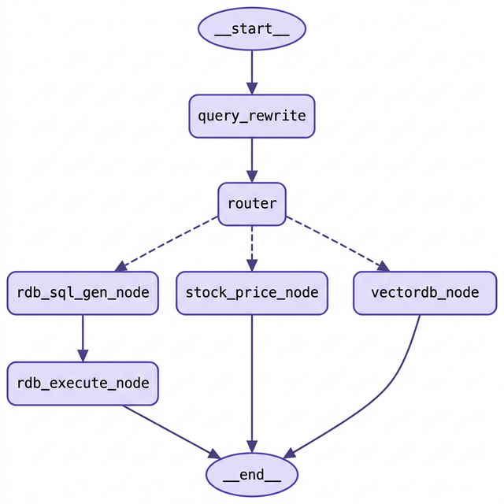

# 🏢 시스템 설계 철학 및 기술 아키텍처 (Architecture Guide)

이 문서는 Finance LLM이 내부적으로 **어떻게 동작하고 어떤 기술 스택으로 설계되었는지** 보여주는 개발자·엔지니어용 해설입니다.

## 🛠 1. 핵심 기술 스택 (Tech Stack)

이 개인용 로컬 RAG 파이프라인의 설계 철학은 **가벼움, 무료 API 활용, 의존성 최소화**에 있습니다.

*   **언어 및 환경:** Python 3.10+ (가상환경 분리 권장)
*   **LLM 엔진 (생성 & 임베딩):** `Google Gemini API` (Flash/Embedding 모델)
    *   *이유:* 개인용 수준에서 가장 관대한 무료 티어를 제공하며 처리 속도가 매우 빠릅니다.
*   **Vector DB (임베딩 검색):** `FAISS (Facebook AI Similarity Search - Local)`
    *   *이유:* 별도의 클라우드 DB 연동 없이 디렉토리 기반 인덱스를 사용하여 로컬 환경에서 가볍고 빠르게 검색할 수 있습니다.
*   **Relational DB (메타데이터):** `SQLite3`
    *   *이유:* Python 기본 내장 DB로서, 파일 메타데이터(파일명, 증권사, 발간일, 타겟)를 추적하고 RAG 파이프라인의 VectorDB와 교차 조회하기에 최적입니다. 특히 "전체 리포트 개수"나 "특정 기간의 리포트 목록" 같은 통계적 질문에 대해, 수천 개의 문서 청크를 벡터 검색하고 LLM 컨텍스트로 태우는 비효율적인 방식 대신 SQL 쿼리 한 번으로 처리함으로써 **토큰 사용량과 비용을 획기적으로 절감**합니다.
*   **LLM 파이프라인 제어:** `LangChain`, `LangGraph`, `Pydantic`
    *   *이유:* 체이닝(Chaining), 프롬프트 템플릿 분리, 텍스트 분할, 상태 기반(Stateful) 라우팅 통제, 멀티 턴 대화 메모리(MemorySaver), Structured Output 파싱, 그리고 **Tool Calling(ToolNode)** 을 통해 LLM 작업들을 구조화하고 안정성(Reliability)을 보장하기 위해 도입되었습니다.
*   **실시간 주가 조회:** `FinanceDataReader`
    *   *이유:* KRX 상장 전 종목의 가격 데이터를 무료로 조회할 수 있으며, `@tool` 데코레이터로 감싸 LangGraph `ToolNode`에 바인딩하여 LLM이 필요 시 자동으로 호출하도록 설계했습니다.
*   **PDF 파싱(구조적 텍스트 추출):** `PyMuPDF (fitz)` (기본) + `marker-pdf` (선택 옵션)
    *   *이유:* 증권사 리포트는 구조가 복잡하고 텍스트 레이아웃 정보가 중요한데, 표준 `PyMuPDF(fitz)`는 매우 빠르고 안정적입니다. 반면, 딥러닝 기반의 `marker-pdf`는 GPU 환경(CPU도 가능하지만 느림)에서 표와 수식을 더 정밀하게 추출할 수 있어 사용자가 환경에 맞춰 선택할 수 있도록 설계했습니다. (실패율이 낮고 가벼운 `fitz`를 기본 엔진 및 최종 폴백 엔진으로 사용합니다.)
*   **보안 파싱 (SQL Injection 방어):** `sqlglot`
    *   *이유:* LLM이 생성한 쿼리의 AST(추상 구문 트리)를 분석하여 허가된 테이블 접근 및 `SELECT` 문법만 허용하는 강력한 백엔드 가드레일을 구축하기 위함입니다.
*   **관찰성 및 시스템 기록:** Python 내장 `logging` 모듈
    *   *이유:* 단순 출력을 넘어 백그라운드 구동 환경에서도 에러 트래킹 및 파이프라인 관찰(Observability)을 수행하기 위함입니다.
*   **Reranking (옵션):** `FlashRank`

---

## 🏛 2. 시스템 설계 파이프라인 다이어그램

본 프로젝트는 크게 "데이터 적재 파이프라인(Ingestion)"과 "데이터 검색 파이프라인(Retrieval & Search)" 두 축으로 분리되어 있습니다.

### A. 데이터 적재 파이프라인 (`src/core/embed_pipeline.py`)

1. **파일 스캔 & 메타 파싱:** `data/downloaded/` 폴더 내 새로운 PDF 파일을 확인하고 파일명 규약에 따라 타겟, 발행일, 증권사를 파싱합니다.
2. **배치 Insert (병목 제거):** 수많은 파일의 메타데이터를 메모리상에서 모두 파싱한 후, 단일 DB Connection을 통해 `.executemany()` 배치 연산으로 SQLite RDB에 동기화하여 I/O 병목을 제거합니다.
3. **Markdown 중심의 지능형 텍스트 처리:**
   - **Step 3.1. 엔진별 추출 (PDF → Markdown/Text):** 설정(`config.py`)에 따라 `marker-pdf`(마크다운) 또는 `PyMuPDF(fitz)`(표준 텍스트)를 사용하여 PDF를 텍스트로 변환합니다. `marker`는 시각적 구조를 분석해 `# 제목` 구조를 직접 생성하며, `fitz`는 빠른 속도와 안정성을 제공합니다.
   - **Step 3.2. 텍스트 정제:** 생성된 마크다운 블록 단위로 금융 노이즈(표, 재무 레이블, 준법고지)를 필터링합니다.
4. **계층적 논리 분할 (Parent-Child Chunking):** 
   - **Step 4.1. 부모(Parent) 분할:** `MarkdownHeaderTextSplitter` + `RecursiveCharacterTextSplitter`를 사용해 넓은 맥락을 담은 큰 덩어리(약 2,000자)로 나눕니다.
   - **Step 4.2. 자식(Child) 분할:** 각 부모 청크를 검색 효율이 높은 작은 조각(약 500자)으로 다시 나눕니다.
   - **Step 4.3. ID 매핑 저장:** 자식 청크는 FAISS(Vector DB)에 `parent_id`와 함께 저장하고, 실제 부모 텍스트는 SQLite의 `parent_chunks` 테이블에 해당 ID로 저장합니다.
5. **벡터 임베딩:** Gemini 임베딩 모델을 호출하여 자식 청크의 텍스트를 고차원 숫자(Vector)로 바꿉니다.
6. **저장 & 동기화:** FAISS DB에 인덱스로 저장하고, SQLite `is_embedded=1` 로 상태를 업데이트하여 중복 처리를 방지합니다.

### C. 검색 시 컨텍스트 확장 (Small-to-Big Retrieval)

1. **검색:** 사용자의 질문으로 FAISS에서 가장 유사한 **자식(Child) 청크**를 찾습니다.
2. **필터링 및 병합 (Optimization):** 
   - 검색된 자식 청크들의 `parent_id`를 확인하고, **중복된 부모 맥락을 제거(Context Merging)**하여 LLM의 토큰 낭비를 최소화합니다.
3. **확장:** `parent_id`를 기반으로 SQLite의 `parent_chunks` 테이블을 조회하여 해당 **부모(Parent) 청크**의 전체 컨텍스트를 불러옵니다.
4. **생성:** LLM에게는 자식보다 훨씬 넓은 맥락이 담긴 부모 텍스트를 제공하여 정보의 단절 없이 정확한 답변을 생성하도록 합니다.

### B. 검색 및 대화 파이프라인

LangGraph의 상태 전환(State Machine)을 사용하여, 무분별하게 Vector DB를 뒤지지 않고 사용자의 **질문 의도에 따라 똑똑하게 라우팅(Routing)**하는 아키텍처입니다.

---

## 🛡️ 3. 주요 개발 철학과 차별점

*   **RAG 정확도의 핵심은 전처리(Pre-processing):**
    대규모 LLM보다 더 중요한 것은 "깨끗한 컨텍스트(Context)를 제공하는 것"이라는 철학 아래, PyMuPDF의 필터링 모듈(`src/configs/filter_configs.py`)을 정교하게 고도화했습니다. 로컬 디바이스에서는 표(Table) 이해 알고리즘보단 표를 과감히 버리는 것이 할루시네이션(환각) 예방에 타당하다고 판단했습니다.
*   **Dual-Storage (이중 저장소 교차 검증 구조):**
    RAG가 가진 "파일에 대해 질문하면 Vector DB에만 의존하는 현상"을 해결하기 위해 RDB를 도입하여 구조적 메타데이터(증권사, 기간)를 하드 라우팅 시켰습니다. 이는 단순히 정확도를 높이는 것을 넘어, 통계성 질문이나 메타데이터 필터링 시 수백 개의 문서 조각을 LLM 프롬프트에 구겨 넣는 **토큰 낭비를 원천적으로 차단**하여 경제적인 파이프라인을 구축하게 해줍니다.
*   **Tool Calling 기반 주가 조회 통합:**
    주가 조회를 별도 노드로 분리하지 않고 `@tool` + `ToolNode` 패턴을 도입하여, RDB와 VectorDB 모든 경로에서 LLM이 **필요 시 자율적으로 주가 데이터를 호출**할 수 있도록 설계했습니다. 이는 "리포트 분석 + 현재 주가"를 동시에 요구하는 복합 질의를 자연스럽게 처리할 수 있게 합니다.
*   **1인 로컬 시스템의 한계를 극복하는 엔지니어링:**
    단순 파이썬 스크립트 데모 수준을 벗어나기 위해, **DB 배치(Batch) 처리**를 통한 I/O 최적화, **AST 파싱을 통한 강력한 SQL 프롬프트 가드레일**, 그리고 전역 **Logging 아키텍처**를 구축하여 프로덕션 백엔드 레벨의 코어 단단함을 확보했습니다.
