# Finance LLM 사용자 신고 기반 개선 루프

## 현재 구현 운영 가이드

원문 작성일: 2026년 7월 26일<br>
재개정일: 2026년 8월 31일<br>
대상: 제품 운영자 · 개발자 · 품질 검증 담당자
문서 목적: 사용자 신고 접수, 재현 자산 고정, 릴리스별 실행, 비교 판단, 이슈 종결 계약을 현재 코드 기준으로 설명한다.

> **핵심 결론:** 현재 구현에는 `신고 → Supabase 이슈 → Fixture·FixedSnapshot·Case → Baseline·Candidate Run → Comparison → 이슈 분류`의 기본 루프가 있다. 다만 Comparison 뒤 종결은 운영상 권장 순서이지 서버가 강제하는 선행 조건이 아니며, 이 문서는 hosted 배포 완료를 증명하지 않는다.

### 전체 동작 화면

2026년 8월 31일 Chrome의 `http://localhost:8501/`에서 한 신고를 처음부터 끝까지 따라가며 확인한 실제 화면이다. 운영 화면은 `조치 중` 신고 `b48d0660`, READY Fixture `fixture_a81a9c36`, READY Case `case_b726539165e`, 성공·유효 Baseline `run_e5ac609bae…`, 성공·유효 Candidate `run_d4df70b4df…`의 동일 계보를 사용한다.

아래 캡처는 화면 연결과 저장된 증거를 읽기 전용으로 검증한 기록이다. `신고 제출`, 새 Run 실행, `불변 Comparison 저장`, `상태 변경 저장`은 누르지 않았다. 따라서 마지막 두 화면은 완료 기록이 아니라 각각 Comparison 판단 입력과 Issue 종결의 **저장 전 준비 상태**다.

#### 1. Chat에서 신고 진입

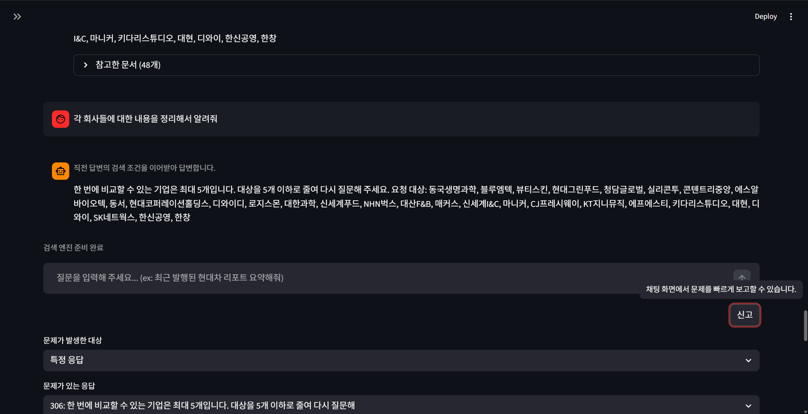

문제가 발생한 특정 응답에서 `신고`를 열어 신고 대상과 응답을 고른다.

#### 2. 신고 분류·동의 범위·전송 미리보기

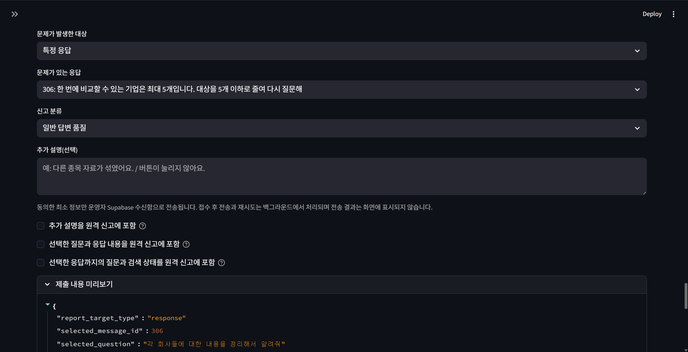

원격 전송 동의는 기본 해제이며, 운영자에게 보낼 최소 정보와 redaction 결과를 제출 전에 확인한다.

#### 3. 작업함에서 신고 선별

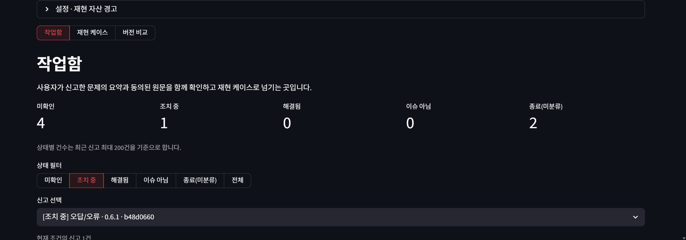

운영자는 상태 필터와 신고 목록에서 처리할 Issue를 선택한다.

#### 4. 신고 요약과 관측값 확인

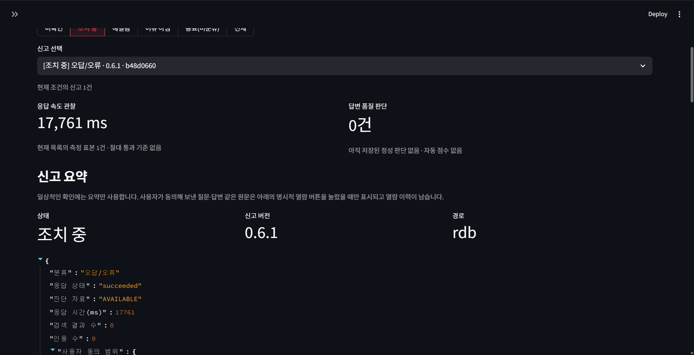

응답 속도, 품질 판단 유무, 신고 버전, route와 동의 범위를 함께 확인한다.

#### 5. 현재 근거와 다음 행동 확인

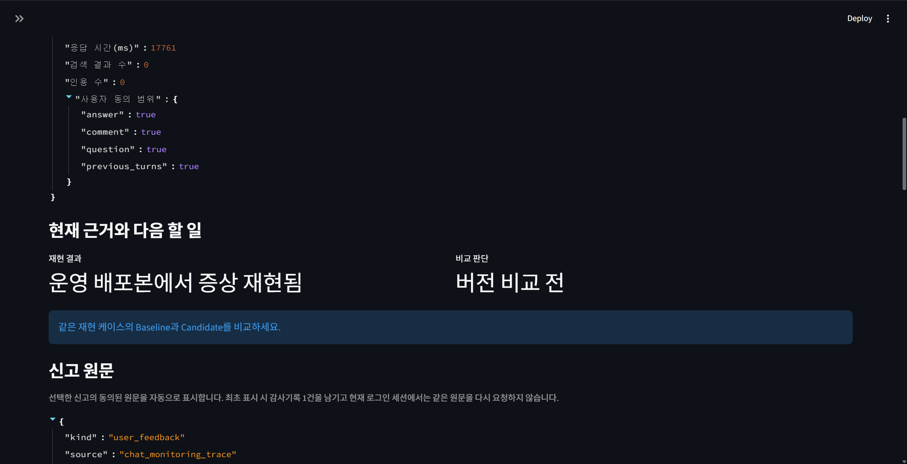

저장된 재현 기록에서 `운영 배포본에서 증상 재현됨`을 확인하고 같은 Case의 Baseline·Candidate 비교로 이동한다.

#### 6. Fixture READY 확인

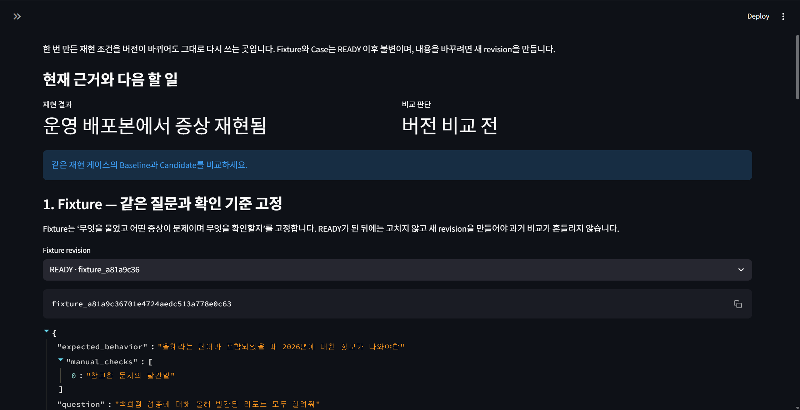

`fixture_a81a9c36`은 질문과 기대 동작을 고정하고 답변에 `2026`이 포함되는지 검사한다.

#### 7. FixedSnapshot과 ReconstructionLineage 확인

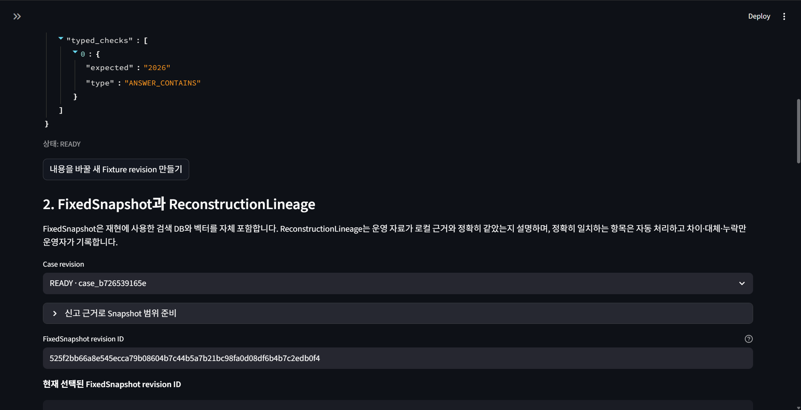

`case_b726539165e`가 READY이고 선택한 FixedSnapshot revision 및 `PARTIAL` 운영자 정의 범위가 Case에 고정됐는지 확인한다.

#### 8. 신고 버전 Baseline 실행 기록

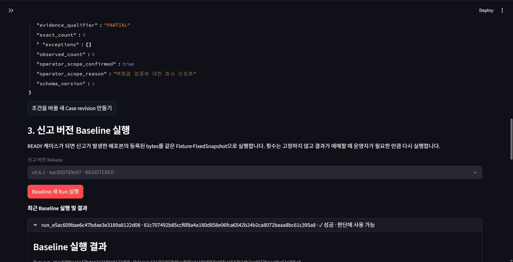

신고 버전 `v0.6.1`의 저장된 Baseline Run이 `성공 · 판단에 사용 가능`인지 확인한다.

#### 9. Candidate Release와 실행 진입점

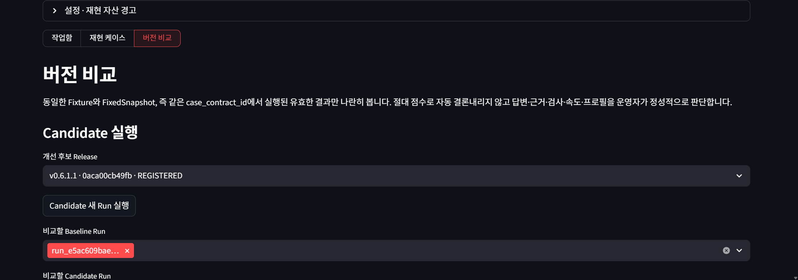

개선 후보 `v0.6.1.1`을 선택하고 같은 Case에서 실행할 Candidate 진입점과 비교 대상 Baseline을 확인한다. 캡처 중 새 Run은 실행하지 않았다.

#### 10. 같은 Case의 유효 Run 선택

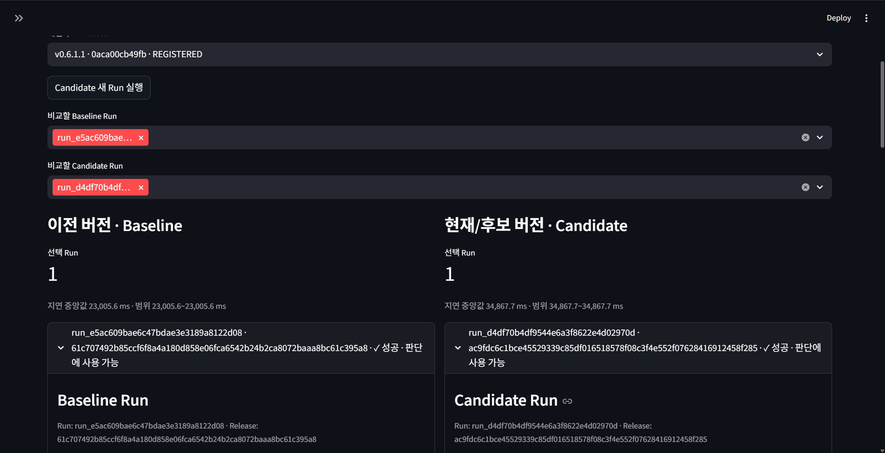

양쪽 모두 한 건의 성공·유효 Run이 선택됐으며 지연 중앙값과 Run identity를 나란히 확인할 수 있다.

#### 11. 답변 내용 비교

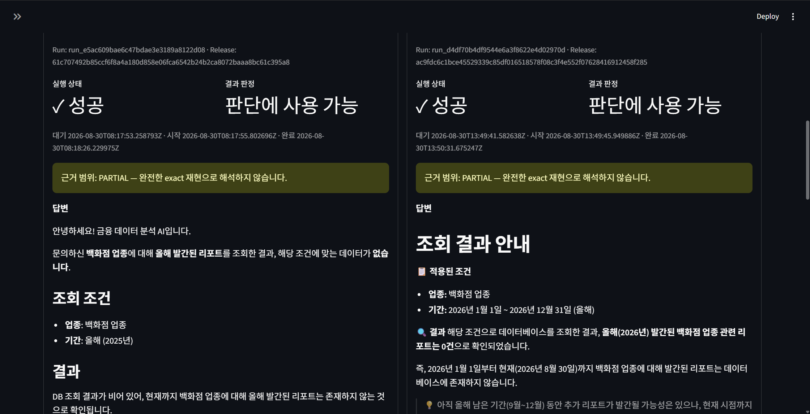

Baseline은 `올해`를 2025년으로 처리했지만 Candidate는 고정 시각에 맞춰 2026년 범위를 사용한다. 두 결과 모두 `PARTIAL` 근거 범위임을 함께 표시한다.

#### 12. typed check와 runtime profile 비교

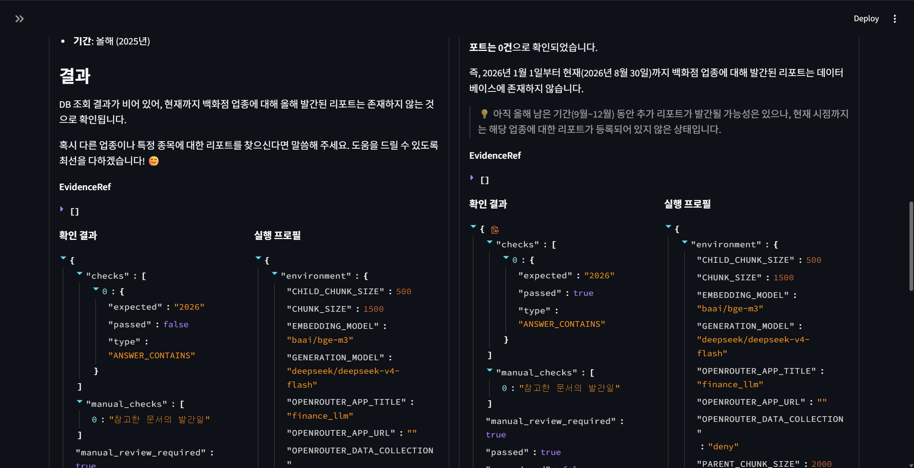

같은 `ANSWER_CONTAINS: 2026` 검사가 Baseline에서는 `false`, Candidate에서는 `true`이며 실행 profile도 함께 검토할 수 있다.

#### 13. 정성 Comparison 판단 준비

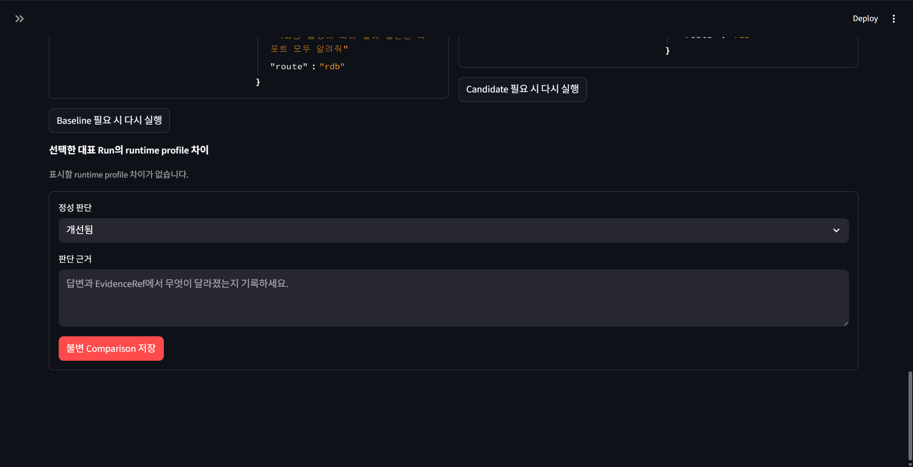

운영자가 정성 verdict와 근거를 기록하는 단계다. 화면은 `개선됨`을 선택한 입력 전 상태이며 Comparison을 저장하지 않았다.

#### 14. Issue 종결 준비

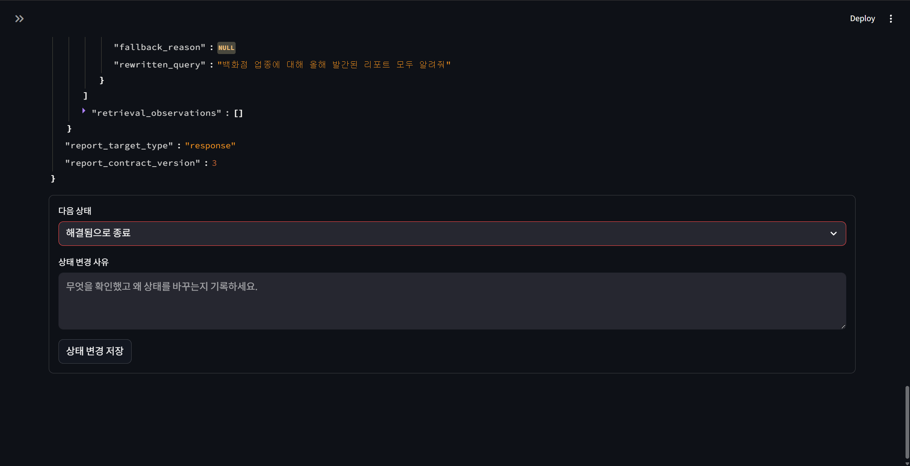

Comparison 근거를 검토한 뒤 `해결됨으로 종료`와 변경 사유를 준비한다. 캡처 중 상태 변경을 저장하지 않았으므로 원격 Issue는 계속 `조치 중`이다.

<!-- PAGE BREAK -->

# 개정 요약

이번 개정판은 과거 계획 문서를 현재 구현 계약으로 다시 작성한다.

- 구현된 기능, 운영상 권장 절차, 아직 구현되지 않은 목표를 구분한다.
- production Issue 상태와 감사 이력의 권위는 Supabase에, 재현 자산의 전체 내용과 실행 증거는 운영자 PC에 둔다.
- `OPEN / IN_PROGRESS / RESOLVED / NOT_ISSUE`와 legacy `CLOSED`를 서로 다른 의미로 설명한다.
- 신고 원문은 현재 UI에서 선택 즉시 자동 조회되고 최초 조회가 감사된다는 실제 동작을 반영한다.
- 개별 Chat의 `graph_manifest`·`node_runs`와 공식 Baseline/Candidate Run artifact를 별도 증거 계약으로 구분한다.
- 현재 알려진 FixedSnapshot industry 검색 표시 문제와 배포 격차를 숨기지 않는다.

# 1. 문서의 권위와 적용 범위

## 1.1 현재 동작을 판단하는 우선순위

| 우선순위 | 기준 | 이 문서에서의 역할 |
| --- | --- | --- |
| 1 | 현재 코드·migration·테스트 | 실제 실행 계약과 강제 불변조건 |
| 2 | 이 운영 가이드 | 현재 운영 절차와 구현 경계의 canonical 설명 |
| 3 | Monitoring·Architecture 문서 | 화면별 진단·시스템 구조 상세 |
| 4 | 미래 release 설계 | canary·promotion·installer·rollback을 포함한 목표 |
| 5 | historical plans·deliverables | 의사결정 이력; 현재 동작의 권위가 아님 |

이 문서의 “구현됨”은 **2026년 8월 30일 로컬 코드와 테스트로 확인됨**을 뜻한다. 원격 Supabase migration 적용, Edge Function 배포, 실제 운영 데이터 호환까지 확인됐다는 뜻은 아니다.

## 1.2 이 문서가 다루는 것

- Chat에서 사용자가 문제를 신고하고 안전한 원격 payload를 만드는 과정
- durable outbox와 Supabase ingest 경계
- 인증된 단일 운영자의 이슈 분류와 감사 이력
- Fixture, FixedSnapshot, ReconstructionLineage, ReproductionCase 계약
- 등록된 릴리스의 격리 실행과 Baseline/Candidate 비교
- 원격 control projection과 로컬 자산 불일치의 운영자 UI 차단
- 장애 복구, 알려진 제한, 검증 명령

## 1.3 이 문서가 완료됐다고 주장하지 않는 것

- 자동 원인 분석, 자동 코드 수정, PR 생성 또는 자동 배포
- 정량 임계값에 의한 자동 개선 판정과 자동 이슈 종결
- canary, qualification, PromotionRecord, installer 게시, 자동 rollback
- hosted Supabase에 현재 migration과 Function이 배포됐다는 사실
- 공식 Baseline/Candidate Run의 node 단위 graph 회귀 비교
- 사용자에게 수정 완료를 다시 알리는 알림 루프

<!-- PAGE BREAK -->

# 2. 현재 구현된 전체 흐름

아래 도식에서 `[강제]`는 코드·DB가 거부 조건을 가진 단계이고, `[권장]`은 운영자가 따라야 하지만 Issue API가 선행 조건으로 검사하지 않는 단계다.

```text
Chat 신고
  └─ [강제] 명시적 동의 + redaction preview + durable outbox enqueue
       └─ [강제] Supabase ingest 검증·멱등 저장
            └─ Issue OPEN + CREATED event
                 └─ 신고 선택
                      ├─ [강제] 원문 자동 조회 최초 1회 RAW_VIEWED audit
                      └─ [권장] IN_PROGRESS로 변경
                           └─ [강제] Fixture DRAFT → READY
                                └─ [강제] FixedSnapshot READY
                                     └─ [강제] Lineage 확인 + Case DRAFT → READY
                                          └─ [강제] 신고 Release Baseline Run
                                               └─ [권장] 실패 재현 확인
                                                    └─ [강제] 다른 Release Candidate Run
                                                         └─ [강제] 같은 Case의 VALID Run만 Comparison
                                                              └─ [권장] RESOLVED 또는 NOT_ISSUE
```

한 건의 문제를 처리할 때 가장 중요한 identity는 `case_contract_id`다. Fixture의 질문·증상·기대 동작·검사, FixedSnapshot, 고정 시각, evaluator, 자료 대응 증명이 이 값에 묶인다. 공식 Comparison은 양쪽 Run이 같은 `case_contract_id`를 가질 때만 가능하다.

## 2.1 세 개의 운영 작업 공간

| 작업 공간 | 운영자의 질문 | 주된 결과 |
| --- | --- | --- |
| 작업함 | 무엇이 신고됐고 지금 어떤 상태인가? | 요약·동의 원문·감사 이력·상태 변경 |
| 재현 케이스 | 어떤 질문과 자료로 같은 문제를 재현할 것인가? | READY Fixture·FixedSnapshot·Case |
| 버전 비교 | 신고 버전과 개선 버전이 실제로 어떻게 다른가? | Run 이력·Comparison·다음 행동 판단 |

화면은 여러 내부 ID와 hash를 운영자에게 매번 입력시키지 않는다. 운영자는 기대 동작, 검사, 문서 범위, 예외 사유, 최종 판단을 확인하고 시스템이 identity·digest·가용성·revision을 계산한다.

# 3. 저장소와 권위의 분리

## 3.1 어떤 정보가 어디에 있는가

| 정보 | 권위와 저장 위치 | 보존 목적 |
| --- | --- | --- |
| 신고 원문 | Supabase `private.issue_reports` | 동의된 원문과 제한된 진단의 최종 수신 |
| Issue 상태·상태 감사 | Supabase monitoring Issue·event | production 업무 상태의 단일 기준 |
| 전송 대기 payload | 로컬 outbox SQLite | 성공·거절·소진·만료 전까지만 임시 보존 |
| Fixture·Case·Release·Run·Comparison 본문 | `MONITORING_ARTIFACT_ROOT`의 로컬 registry·artifact | 재현과 비교의 전체 증거 |
| FixedSnapshot bytes | 로컬 managed artifact root | 동일 catalog·FAISS subset의 반복 실행 |
| control projection | Supabase control record·event | 로컬 자산 ID·digest·가용성의 제한된 원격 감사 |
| 신고 원문 cache·reproduction seed·선택 중 문서 | 현재 Streamlit session memory | 한 로그인 세션의 작업 편의 |
| Chat 답변·graph snapshot | 로컬 conversation store의 message metadata | 응답별 실행 진단 |

production UI는 Issue 상태를 바꿀 때 Supabase API만 호출한다. 로컬 registry에도 Issue row와 상태 필드가 있지만, 활성 화면에서 production lifecycle의 두 번째 권위로 쓰지 않는다. 로컬 Issue는 재현 자산을 묶고 파생 진행 상황을 계산하는 anchor다.

## 3.2 Supabase에 보내지 않는 내용

control projection에는 record kind·ID, lifecycle status, content digest, 파생 availability, 제한된 참조 ID와 정성 분류만 보낸다. 다음 내용은 로컬에 남는다.

- Fixture·Case 전체 본문과 질문·기대 동작
- 답변 본문, EvidenceRef, runtime profile
- 로컬 파일 경로와 FixedSnapshot 내부 catalog
- Comparison에서 선택한 반복 Run 전체 목록
- Chat의 GraphManifest와 NodeRun

원격 projection은 로컬 내용을 복사하는 백업이 아니다. 로컬 identity와 불변 기록이 예상한 순서로 존재하는지를 확인하는 감사 경계다.

## 3.3 session에만 두는 내용

선택한 신고 원문과 여기서 만든 최소 reproduction seed는 현재 로그인 session의 메모리에만 둔다. 로그아웃 또는 session 종료 시 access token, 원문 cache, seed, Snapshot 선택 상태를 제거한다. 비밀번호와 refresh token은 저장하지 않는다.

<!-- PAGE BREAK -->

# 4. 사용자 신고와 안전한 수집

## 4.1 신고 진입

Chat의 `신고`에서 사용자는 문제가 난 특정 응답 또는 화면·시스템 문제를 고른다. 분류는 일반 답변 품질, 검색 정확도, 오답·오류, 속도, 버그·기능, 기타 중 하나이며 추가 설명은 선택이다.

원격 내용 동의는 모두 기본 해제다.

- 추가 설명 포함
- 선택 질문과 응답 포함
- 선택 응답까지의 이전 질문·검색 상태 포함

이전 turn·검색 상태 동의를 켜도 최대 8개 user 질문, route, filter, 문서 범위만 포함하며 이전 assistant 답변 본문은 포함하지 않는다. rewritten query, filter, source UID/hash를 담는 `case_diagnostics` 전체도 이 동의가 있어야 전송된다. 선택 질문·응답은 각각 제한된 길이로 redaction되며 route, latency, 결과 수, 인용 수 같은 비본문 진단은 별도 allowlist 계약을 따른다.

## 4.2 제출 전과 제출 후

1. 앱이 메모리에서 신고 context를 만든다.
2. 동의한 필드만 원격 계약으로 투영한다.
3. credential, 개인정보, 로컬 절대경로를 가리고 제한 길이를 적용한다.
4. 실제 전송 형태의 redaction preview를 화면에 표시한다.
5. SQLite outbox의 durable enqueue가 성공한 뒤에만 `신고가 접수되었습니다.`를 표시한다.
6. HTTP 전송과 재시도는 background worker가 처리하며 사용자 채팅을 막지 않는다.

원격 기능이 꺼졌거나 설정이 불완전하면 로컬 신고 파일로 우회 저장하지 않고 제출을 비활성화한다.

## 4.3 outbox 계약

| 항목 | 현재 계약 |
| --- | --- |
| 단일 event 상한 | 128 KiB |
| outbox 전체 상한 | 50 MiB 또는 1,000건 |
| 재시도 | 최초 시도 뒤 최대 3회 재시도 |
| lease | 한 worker가 60초 동안 전송 소유권 확보 |
| 만료 | 생성 후 7일 |
| terminal 처리 | 성공·영구 거절·재시도 소진·만료 시 row와 payload 삭제 |

outbox는 최종 신고 저장소가 아니다. `queued / sending / retry` 동안만 전송 책임을 가지며 terminal 결과에서는 payload를 즉시 제거한다.

## 4.4 Supabase ingest 계약

`issue-report-ingest`는 POST만 허용하고 publishable key, body size, exact schema, timestamp, 동의와 실제 내용의 일치, 잔존 민감정보, quota, `event_id` 멱등성을 검사한다. 저장은 service-role 전용 RPC를 통해 private table에 수행하며, insert trigger가 `OPEN` Issue와 `CREATED` event를 만든다.

저장소의 Function·migration·테스트가 존재한다는 사실과 hosted 프로젝트에 최신 버전이 적용됐다는 사실은 다르다. 운영 검증에서는 두 Function과 migration 세트를 같은 배포 단위로 확인해야 한다.

# 5. production Issue lifecycle

## 5.1 상태의 의미

| 상태 | 화면 표현 | 의미와 사용 |
| --- | --- | --- |
| `OPEN` | 미확인 | 아직 확인을 시작하지 않았거나 다시 연 이슈 |
| `IN_PROGRESS` | 조치 중 | 운영자가 조사·재현·개선 작업을 진행 중 |
| `RESOLVED` | 해결됨 | 문제를 해결했다고 운영자가 분류한 terminal 결과 |
| `NOT_ISSUE` | 이슈 아님 | 의도된 동작·오해·중복 등 해결 대상이 아니라고 분류한 terminal 결과 |
| `CLOSED` | 종료(미분류) | 과거 상태의 의미를 추정하지 않고 보존하는 legacy terminal 값 |

신규 전환은 `CLOSED`를 만들지 않는다. legacy `CLOSED`는 `OPEN`, `RESOLVED`, `NOT_ISSUE` 중 하나로 재분류할 수 있다.

## 5.2 허용 전이

```text
OPEN        → IN_PROGRESS | RESOLVED | NOT_ISSUE
IN_PROGRESS → OPEN        | RESOLVED | NOT_ISSUE
RESOLVED    → OPEN        | NOT_ISSUE
NOT_ISSUE   → OPEN        | RESOLVED
CLOSED      → OPEN        | RESOLVED | NOT_ISSUE   (legacy source only)
```

모든 전이는 1~2,000자의 사유와 `expected_record_revision`을 요구한다. 서버는 compare-and-swap으로 갱신하고 actor, 이전·다음 상태, 사유, server timestamp를 append-only event로 남긴다. stale revision이면 덮어쓰지 않고 conflict를 반환한다.

## 5.3 신고 원문 열람의 실제 동작

현재 작업함은 신고를 선택하면 동의된 원문을 자동 조회한다. 최초 조회 시 `RAW_VIEWED` 감사 event 한 건을 남기고 같은 로그인 session에서는 cache를 사용해 다시 요청하지 않는다. 원문이 보존 기간 만료 등으로 없으면 `raw_unavailable`로 표시하며, 요약만으로 사실을 추정하지 않는다.

## 5.4 종결에서 강제되는 것과 권장되는 것

`RESOLVED`와 `NOT_ISSUE`는 Comparison 없이도 API상 선택할 수 있다. 따라서 다음을 구분한다.

- **서버 강제:** 사유, CAS revision, 허용 전이, 활성 admin
- **UI/service gate:** 상태 전환 직전에 control projection을 reconcile하고 해결되지 않은 drift가 있으면 현재 요청을 중단한다. 다만 Issue 전환 API는 control-set revision이나 digest를 같은 transaction에서 검사하지 않으므로 서버 원자적 불변조건은 아니다.
- **권장:** `IN_PROGRESS → 재현 → Baseline/Candidate → Comparison → RESOLVED`
- **정당한 단축:** 중복, 잘못된 신고, 의도된 동작처럼 실행 비교가 불필요한 경우 `NOT_ISSUE`

현재 코드는 `RESOLVED`에 성공 Comparison을 필수 gate로 두지 않는다. 운영자는 근거가 없는 종결을 피하고 사유에 확인한 증거를 적어야 한다.

<!-- PAGE BREAK -->

# 6. 재현 자산 계약

## 6.1 FixtureRevision

Fixture는 “무엇을 다시 실행하고 어떻게 확인할지”를 기록한다.

| 구성 | 내용 |
| --- | --- |
| 질문 | 재현할 입력 |
| 신고 증상 | 실제로 관찰된 문제 |
| 기대 동작 | 운영자가 승인한 올바른 결과 |
| typed checks | 자동 평가 가능한 제한된 검사 |
| manual checks | 사람이 확인해야 하는 검사 목록 |

typed check allowlist는 `ANSWER_CONTAINS`, `ANSWER_NOT_CONTAINS`, `EVIDENCE_CONTAINS`, `CITATION_PRESENT`, `ROUTE_EQUALS`, `MANUAL`이다. Fixture는 `DRAFT → READY`로 이동하며 READY 이후 본문은 변경할 수 없다. 변경은 predecessor를 가리키는 새 revision으로 만든다.

## 6.2 FixedSnapshotRevision

FixedSnapshot은 실행할 때 active DB를 다시 조회하는 필터가 아니라, 선택한 report의 catalog row와 vector를 포함한 self-contained Native V2 자료 묶음이다.

- 현재 base와 READY delta가 합쳐진 active publication metadata에서 문서를 제안한다.
- 신고 당시 관찰된 report UID, route filter 일치 문서, 운영자 수동 추가를 구분한다.
- 운영자가 최종 범위를 확인한 뒤 projected SQLite catalog, FAISS subset, manifest를 만든다.
- TEMP 위치에서 hash, count, dimension, mapping을 검증한 뒤 digest identity 경로에 원자 게시한다.
- 등록 가능한 상태는 검증된 `READY`뿐이다.
- 실행 시 active catalog/index로 fallback하지 않고 Snapshot 자신의 bytes만 연다.

`AVAILABLE / LOCAL_MISSING / CORRUPT / INCOMPATIBLE`는 저장 lifecycle을 되돌리는 상태가 아니라 현재 bytes에서 계산한 availability다. 운영자 UI는 개별 자산의 수동 복구를 제공하지 않는다. Git Release의 `LOCAL_MISSING` cache는 실행 시 등록 commit에서 자동 재생성하고, FixedSnapshot은 새 revision과 Case로 이어간다.

## 6.3 ReconstructionLineage

Lineage는 신고 당시 관찰한 source UID/hash와 현재 FixedSnapshot 문서의 대응을 증명한다.

| qualifier | 의미 |
| --- | --- |
| `EXACT` | 관찰된 자료가 같은 UID와 hash로 모두 존재 |
| `PARTIAL` | 누락·내용 차이 또는 운영자 정의 범위가 포함됨 |
| `SUBSTITUTE_INCLUDED` | 확인된 대체 자료가 포함됨 |

`MISSING`, `CONTENT_DIFFERENT`, `SUBSTITUTE` 예외는 운영자가 각각 확인해야 한다. 대체·누락은 사유도 필수다. 신고에 관찰 source가 없으면 `OPERATOR_DEFINED` 범위를 명시적으로 승인하고 이유를 남기며, 이 경우 qualifier는 `PARTIAL`이다.

## 6.4 ReproductionCaseRevision

Case는 다음을 한 계약으로 묶는다.

- READY Fixture revision과 digest
- READY FixedSnapshot revision
- 고정 시각
- evaluator
- Lineage proof와 evidence qualifier

Case는 `DRAFT → READY`이고, READY 시 canonical body에서 `case_contract_id`를 한 번 계산한다. READY Fixture, 가용 Snapshot, 비어 있지 않은 evaluator, 확인된 Lineage가 없으면 READY가 되지 않는다. 이후 변경은 새 Case revision이다.

## 6.5 ReleaseManifest

Release의 의미상 identity는 `app version + full Git commit`이다. 시스템은 clean 상태의 README와 Git HEAD에서 두 값을 자동으로 읽고, worktree가 아니라 해당 commit의 추적 파일로 app/runtime cache를 만든다. runner 계약과 object hash를 검증한 뒤 `REGISTERED`로 게시하지만 build·bundle digest는 cache 무결성 metadata일 뿐 identity가 아니다. `.env`, private-key container·marker, VCS metadata는 cache에 포함하지 않으며 `.env.example`과 공개 인증서는 허용한다.

공식 최초 baseline은 `v0.6.1`과 지정된 remote git revision이다. 로컬에만 있었던 `v0.6.0`은 등록하지 않는다. 동일 app version을 다른 commit으로 다시 등록할 수 없다. cache가 누락되면 등록 commit에서 자동 재생성하며, Git object가 없거나 재생성 checksum이 다르거나 cache가 손상·reader 비호환이면 Run을 시작하지 않는다. 과거 schema v1 bundle은 그대로 읽지만 누락 시 자동 재생성하지 않는다.

# 7. Run과 Comparison

## 7.1 격리 실행

registered release는 임시 workspace로 복사되고, 하나의 FixedSnapshot만 Native V2 실행 layout으로 준비된다. runner는 현재 운영 checkout의 app module로 조용히 fallback하지 않도록 import path를 격리한다. API key 같은 실행 credential은 실행 시 명시적으로 전달하고 Release·Fixture·Snapshot·Run artifact에 보존하지 않는다.

이 격리는 **source/import-isolated compatibility run**의 경계다. runner는 현재 운영 process의 Python interpreter와 설치된 site-packages를 사용하므로 dependency 전체가 hermetic하게 고정됐다는 뜻은 아니다. 완전한 dependency 재현은 interpreter·lockfile 또는 vendored runtime identity를 Release 계약에 추가하는 후속 범위다.

Baseline은 해당 Issue가 신고된 release를 사용해야 한다. 현재 UI는 Candidate에서 신고 release를 제외하고 다른 registered release만 선택하게 한다.

## 7.2 Run lifecycle과 불변성

```text
QUEUED → RUNNING → SUCCEEDED | FAILED | CANCELLED | INTERRUPTED
```

Issue, Case, Release, side, runtime profile은 queue 뒤 변경할 수 없다. terminal 전이는 result artifact를 create-only 방식으로 먼저 만들고 digest와 상대 경로를 registry에 연결한다. 로컬 terminal record를 불변 저장한 뒤 원격 terminal projection을 best-effort로 동기화하며, 원격 실패는 로컬 결과를 되돌리지 않고 경고로 남긴다. 반면 `QUEUED`·`RUNNING` projection 실패는 실행을 중단한다. terminal Run은 덮어쓰지 않는다.

성공 Run은 다음 증거를 요구한다.

- raw answer
- bounded EvidenceRef 목록
- route summary
- typed check result와 manual review 필요 여부
- 실제 runtime profile
- latency
- Case의 evidence qualifier

queue에 고정한 runtime profile과 실제 runner profile이 다르면 실행이 성공했어도 `INVALID`다. 공식 비교에는 `SUCCEEDED + VALID` Run만 사용할 수 있다.

## 7.3 반복 실행

고정 10회, 최소 유효 횟수, 자동 통과 점수는 없다. 결과가 흔들리거나 지연을 더 확인해야 할 때 운영자가 Baseline과 Candidate를 필요한 만큼 다시 실행한다. 비교 화면은 선택한 Run 수, 지연 중앙값과 범위, 각 답변·근거·검사·profile을 함께 보여준다.

## 7.4 Comparison

Comparison은 같은 Issue와 같은 `case_contract_id`의 Baseline·Candidate를 각각 한 건 이상 요구한다. 다른 Case, 실패·무효 Run, side가 뒤바뀐 Run을 거부한다.

| verdict | 운영 의미 |
| --- | --- |
| `IMPROVED` | 신고 문제와 비교 근거가 의미 있게 개선됨 |
| `NOT_IMPROVED` | 변경했지만 문제를 충분히 해결하지 못함 |
| `REGRESSED` | 후보가 기준보다 악화됨 |
| `INCONCLUSIVE` | 자료·반복 실행·수동 판단이 더 필요함 |

Comparison에는 note와 actor가 필요하며 생성 후 변경하지 않는다. 재판단은 최신 Comparison을 `supersedes_comparison_id`로 가리키는 새 record를 만든다.

## 7.5 typed check와 사람의 판단

자동 typed check는 기대 문자열, 근거, citation, route 같은 좁은 조건만 평가한다. `MANUAL` check는 `passed=null`과 `manual_review_required=true`로 남고 별도 구조화 점수를 만들지 않는다. 현재 수동 판단의 최종 기록은 Comparison verdict와 note다.

따라서 자동 check 통과는 전체 답변 품질의 자동 승인도, Issue 종결의 자동 명령도 아니다.

<!-- PAGE BREAK -->

# 8. 운영자 실행 절차

## 8.1 진입과 인증

1. `DEPLOYMENT_ENVIRONMENT=production`, operator 기능 플래그, Supabase project URL, publishable key, operator Function URL, managed artifact root가 모두 유효한지 확인한다.
2. 활성 `private.monitoring_admins` 사용자로 로그인한다.
3. access token은 현재 session memory에서만 사용하고, 비밀번호와 refresh token은 남기지 않는다.

초기 운영자는 Supabase Dashboard에서 초대 또는 생성한 Auth 사용자 UUID를 `private.monitoring_admins`에 active 행으로 등록해야 한다. 이 작업은 운영 DB 권한이 있는 배포 담당자가 migration 적용 후 한 번 수행하며, 앱 UI에서는 관리자 추가·권한 변경을 제공하지 않는다.

```sql
insert into private.monitoring_admins (user_id)
values ('<auth.users.id>');
```

설정이 일부만 있거나 인증 경계가 불완전하면 Monitoring 메뉴 자체를 노출하지 않는다. 화면 숨김이 보안 경계가 아니므로 Edge Function이 JWT와 active admin membership을 다시 검사한다.

## 8.2 작업함

1. 상태별 건수와 필터에서 Issue를 고른다.
2. 요약과 자동 조회된 동의 원문을 확인한다.
3. 조사를 시작하면 사유를 적고 `IN_PROGRESS`로 바꾼다.
4. raw가 없으면 요약을 사실로 승격하지 말고 `raw_unavailable`을 기록한다.

최근 최대 200건만 상태 count와 목록의 기준이다. 전체 운영 보존량을 뜻하지 않는다.

## 8.3 Fixture와 Snapshot

1. 원문에서 question, reported symptom, observed answer, 제한된 diagnostics로 reproduction seed를 만든다.
2. 기대 동작과 typed/manual check를 운영자가 검토한다.
3. Fixture를 READY로 고정한다.
4. 관찰 UID와 route filter 기반 제안을 확인한다.
5. 필수 관찰 문서, filter 제안, 수동 추가 문서의 포함 이유를 구분해 최종 범위를 정한다.
6. `FixedSnapshot READY 생성` 전까지 add/remove는 session 선택일 뿐 영속 자산이 아님을 확인한다.
7. FixedSnapshot을 생성하고 Lineage 예외를 확인한다.
8. Case를 READY로 만들어 `case_contract_id`를 확정한다.

## 8.4 Baseline과 Candidate

1. 신고 version에 대응하는 exact Release bundle을 등록한다.
2. Baseline을 실행한다.
3. 자동 check와 답변·EvidenceRef를 보고 신고 문제가 재현됐는지 판단한다.
4. 재현되지 않으면 질문, 문서 범위, Lineage, 기대 검사부터 다시 검토한다.
5. 다른 candidate Release를 등록하고 같은 Case로 실행한다.
6. 필요한 만큼 양쪽 Run을 반복한다.

미완료 `QUEUED / RUNNING` Run이 있으면 새 Run을 시작하지 않는다. 다른 runner·Monitoring process가 없음을 운영자가 확인한 경우에만 미완료 Run을 `INTERRUPTED + INVALID` artifact로 봉인한다.

## 8.5 비교와 종결

1. 같은 Case의 `SUCCEEDED + VALID` Baseline과 Candidate를 고른다.
2. 답변, EvidenceRef, typed/manual check, latency, runtime profile, evidence qualifier를 나란히 본다.
3. verdict와 구체적 note를 저장한다.
4. `IMPROVED`라면 control projection이 일치하는지 다시 확인한다.
5. 사유와 함께 `RESOLVED`로 전환한다.
6. 재현 대상이 아닌 경우에는 `NOT_ISSUE` 사유를 남긴다.

5번은 권장 운영 순서다. 서버가 Comparison 존재를 `RESOLVED`의 hard gate로 검사하지 않는 현재 제한은 11장에 다시 적는다.

# 9. 원격 control projection과 차단 규칙

## 9.1 projection의 목적

로컬 자산의 전체 내용을 원격에 복제하지 않으면서, 운영자가 어떤 identity와 lifecycle을 사용해 판단했는지 감사할 수 있게 한다. record kind는 Fixture, Case, FixedSnapshot, Release, Run, Comparison이다.

각 record는 lifecycle status, content digest, availability, 제한된 references와 attributes를 가진다. READY Case는 Fixture·FixedSnapshot·Case contract identity와 evidence qualifier를, Comparison은 Case contract identity와 verdict를 반드시 포함한다. Fixture·Case·Comparison 같은 비산출물 record의 availability는 `null`이다. 수정 가능한 상태 변화는 revision CAS를 사용하고, 불변 record의 digest가 다르면 `immutable_conflict`로 차단한다.

## 9.2 동기화 순서

Fixture → FixedSnapshot → Case → Release → Run → Comparison 순서로 dependency를 보존한다. Run은 복구 시 원격에도 `QUEUED → RUNNING → terminal` 순서로 replay한다.

## 9.3 작업을 막는 상황

- 원격에 로컬이 예상하지 못한 record identity가 존재
- 같은 immutable record ID의 digest가 다름
- record revision conflict가 해결되지 않음
- 로컬 Issue는 없는데 원격 control record가 남아 있음
- FixedSnapshot 또는 Release의 availability를 신뢰할 수 없음
- 미완료 Run이 있음

production UI/service는 새 Run과 Issue 전환 직전에 projection을 reconcile하고, 해결되지 않은 drift가 있으면 현재 요청을 중단한다. 다만 Issue 전환 API 자체에는 control-set digest의 원자적 precondition이 없으므로 직접 API 호출이나 동시 변경까지 서버가 차단하는 계약은 아니다. Supabase projection은 backup이 아니므로 로컬 registry가 사라졌다면 metadata만 보고 재구성하지 않고 exact artifact 복원을 요구한다.

# 10. Chat 진단 증거와 공식 Run 증거의 차이

개별 Chat Monitoring과 공식 Baseline/Candidate Run은 모두 신고 조사에 쓰이지만 증거의 목적과 계약이 다르다.

| 구분 | 목적 | 보존하는 핵심 증거 |
| --- | --- | --- |
| 개별 Chat Monitoring | 신고 원인 이해와 reproduction seed 준비 | 응답 당시 `graph_manifest`, `node_runs`, turn 지표와 검색 근거 |
| 공식 Baseline/Candidate Run | 같은 Case에서 릴리스 결과 검증·비교 | 답변, EvidenceRef, route summary, typed check, runtime profile, latency |

Chat graph의 저장 schema, 렌더링, legacy 호환과 화면 세부 계약은 [Monitoring Mode의 응답 원인 확인](MONITORING.md#응답-원인-확인)을 따른다. 공식 Run에는 현재 `graph_manifest`와 `node_runs`가 없으므로 Chat의 node 시간이나 topology를 Baseline/Candidate 회귀 결과로 해석하지 않는다.

# 11. 장애와 복구

| 증상 | 의미 | 처리 |
| --- | --- | --- |
| `method_not_allowed` | 앱보다 오래된 operator Function 또는 잘못된 route 배포 가능성 | migration을 순서대로 적용하고 `issue-report-operator`를 현재 코드로 재배포한 뒤 action POST를 확인 |
| `unauthorized`·session 만료 | access token 부재·만료 | 비밀번호를 저장하지 말고 다시 로그인 |
| `forbidden` | active admin membership 없음 | 운영 DB에서 admin UUID와 active 상태 확인 |
| `revision_conflict` | 다른 화면이 Issue/control record를 먼저 변경 | 최신 상태를 다시 읽고 근거를 재검토한 뒤 재시도 |
| `raw_unavailable` | 원문 삭제·보존 만료·저장 부재 | 요약만으로 Fixture를 확정하지 말고 부족한 근거를 명시 |
| control drift | 원격 identity·digest·revision이 로컬과 불일치 | UI에서 새 Run·전환 요청을 중단하고 exact 로컬 artifact와 projection을 대조 |
| active catalog 불가 | Snapshot 후보 원천을 신뢰할 수 없음 | active publication 복구 후 다시 목록을 읽고 fallback 금지 |
| Snapshot missing·corrupt·incompatible | READY identity의 현재 bytes를 실행할 수 없음 | 현재 자료로 새 Snapshot revision을 만들고 새 Case revision에 연결 |
| Release cache missing | registered Git release의 로컬 실행 cache가 없음 | 등록된 version·commit에서 자동 재생성하고 checksum 검증; Git object가 없으면 실행 차단 |
| Release corrupt·incompatible | cache checksum 또는 reader 계약 불일치 | 기존 cache를 덮어쓰지 않고 원인을 확인한 뒤 새 version·commit으로 등록 |
| 미완료 Run | 이전 process가 terminal artifact를 남기지 못함 | 다른 process가 없음을 확인한 뒤 `INTERRUPTED + INVALID`로 봉인 |
| runner 실패·timeout | 격리 실행이 정상 artifact를 만들지 못함 | typed error와 제한된 메시지를 보존하고 원인 수정 후 새 Run |
| artifact digest mismatch | 파일 손상 또는 교체 | 결과를 사용하지 않고 원인을 수정한 뒤 새 Run 실행; terminal record 덮어쓰기 금지 |

`method_not_allowed`는 클라이언트 method를 GET으로 바꾸는 문제가 아니다. 현재 lifecycle API는 `/issues/{id}/start|resolve|dismiss|reopen`에 POST를 사용한다. 서버가 이 route를 모르면 Function·migration 배포 버전이 맞는지 확인해야 한다.

## 11.1 현재 알려진 FixedSnapshot 검색 문제

`report_type=industry` filter가 있으면 일치하는 industry 문서가 자동 제안·선택될 수 있다. 직접 검색은 이미 선택된 UID를 “추가 가능” 결과에서 제외하므로 실제 문서가 있어도 0건처럼 보일 수 있다. 또한 broker 선택지는 report type으로 좁히지 않은 전체 목록에서 만들어져 industry 문서가 없는 broker를 고를 수 있다.

현재 운영 우회는 다음과 같다.

- “선택된 문서” 목록에서 industry 문서가 이미 포함됐는지 먼저 확인한다.
- 검색 결과 0건을 catalog 0건으로 해석하지 않는다.
- broker를 `전체`로 되돌린 뒤 다시 확인한다.
- 최종 READY 생성 전 선택 범위와 포함 이유를 검토한다.

이 문제는 검색 engine의 industry 자료 부재가 아니라 선택·추가 가능 결과를 구분하지 못하는 UI 표시 문제다. 향후에는 검색 결과를 `이미 포함 / 추가 가능`으로 나누고 broker option을 report type에 맞게 제한해야 한다.

## 11.2 현재 알려진 계약 간격

- Comparison 없이도 `RESOLVED`가 가능하다.
- manual check 결과는 별도 구조화 record가 아니라 Comparison note와 verdict에 남는다.
- 공식 Run에는 node-level graph trace가 없다.
- 관찰 UID 하나가 active publication에서 사라지면 자동 proposal 전체가 실패할 수 있다.
- terminal Issue 전환의 projection gate는 UI/service 선행 검사이며 서버 transaction과 원자적으로 묶여 있지 않다.
- Release runner는 app import를 격리하지만 현재 interpreter와 site-packages까지 고정하지는 않는다.
- hosted Supabase의 실제 적용 상태는 로컬 테스트만으로 증명할 수 없다.

# 12. 구현됨과 후속 범위

## 12.1 현재 구현됨

| 영역 | 현재 결과 |
| --- | --- |
| Chat 신고 | 대상 선택, 개별 동의, redaction preview, durable outbox |
| 원격 접수 | bounded ingest, 멱등 저장, private report, OPEN Issue 생성 |
| 운영자 인증 | Supabase Auth, active admin 재검사, memory-only token |
| Issue 분류 | 4개 현재 상태 + legacy CLOSED, 사유·CAS·append-only event |
| 재현 자산 | versioned Fixture, self-contained FixedSnapshot, Lineage, Case contract |
| 릴리스 실행 | immutable registered bundle, isolated runner, exact Snapshot |
| 비교 | 반복 Run, 같은 Case gate, 정성 Comparison과 superseding history |
| 원격 감사 | metadata-only control projection과 drift 차단 |
| Chat 진단 | 응답별 versioned graph manifest와 NodeRun 기반 렌더링 |

## 12.2 아직 구현되지 않았거나 현재 루프 밖

| 영역 | 현재 경계 |
| --- | --- |
| 자동 수정 | 원인 분석·코드 변경·PR 생성·merge를 자동화하지 않음 |
| 자동 품질 gate | 고정 횟수·절대 점수·자동 verdict·자동 종결 없음 |
| release promotion | qualification, PromotionRecord, canary, installer 게시 미구현 |
| 배포 후 자동 복구 | telemetry 기반 rollback과 실제 설치 상태 추적 미구현 |
| 일반 회귀 suite | 여러 Issue를 묶는 versioned evaluation suite와 CI gate 미구현 |
| node 회귀 비교 | official Run 간 graph topology·NodeRun 시간 비교 미구현 |
| 사용자 후속 알림 | 해결 결과를 신고 사용자에게 전달하는 경로 미구현 |

# 13. 검증과 배포 판정

## 13.1 로컬 구현 검증

전체 Python suite와 개선 루프의 핵심 회귀는 커밋 직전에 다음 명령으로 다시 확인한다.

```text
python -m pytest tests/monitoring_v8 tests/test_fixed_snapshot.py \
  tests/test_release_assets.py tests/test_reproduction_runner.py \
  tests/test_operator_monitoring_views.py tests/test_monitoring_admin_client.py \
  tests/test_supabase_monitoring_operator.py tests/e2e -q

python -m pytest -q
```

검증 결과를 문서나 commit에 적을 때는 실행 날짜, commit hash, pass/skip/fail 수를 함께 남긴다.

## 13.2 production 배포 검증

로컬 테스트 통과와 별도로 다음 증거가 있어야 hosted 배포 완료라고 말할 수 있다.

1. `supabase/migrations/`의 현재 파일이 이름 순서대로 적용됨
2. `issue-report-ingest`와 `issue-report-operator`가 현재 source로 배포됨
3. 초기 admin UUID가 active membership으로 등록됨
4. 비관리자 403, 관리자 목록 조회, 원문 열람 `RAW_VIEWED` audit 확인
5. `start / resolve / dismiss / reopen` POST가 405 없이 동작
6. control record create/update/conflict와 projection drift 차단 확인
7. 실제 managed artifact root에서 Snapshot·Release·Run restore smoke 확인

배포 절차는 현재 migration·Function source를 기준으로 하며, 배포 대상이 과거 문서의 endpoint 계약을 따르는지 추측하지 않는다.

## 13.3 문서 완료 기준

- 구현·권장·미구현 표현이 분리돼 있다.
- production Issue와 로컬 재현 registry의 권위가 섞이지 않는다.
- official Run과 Chat graph evidence가 구분돼 있다.
- 알려진 UX gap과 hosted 미검증 영역이 기록돼 있다.
- 파일·symbol·상태·테스트 명령이 현재 구현과 일치한다.

# 14. 구현 근거와 유지 규칙

## 14.1 주요 구현 파일

| 책임 | 파일 |
| --- | --- |
| Chat 신고·동의 UI | `apps/gui/chat_views.py` |
| remote payload·outbox | `src/core/issue_report_outbox.py` |
| operator API client | `src/core/monitoring_admin_client.py` |
| production operator UI | `apps/gui/operator_monitoring_views.py` |
| 로컬 registry·불변 계약 | `src/core/operator_monitoring.py` |
| 원격/로컬 orchestration | `src/core/operator_monitoring_service.py` |
| self-contained Snapshot | `src/core/fixed_snapshot.py` |
| runnable Release | `src/core/release_assets.py` |
| 격리 runner | `apps/cli/reproduction_runner.py` |
| Chat graph snapshot | `src/core/graph_observability.py`, `apps/gui/chat_jobs.py` |
| Supabase lifecycle | `supabase/functions/issue-report-operator/`, `supabase/migrations/20260830*.sql` |

## 14.2 관련 문서의 역할

- `MONITORING.md`: 운영자 화면 및 개별 Chat 지표·trace 상세
- `../architecture/ARCHITECTURE.md`: 전체 데이터 흐름과 graph observability 구조
- `.omx/plans/user-feedback-error-improvement-loop-2026-07-26.md`: 초기 계획 이력
- `.omx/plans/release-scoped-monitoring-fixture-snapshot-mvp-2026-08-17.md`: 재현 MVP 의사결정 이력

## 14.3 변경 정책

다음 항목이 바뀌면 이 문서를 같은 변경에서 갱신한다.

- Issue 상태·허용 전이·종결 gate
- consent·redaction·outbox 보존 계약
- Fixture check allowlist 또는 Case contract 구성
- Snapshot manifest·reader contract·Lineage qualifier
- Release·Run artifact schema와 Comparison verdict
- Supabase control projection의 field와 권위 경계
- official Run과 Chat graph evidence의 연결 여부
- Monitoring 작업 공간과 navigation
