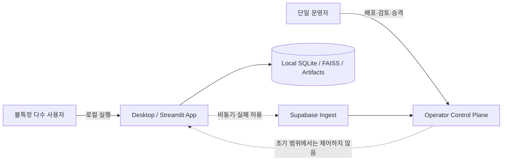

# 제품 범위와 운영 원칙

| 항목 | 값 |
| --- | --- |
| 상태 | 운영판 기획 초안 |
| 문서 버전 | 0.2.0 |
| 기획 책임자 | 기획자 |
| 기술 검토자 | 지정 필요 |
| 최종 갱신일 | 2026-08-09 |

> 현재 저장소의 개발 대상은 PoC/MVP다. 이 문서는 그 구현의 완료 보고서가 아니라, 별도로 진행할 운영판의 범위와 원칙을 검토하기 위한 초안이다. 현재 코드에 이미 있는 기능과 운영판에서 새로 만들 기능을 구분해 읽는다.

## 1. 목표

현재 PoC/MVP 금융 RAG 애플리케이션의 기능 축을 참고하되, 별도 운영판에서는 다음 역량을 갖추는 것을 목표로 한다.

- 어떤 코드·데이터·검색 정책·모델·설정으로 결과가 생성되었는지 재현한다.
- 불특정 다수에게 배포된 설치본에서 오류와 품질 저하를 개인정보 노출 없이 관측한다.
- 사용자가 명시적으로 제출한 이슈를 운영자가 분류하고 평가 사례로 전환한다.
- software package와 로컬 data/index의 revision을 분리해 검증하고, 각 설치본이 실제 사용한 조합을 재현한다.

서비스의 핵심 사용자 흐름은 유지하는 방향으로 검토한다. 이번 기획 범위는 검색·답변 기능 추가보다 데이터 계약, 버전 계보, 관측, 개선 과정을 정의하는 데 있다. 실제 운영판 구조는 기술 검토와 기획자 승인 뒤 별도 저장소에서 확정한다.

## 2. 운영 모델

`단일 운영자`는 사용자가 한 명이라는 뜻이 아니다. 운영 권한을 가진 관리 주체가 한 명이고, 배포 대상 사용자는 공개적이며 운영자 계정을 공유하지 않는다.

## 3. 제품 원칙

### PROD-001 — Local-first 권위

**[Product decision]** 검색·답변에 필요한 문서, catalog, vector index 및 현재 활성 revision의 기준 원본은 로컬이다.

수용 기준:

- Supabase가 끊겨도 검색·답변의 기존 provider 경로는 동일하게 동작한다.
- telemetry 전송 성공 여부가 답변 성공 여부를 바꾸지 않는다.
- Supabase 데이터를 조회하지 않아도 활성 로컬 revision을 판정할 수 있다.

`Local-first`는 full-offline을 뜻하지 않는다. 현재 [`src/llms/embeddings.py`](../../src/llms/embeddings.py)와 [`src/llms/factory.py`](../../src/llms/factory.py)의 query embedding/generation은 외부 model provider를 사용하므로 전체 네트워크 또는 provider 장애 시 답변을 완성할 수 없다. 이 경우 앱은 로컬 상태를 손상하지 않고 provider 오류를 명확히 표시해야 한다. local embedding/generation 또는 search-only degraded mode는 별도 제품 요구사항이다.

### PROD-002 — 원격 관측 실패 격리

**[Product decision]** Supabase는 보조 control plane이며 핵심 요청 경로의 동기 의존성이 아니다.

수용 기준:

- 사용자 요청 완료 전에 원격 telemetry 응답을 기다리지 않는다.
- 원격 장애 시 이벤트는 제한된 로컬 outbox에 저장되거나 정책에 따라 폐기된다.
- outbox 실패가 사용자 작업을 실패 상태로 바꾸지 않는다.

### PROD-003 — 공개 클라이언트는 신뢰 경계 밖에 둔다

**[Product decision]** 설치 파일과 네트워크 요청은 분석·변조·재전송될 수 있다고 가정한다.

수용 기준:

- 배포물에 Supabase secret key, legacy `service_role`, DB 비밀번호 또는 connection string이 없다.
- 공개 클라이언트가 application table을 직접 insert/read하지 않는다.
- 서버는 client timestamp, app version, installation ID, severity를 신뢰하지 않고 검증·제한한다.
- 공개 요청이 운영자 데이터 조회나 다른 사용자의 데이터 변경 권한을 얻지 못한다.

### PROD-004 — 기기 자격증명은 초기 필수 조건이 아니다

**[Product decision]** 기본 운영 이벤트와 이슈 POST를 위해 기기별 secret credential을 발급하지 않는다.

- `installation_id`는 최초 실행 시 생성하는 무작위 UUID이며 하드웨어 fingerprint가 아니다.
- 사용자는 로컬 데이터 초기화로 `installation_id`를 재설정할 수 있다.
- `installation_id`는 상관관계·rate limit 보조값이지 인증 수단이 아니다.
- publishable key는 공개되어도 되는 프로젝트 식별 수단이지 클라이언트 진위 증명이 아니다.

다음 증거가 생기면 짧은 수명의 서버 발급 기기 토큰을 의사결정 검토안으로 비교한다. 운영판에서 채택하면 그 저장소의 ADR로 기록한다.

- IP 기반 제한만으로 제어할 수 없는 지속적 악용
- 설치 단위 quota/revocation의 운영상 필요
- 합법적 사용자를 과도하게 차단하는 공유 IP 문제

device token을 도입해도 공개 바이너리의 비밀로 간주하거나 genuine-app 증명으로 표현하지 않는다.

### PROD-005 — 최소 수집과 명시적 동의

**[Product decision]** 자동 수집은 동작·성능·오류의 구조화된 메타데이터로 제한한다. 질문, 답변, 문서 본문, screenshot 등 내용 데이터는 사용자가 제출 화면에서 확인하고 동의한 경우에만 보낸다.

수용 기준:

- 자동 이벤트 스키마에 raw question, full answer, prompt, retrieved chunk, PDF body, embedding이 없다.
- 이슈 제출 UI가 전송 항목과 제외 항목을 미리 보여준다.
- 사용자 코멘트와 선택 turn은 명시적 제출 행위 후에만 전송된다.
- 모든 outbound payload는 allowlist 기반 redaction과 크기 제한을 통과한다.

### PROD-006 — 관측 데이터의 자동 승격 금지

**[Product decision]** 원격으로 수집된 이벤트와 이슈는 개선 후보일 뿐, 평가 정답이나 production 변경 명령이 아니다.

수용 기준:

- `trust_level=anonymous` 데이터가 자동으로 evaluation suite에 들어가지 않는다.
- 운영자가 재현 조건과 기대 결과를 승인해야 회귀 후보가 `ready` 상태로 이동한다.
- 원격 데이터가 자동으로 prompt, model, chunk 정책, active snapshot을 변경하지 않는다.

### PROD-007 — 재현 가능한 실행 조합

**[Product decision]** 이슈와 평가 run은 중앙에서 식별 가능한 software release와 설치별 local runtime revision을 분리해 참조해야 한다.

`SoftwareReleaseManifest`는 app/build/code/dependency/schema compatibility/prompt/model/default config를 식별한다. `LocalRuntimeRevision`은 corpus/retrieval profile/base snapshot/active delta/composite/publication state를 식별한다. 평가 근거는 별도의 suite revision과 PromotionRecord를 가진다. 상세 규칙은 [버전과 계보 정책](03_VERSIONING_AND_LINEAGE.md)에 따른다.

### PROD-008 — 승인·배포·활성화·롤백 분리

**[Product decision]** 중앙 운영자의 `promotion`은 배포 가능한 software package와 검증 조합을 승인하는 행위다. 공개 설치본을 원격에서 자동 활성화하거나 롤백한다는 뜻이 아니다.

수용 기준:

- 초기 배포는 manual installer workflow를 사용하고 candidate, qualified, published, installed, locally active 상태를 구분한다.
- software rollback은 이전에 검증된 installer/package와 local DB backup/compatibility 절차를 사용한다.
- data/index rollback은 각 설치본의 retrieval publication/recovery 경로에서 predecessor local revision으로 수행한다.
- 중앙 Supabase 상태가 설치본의 software 또는 active snapshot을 자동 변경하지 않는다.
- software와 local runtime을 함께 검증한 근거는 PromotionRecord에 두 revision을 모두 기록한다.

## 4. 범위

### 포함

- 데이터 사전과 데이터별 생애주기
- chunk/overlap/extractor/embedding을 포함한 retrieval profile versioning
- software release, local runtime, server ingest, evaluation suite 계보
- 비차단 로컬 outbox와 Supabase 공개 ingest 경계
- 구조화된 모니터링, 명시적 이슈 제출, 관리자 조회
- 평가, canary, 승격, 롤백, 사후 회귀 사례 등록
- Figma 기반 시각적 기획 지식베이스: 시스템 경계, 데이터 계보, 상태 생애주기, 운영 화면을 한눈에 탐색·리뷰

### 제외

- Supabase를 답변·검색의 원본 DB로 전환
- 사용자 계정, 결제, 조직별 multi-tenancy
- 원격에서 로컬 파일·대화·index를 직접 제어하는 기능
- 모든 raw log와 대화를 중앙에 수집하는 기능
- 수집 데이터만으로 자동 학습·자동 prompt 수정·자동 배포
- 완전한 MDM, 코드 서명, genuine-device attestation

## 5. 핵심 사용자 흐름

### 일반 사용

1. 사용자가 로컬 앱을 실행한다.
2. 앱은 packaged SoftwareReleaseManifest와 local data/index revision을 각각 검증한다.
3. 질문과 답변은 로컬 권위 데이터에 기반해 처리한다.
4. 구조화된 이벤트는 로컬 outbox에 비동기로 기록된다.
5. 네트워크 가능 시 batch POST하고, 실패 시 재시도 또는 만료한다.

### 이슈 제출

1. 사용자가 현재 turn에서 `문제 신고`를 선택한다.
2. 앱은 자동 포함되는 진단 필드와 선택 포함 가능한 내용을 보여준다.
3. 사용자가 코멘트와 포함 범위를 확인하고 제출한다.
4. 다중 turn 재현 정보는 별도 동의가 있을 때만 최대 8개 turn의 질문과 제한된 검색 상태를 포함하며, 이전 답변 본문은 제외한다.
5. 별도 로컬 신고 산출물은 만들지 않고 bounded 원격 payload를 retry-only outbox에 기록한다. 이 durable 기록이 성공한 뒤에만 접수 완료를 안내한다.
6. outbox 기록 이후의 원격 전송 상태는 사용자에게 노출하지 않고 background worker에서 처리한다.
7. 영구 거절 또는 재시도 만료는 조용히 실패 처리하고 해당 outbox payload를 삭제한다.
8. 운영자는 원격 이슈를 triage하되, 기대 결과 승인 전에는 평가 사례로 승격하지 않는다.

### 운영자 개선

1. 버전별 오류·no-result·latency·이슈 추이를 본다.
2. 현상을 data/extraction/chunk/retrieval/ranking/prompt/model/UI/network 층으로 분류한다.
3. 재현 manifest와 승인된 기대 결과를 만든다.
4. 한 번에 하나의 주요 변수를 바꾼 후보를 평가한다.
5. 품질 게이트와 canary를 통과한 software/runtime 검증 조합만 `qualified`로 승인한다.
6. 수동 배포 후 악화 시 software package와 local retrieval revision의 영향 영역을 구분해 각 rollback runbook을 실행한다.

### 초기 수동 배포

1. 운영자가 clean build에서 package digest와 SoftwareReleaseManifest를 생성한다.
2. 고정된 reference LocalRuntimeRevision에서 평가·canary를 완료한다.
3. PromotionRecord로 `qualified`를 승인한다.
4. installer를 승인된 배포 채널에 게시한다. 이 시점이 `published`다.
5. 사용자가 수동으로 설치하고, 앱이 package integrity와 local schema compatibility를 확인한 뒤 활성화한다.
6. 실패 시 기존 local data backup을 보존한 채 이전 호환 installer로 복구한다.

자동 갱신과 중앙 강제 복구는 초기 범위에 없다. 향후 도입할 경우 패키지 서명, 갱신 파일 진위 확인, 단계적 배포, 원자적 활성화를 운영판 저장소의 별도 의사결정 기록으로 승인한다.

## 6. 성공 기준

초기 production 준비 완료 조건은 다음과 같다.

| 지표 | 초안 기준 | 확정 방식 |
| --- | --- | --- |
| telemetry 격리 | 원격 장애 때문에 실패한 사용자 요청 0건 | fault injection |
| 민감 내용 자동 전송 | allowlist 외 content field 0건 | contract/security test |
| 재현 가능성 | 수집된 오류·평가 run 100%가 software manifest와 local runtime revision 참조 | contract + audit query |
| 중복 방지 | 동일 `event_id` 재전송 시 논리 row 1개 | idempotency integration test |
| 알려지지 않은 software manifest | 정상 지표와 분리되어 quarantine; valid unknown local revision은 unverified cohort | ingest integration test |
| 개선 통제 | 익명 이슈의 자동 suite 등록·자동 승격 0건 | state-transition test |
| 운영 가시성 | app/error/issue/release별 최소 dashboard 제공 | operator acceptance test |

latency, event delivery, error-rate 경보의 숫자 임계값은 실제 canary 2주 데이터를 기준으로 확정한다. 측정 전 임의의 SLO를 production 약속으로 사용하지 않는다.

## 7. 오픈 결정

| ID | 질문 | 초안 제안 | Owner | Gate |
| --- | --- | --- | --- | --- |
| PD-001 | 자동 운영 이벤트 기본 동의 방식 | 고지 후 기본 허용, 언제든 opt-out | Product / Legal | 외부 베타 |
| PD-002 | issue screenshot 허용 여부 | 초기에는 비활성, 별도 private upload 완성 후 허용 | Product / Security | 첨부 구현 |
| PD-003 | 사용자에게 전송 성공을 어떻게 표시할지 | 로컬 접수와 원격 전송 상태를 구분 | Product / UX | UI 설계 |
| PD-004 | 공개 ingest kill switch 발동 기준 | 비용/오류/악용 기준 3종 | Product / Engineering | 운영 리허설 |
| PD-005 | 지원 가능한 과거 release 범위 | 최근 2개 minor 제안 | Product / Engineering | 첫 정식 릴리스 |
| PD-006 | Windows code signing | 공개 GA에는 적용 권장, 인증서/비용 검토 | Product / Security | 공개 GA |
| PD-007 | installer 배포 채널 | authenticated HTTPS 채널 + 독립 checksum | Product / Release | 외부 beta |

