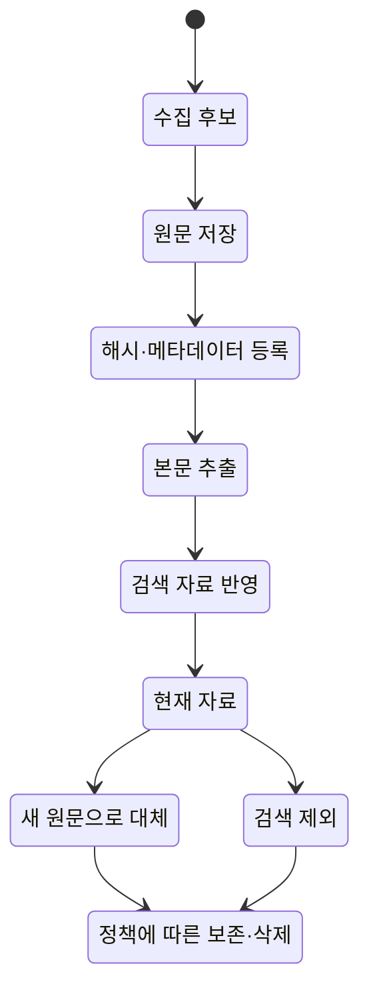
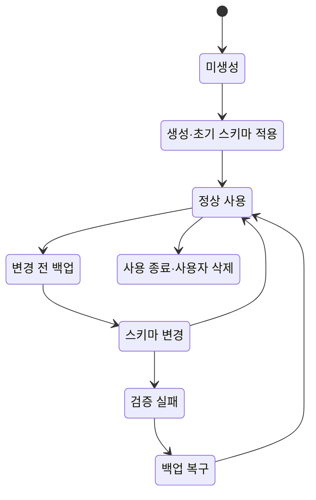
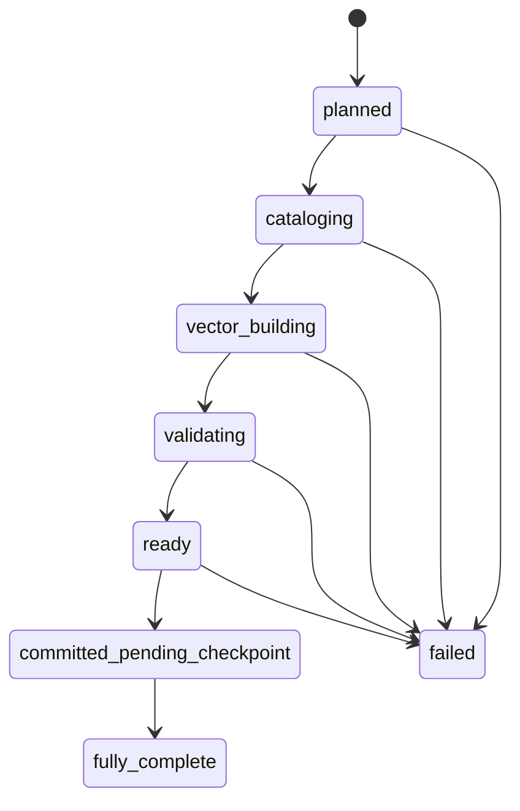
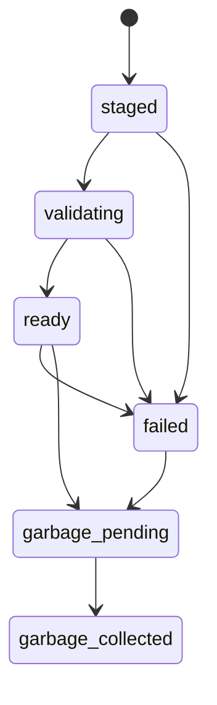
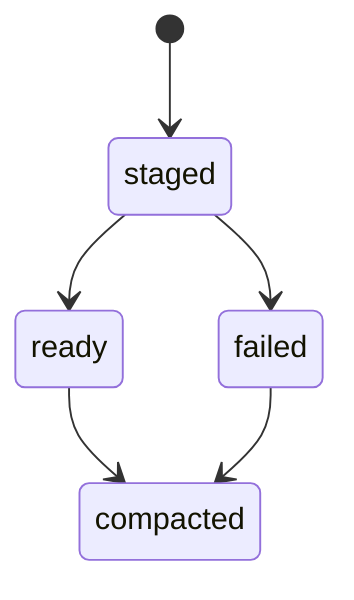
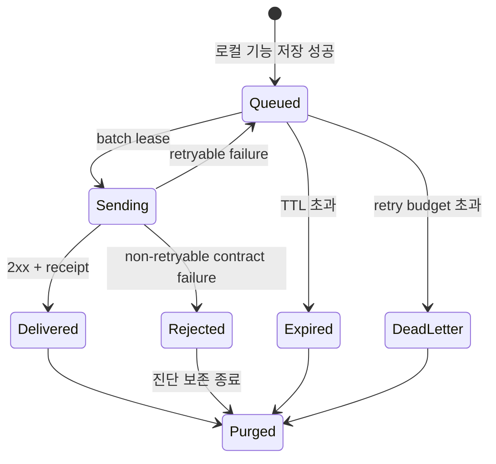
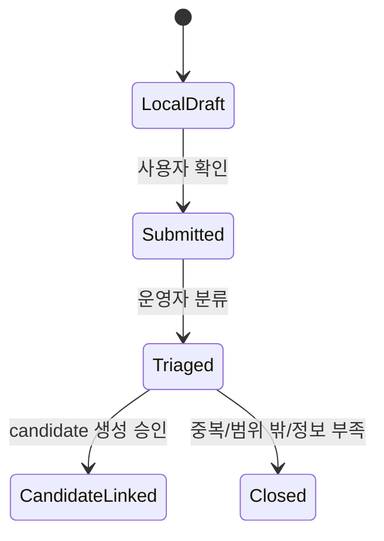
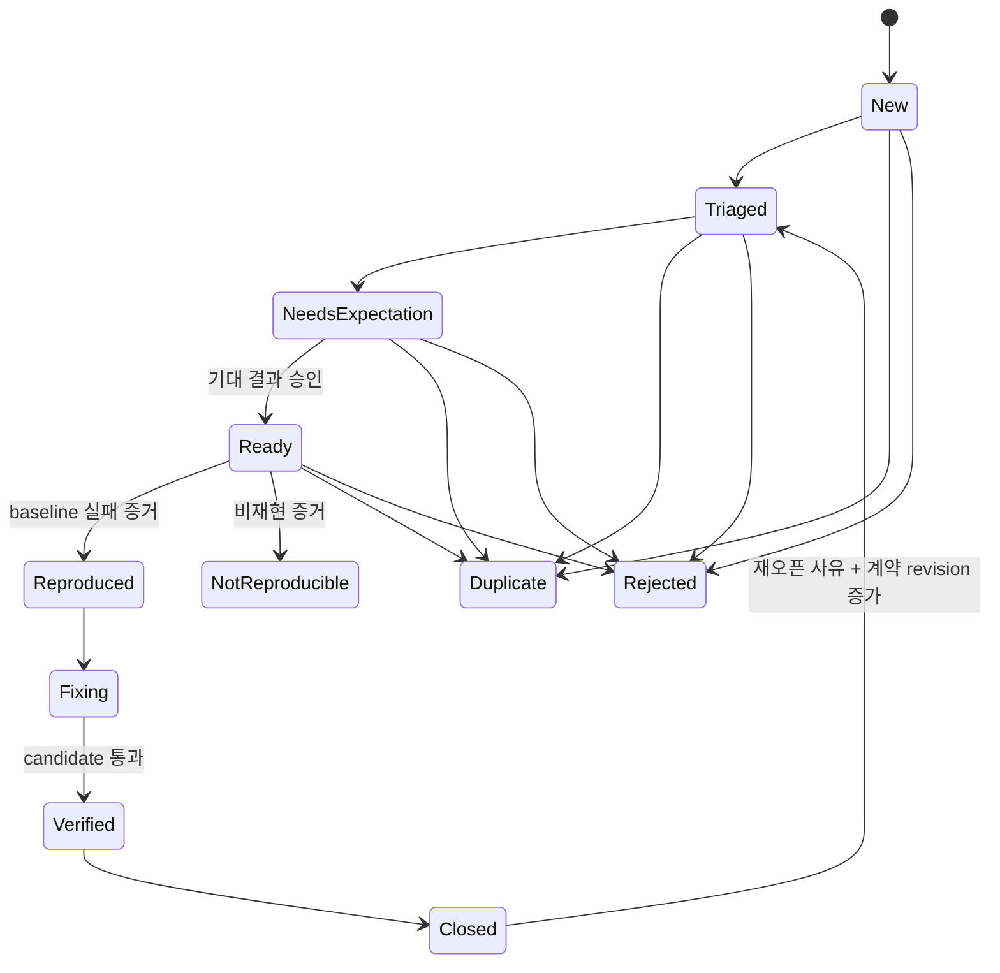

# 데이터 정의와 생애주기

| 항목 | 값 |
| --- | --- |
| 상태 | 운영판 기획 초안 |
| 문서 버전 | 0.2.0 |
| 기획 책임자 | 기획자 / 데이터 관리 책임자 |
| 기술 검토자 | 지정 필요 |
| 최종 갱신일 | 2026-08-09 |

## 1. 데이터 분류 원칙

데이터는 저장 위치가 아니라 의미와 권위에 따라 분류한다.

| 등급 | 정의 | 예시 | 기본 전송 정책 |
| --- | --- | --- | --- |
| Public metadata | 공개되어도 무방한 제품 정보 | release version, schema version | 자동 허용 |
| Operational pseudonymous | 직접 식별자는 없지만 설치·trace를 연결 가능 | installation ID, latency, error code | 고지·opt-out 하에 자동 허용 제안 |
| User-provided content | 사용자가 직접 입력하거나 선택한 내용 | issue comment, selected turn | 명시적 제출 시에만 허용 |
| Sensitive local content | 원본 또는 광범위한 문맥 | PDF body, full conversation, retrieved chunks | 자동 전송 금지 |
| Secret | 권한을 부여하는 값 | provider key, service role, DB password | 저장·전송·로그 금지 |

`installation_id`, `trace_id`, hash는 개인정보가 아니라고 단정하지 않는다. 다른 데이터와 결합될 가능성이 있으므로 pseudonymous 데이터로 보존·접근을 제한한다.

## 2. 데이터 사전

`PoC/MVP 구현`은 현재 코드에 대응하는 영속 객체가 있다는 뜻이다. `운영판 목표`는 별도 운영판의 구현 대상, `개념`은 흐름 설명용이며 별도 자료로 저장되지 않았다는 뜻이다.

| 상태 | 데이터 객체 | 의미 / 핵심 식별자 | 권위 저장소 | 생성 | 종료 조건 |
| --- | --- | --- | --- | --- | --- |
| PoC/MVP 구현 | PDF 원문 / 보고서 | 수집 원본과 메타데이터, `report_uid`, `source_sha256` | 로컬 파일·카탈로그 | 수집·가져오기 | 원문 보존·삭제 정책은 운영판에서 확정 필요 |
| 개념 | 추출 문서 | 추출기의 임시 결과; 현재 독립 ID·자료 없음 | 빌드 메모리·임시 경로 | 본문 추출 | 분할 완료 또는 빌드 실패 |
| PoC/MVP 구현 | 부모 문단 / 청크 | 검색 단위, `parent_uid` / `chunk_uid` | 로컬 SQLite 카탈로그 | 문서 분할 | 논리 레코드와 물리 검색 자료 정리를 분리 |
| PoC/MVP 구현 | 벡터 값 | 임베딩 값과 검증 합계 | 로컬 불변 자료 | 임베딩 | 참조 스냅숏 보존 종료 후 정리 |
| PoC/MVP 구현 | 검색 정책 | 추출·분할·겹침·임베딩 정책, `profile_id` / `profile_hash` | 로컬 카탈로그·목록 파일 | 정책 확정 | 불변; 새 정책은 새 식별자 |
| PoC/MVP 구현 | 자료 묶음 목록 | 포함·제외 원문 결정, `source_manifest_sha256` | 로컬 빌드 자료 | 빌드 | 불변; 후속 버전으로 대체 가능 |
| PoC/MVP 구현 | 빌드 / 스냅숏 | 검증된 검색 산출물, `build_id` / `snapshot_id` | 로컬 카탈로그·FAISS | 빌드·게시 | 상태와 참조에 따라 물리 정리 |
| PoC/MVP 구현·운영판 검토 | 로컬 실행 자료 버전 | 기본 스냅숏 + 게시 세대 + 활성 증분 자료의 정확한 상태 | 로컬 실행 환경·카탈로그 | 게시·갱신 | 다음 로컬 버전으로 대체 |
| 운영판 목표 | 프로그램 배포 정보 | 코드·빌드·의존성·스키마 호환성·프롬프트·모델·기본 설정 | 배포 파일·Git 자료 | 깨끗한 빌드 | 불변; 승인 상태는 별도 기록 |
| 운영판 목표 | 배포 승인 기록 | 프로그램과 기준 로컬 자료의 평가·배포 승인 근거 | 추가만 가능한 결정 기록 | 운영자 결정 | 후속 기록으로 상태 전개 |
| 운영판 목표 | 서버 수집 배포 정보 | 서버 코드, 검증·가림·사용량 제한 정책, DB 변경 버전 | 서버 배포 자료 | 서버 배포 | 불변; 접수 확인에 해시 기록 |
| PoC/MVP 구현 | 대화 | 로컬 사용자 대화 | 로컬 대화 DB | 사용자 대화 | 사용자 삭제·보존 정책 |
| 운영판 목표 | 운영 이벤트 | 내용 본문을 제외한 운영 사건, `event_id` | 로컬 전송 대기함 → Supabase | 실행 중 | 원격 보존 기간 만료 |
| PoC/MVP 구현·운영판 목표 | 이슈 | 최소정보 원격 신고, `event_id`/server receipt | retry-only 로컬 outbox → Supabase | 사용자 제출 | 로컬 ack 즉시 삭제 + 원격 보존 만료 |
| 기획자 입력 필요 | 평가 사례 | 승인된 기대 결과와 평가 묶음 버전 | Git의 버전 관리 파일 | 운영자 승인 | 후속 버전으로 대체; 이력 유지 |
| PoC/MVP 구현·운영판 목표 | 평가 실행 | 로컬 실행 자료는 구현, 원격 정식 등록은 목표, `run_id` | 로컬 자료 + 향후 Supabase 요약 | 평가 실행 | 보존·보관 정책 |
| 운영판 선택 항목 | 첨부 | 사용자가 동의한 재현 보조 파일 | 로컬 + 비공개 저장소 | 명시적 첨부 | 이슈 종료 후 보존 기간 만료 |
| 운영판 목표 | 전송 대기 / 영구 실패 | 전송 대기·실패의 제한된 상태 | 로컬 전송 대기함 | 전송 요청·재시도 소진 | 시간 제한 또는 사용자 초기화 |

## 3. 권위와 복제 규칙

### DATA-001 — 로컬 데이터 권위

**[Product decision]** Source Document부터 Local Runtime Revision까지는 로컬이 권위 원본이다. Supabase에는 검색을 재구성할 raw document, chunk, vector를 복제하지 않는다.

### DATA-002 — 원격 데이터는 관측 사본

**[Product decision]** Telemetry Event, Issue Report, Evaluation Run summary는 운영을 위한 사본이다. 원격 row 유실 또는 지연이 로컬 결과의 유효성을 바꾸지 않는다.

### DATA-003 — 로컬 저장 우선

**[Product decision]** 사용자 답변, 이슈 제출, 평가 결과는 각 기능의 로컬 저장이 성공한 다음에만 원격 이벤트를 enqueue한다.

### DATA-004 — 단방향 초기 경계

**[Product decision]** 초기 production에서는 다음 단방향만 허용한다.

```text
Local authoritative state
  -> redact / normalize
  -> bounded local outbox
  -> public HTTPS ingest
  -> Supabase application tables / private Storage
```

Supabase에서 받은 데이터가 로컬 active snapshot, prompt, model 또는 config를 자동 변경하는 역방향 동기화는 금지한다.

## 4. 공통 이벤트 계약

아래는 기획 수준의 논리 계약이다. 실제 JSON Schema와 타입은 개발자가 version-controlled contract로 추가한다.

```json
{
  "event_id": "uuid",
  "event_schema_version": 1,
  "event_type": "interaction_failed",
  "occurred_at": "client timestamp",
  "installation_id": "random resettable uuid",
  "session_id": "ephemeral uuid",
  "trace_id": "uuid",
  "software_release_manifest_hash": "sha256",
  "local_runtime_revision": {
    "revision_hash": "sha256",
    "base_snapshot_id": "id",
    "publication_generation": 0,
    "write_epoch": 0,
    "composite_revision": "sha256",
    "delta_generation": 0
  },
  "trust_level": "anonymous",
  "payload": {
    "error_code": "stable bounded enum",
    "latency_ms": 0
  },
  "redaction_version": 1
}
```

서버는 `received_at`, `ingest_deployment_manifest_hash`, `source_ip_hash` 또는 rate-limit용 파생값, validation 결과를 별도로 기록한다. raw IP의 저장 여부와 기간은 법적·보안 검토 후 결정하며, 제품 분석용 식별자로 사용하지 않는다.

### 필수 성질

- `event_id`는 클라이언트에서 한 번 생성하고 재시도마다 유지한다.
- `(event_id)`에는 unique constraint를 적용해 at-least-once 전송을 멱등 처리한다.
- `event_schema_version`과 `redaction_version`이 없으면 정상 데이터로 받지 않는다.
- `software_release_manifest_hash`가 알려지지 않은 값이면 `quarantined`로 분리한다.
- 처음 보는 `local_runtime_revision`은 정상적인 설치별 data 차이일 수 있으므로 그 이유만으로 quarantine하지 않는다. 형식·지원 schema를 검증한 뒤 `unverified_claim`으로 관측하며, artifact 증거가 있는 운영자 run만 `operator_verified`로 승격한다.
- 자유 형식 key와 무제한 JSON 중첩은 허용하지 않는다.
- 클라이언트의 severity·timestamp·app version은 검증 전까지 주장(claim)일 뿐이다.

## 5. 자동 수집, 선택 수집, 금지 데이터

### 자동 수집 허용

- event/trace/session/installation 식별자
- software release manifest, local runtime/snapshot/composite/profile/schema/redaction version 또는 hash
- route, job status, 처리 단계, stable error code, exception type, stack hash
- latency와 bounded count: retrieved count, cited count, result count
- no-result, retry, outbox health, evaluation verdict
- OS/app runtime의 coarse category. 정확한 username, hostname, 절대 경로는 제외한다.

### 사용자가 확인한 뒤 선택 수집

- 문제 설명과 기대 동작
- 선택한 질문/답변 turn
- 사용자가 직접 선택한 이전 turn
- screenshot 또는 재현 artifact

### 자동 수집 금지

- raw PDF, parsed body, parent/chunk text
- embedding/vector
- 전체 대화와 전체 prompt/context
- provider request/response 원문
- raw stack trace와 로컬 절대 경로
- 환경 변수, API key, token, cookie, DB connection
- 사용자가 선택하지 않은 파일과 screenshot

## 6. 데이터 객체별 생애주기

### DATA-008 — 객체별 상태 계약

PDF 원문, 데이터베이스, 데이터베이스 레코드, 벡터 검색 자료, 대화, 이슈, 회귀 후보, 평가 자료는 생성 이유와 종료 조건이 다르다. 하나의 일반 `자료 상태`로 합치지 않는다. 현재 PoC/MVP 객체는 코드의 상태 전이를 기준으로 설명하고, 운영판 객체는 별도 구현 전까지 목표 흐름으로 표시한다.

### 6.1 PDF 원문 문서

PDF 파일 자체의 생애주기와 PDF에서 파생된 DB 레코드·청크·벡터의 생애주기를 분리한다.



현재 PoC/MVP는 내려받은 PDF를 로컬에 보존하고 원문 해시와 보고서 정보를 카탈로그에 기록한다. 추출이 실패한 문서는 검색 자료에 넣지 않고 재시도 대상으로 남길 수 있다. 원문 삭제·보존 기간과 사용자가 직접 가져온 PDF 처리 기준은 운영판 기획자가 확정해야 한다.

### 6.2 로컬 데이터베이스 파일

데이터베이스 생애주기는 테이블 안의 개별 레코드 상태가 아니라 DB 파일·스키마·백업·복구의 흐름을 뜻한다.



현재 저장소의 로컬 카탈로그 DB와 대화 DB는 이 범주에 속한다. 운영판에서는 전송 대기함 DB가 추가될 수 있다. 원격 Supabase DB는 별도 객체이며 `마이그레이션 작성 → 검토 → 시험 환경 적용 → 검증 → 운영 환경 적용 → 보존·삭제 작업`의 흐름을 가져야 한다. Supabase 백업 보존과 애플리케이션 레코드 보존을 같은 것으로 간주하지 않는다.

### 6.3 DB 레코드와 검색 단위

보고서 메타데이터, 부모 문단, 청크는 PDF 원문에서 파생되지만 독립 식별자를 가진다.

```text
PDF 등록
  → report_uid와 source_sha256 생성
  → 본문 추출 성공
  → parent_uid / chunk_uid 생성
  → 후보 빌드에 포함
  → 게시된 활성 검색 보기에서 조회
  → 원문 변경·삭제 시 후속 버전 또는 제외 동작 기록
  → 활성 참조와 보존 근거가 사라진 뒤 물리 자료 정리
```

현재 PoC/MVP에서는 논리 레코드 삭제와 과거 이력 정리가 일반 사용자 기능으로 완성되어 있지 않다. 따라서 운영판 문서에서 `삭제 완료`로 표현하지 않고, 삭제 요구와 실제 물리 정리를 별도 검증 항목으로 둔다.

### 6.4 검색 빌드·벡터 스냅숏·증분 자료

하나의 일반 `artifact` 상태로 합치지 않고 현재 executable schema의 객체별 상태를 기준으로 삼는다.







Build는 durable audit record이고, snapshot/delta의 실제 transition guard는 [`src/retrieval/schema.py`](../../src/retrieval/schema.py)와 [`src/retrieval/delta_schema.py`](../../src/retrieval/delta_schema.py)가 기준 원본이다. Figma와 이 문서는 상태를 설명하며 코드와 다른 새 상태를 만들지 않는다.

### DATA-007 — Artifact hold와 GC

ID를 기록하는 것만으로 재현 가능성이 보장되지 않는다. unresolved issue, baseline/candidate, qualifying evaluation run, locally active revision, rollback predecessor가 참조하는 build/snapshot/delta/artifact에는 `artifact_hold` 또는 동등한 retention lease를 건다.

- hold는 `reference_type`, `reference_id`, artifact identity, purpose, created/released/expiry 정보를 가진다.
- unresolved issue와 qualifying release evidence의 hold는 자동 TTL만으로 해제하지 않는다.
- promotion readiness는 ID뿐 아니라 artifact 존재, size, checksum/hash를 확인한다.
- GC는 active runtime reference와 모든 hold가 없고 정책상 보존 기간이 지난 경우에만 허용한다.
- hold가 만료·해제되면 actor, reason, evidence를 남긴다.

### 6.5 로컬 대화

대화는 `대화 묶음 생성 → 사용자·도우미 메시지 누적 → 다시 열기 → 사용자 삭제` 흐름을 가진다. 현재 대화는 로컬 `conversations.db`가 기준 원본이며 원격으로 자동 복제하지 않는다. 운영판에서 보존 기간이나 선택 대화 제출 기능을 도입하더라도 전체 대화와 사용자가 제출에 동의한 일부 대화를 같은 객체로 취급하지 않는다.

### 6.6 원격 전송 대기함

> 운영판 목표 흐름이며 현재 PoC/MVP에는 구현되어 있지 않다.



**[Engineering extension]** SQLite outbox가 권장된다. enqueue와 상태 전이는 원자적으로 수행하고, process crash 후 lease를 회수하며, 크기와 TTL 상한을 둔다. JSONL을 선택한다면 동시성·부분 write·ack compact 안전성을 별도로 증명해야 한다.

### 6.7 원격 운영 이벤트

> 운영판 목표 흐름이며 현재 PoC/MVP에는 구현되어 있지 않다.

```text
received -> validated -> accepted | duplicate | sampled_out | quarantined | rejected
accepted -> retained -> aggregated(optional) -> expired -> deleted
sampled_out -> bounded receipt/aggregate counter(optional) -> deleted
quarantined -> reviewed -> accepted | deleted
```

`duplicate`와 정책에 따른 `sampled_out`은 재시도 대상 오류가 아니다. 둘 다 성공 계열 bounded receipt를 반환해 로컬 outbox가 같은 event를 반복 전송하지 않게 한다. `sampled_out` payload는 정상 event row로 보존하지 않으며, `quarantined` 데이터는 정상 dashboard·SLO에서 제외한다.

### 6.8 이슈



원격 이슈의 사용자 접수 상태와 개발용 회귀 후보 상태는 서로 다른 객체다. 원격 이슈 접수는 운영판 목표이며, 현재 PoC/MVP는 로컬 이슈 파일을 저장한다.

### 6.9 회귀 후보

회귀 후보가 만들어진 뒤 현재 코드와 맞추는 상태는 다음과 같다.



현재 코드의 회귀 후보 상태와 정렬하되, 원격 issue row가 로컬 evaluation candidate로 자동 변환되지 않도록 사람이 승인 경계를 유지한다. `duplicate`는 유효한 다른 candidate와 사유가, `rejected`는 운영자 결정과 사유가 필요하다. `not_reproducible`은 `ready` 상태에서 현재 비재현 증거가 있을 때만 허용한다. `closed → triaged` 재오픈은 사유를 필수로 하고 기대 결과 승인·fix·closure·suite 연결 필드를 초기화한 뒤 contract revision을 증가시킨다.

### 6.10 평가 사례와 평가 실행

- 평가 사례는 기대 결과, 입력 자료, 판정 방식, 통과 기준이 승인되면 불변 버전을 얻는다.
- 평가 실행은 변경 후보의 프로그램 버전, 정확한 로컬 실행 자료 버전, 평가 묶음 버전을 모두 참조한다.
- 같은 사례가 바뀌면 과거 실행을 수정하지 않고 새 평가 묶음 버전을 만든다.
- 결과가 매번 달라질 수 있는 모델은 반복 횟수와 주요 실행 조건을 함께 기록한다.
- 현재 저장소에는 실행 코드가 있으나 승인된 기준 질문 파일이 없으므로 기획자가 질문·기대 결과를 채우기 전에는 운영판 평가 생애주기가 시작된 것으로 보지 않는다.

## 7. 보존과 삭제 초안

### DATA-009 — Retention 실행과 감사

보존 기간은 문서 숫자만으로 완료되지 않는다. server/local configuration revision, scheduled job, dry-run, 삭제 결과, 실패 재시도, backup restore 후 재적용 절차를 함께 version-control하고 운영 증거를 남긴다.

| 데이터 | 초안 보존 | 삭제 트리거 | 비고 |
| --- | --- | --- | --- |
| 로컬 outbox active/retry payload | 최초 실패 후 최대 3회 재시도, 최대 7일 또는 50MB | 먼저 도달한 한도 | 전송 재시도에만 사용 |
| 로컬 outbox delivered/rejected/dead-letter/expired payload | 0일 | terminal outcome 확정 즉시 | 행 삭제, secure-delete와 WAL truncate를 best-effort 적용 |
| Raw operational event | 30일 | scheduled retention job | 2주 baseline 후 조정 |
| 익명 집계 지표 | 12개월 | 월별 retention job | 재식별 가능한 차원 금지 |
| Quarantined/rejected payload | 7일 | 자동 삭제 | raw body 대신 reason 중심 |
| Issue metadata/comment | close 후 180일 | 자동 삭제 또는 비식별화 | 법적 요구 시 조정 |
| Attachment | close 후 90일 | Storage object + metadata 삭제 | DB backup은 object bytes를 포함하지 않음 |
| Evaluation case | supersede 후에도 이력 유지 | 명시적 governance 삭제 | 결과 재현 목적 |
| Evaluation run | 12개월 | archive/delete | 릴리스 근거 run은 더 오래 보존 가능 |
| Software/ingest manifest와 promotion record | 영구 | 삭제하지 않고 후속 record로 상태 전개 | 감사·배포·롤백 이력 |
| Held retrieval artifact | hold가 해제되고 기본 보존 조건을 충족할 때까지 | explicit release + reference audit | unresolved issue/평가/rollback 근거 보호 |

보존 기간은 production 승인 전 확정하며, Supabase plan의 backup/log retention과 동일하다고 가정하지 않는다. 과거 DB backup을 복원하면 restore point 이후 삭제된 row가 다시 나타나며 retention/delete 절차를 재적용할 때까지 유지될 수 있다. 이 가능 기간과 재삭제 절차를 개인정보 고지와 runbook에 명시한다.

### DATA-005 — 삭제 일관성

사용자 삭제 또는 retention job은 DB metadata와 Storage object를 각각 처리하고 결과를 감사한다. Supabase DB backup은 Storage object bytes의 backup이 아니므로, restore runbook은 DB retention 재실행과 Storage metadata/object reconciliation을 별도 단계로 수행한다.

### DATA-006 — 크기 제한

초기 후보값은 다음과 같으며 부하 테스트 후 승인한다.

| 항목 | 후보 상한 |
| --- | ---: |
| batch event 수 | 20 |
| batch HTTP body | 128 KiB |
| 단일 automatic event | 16 KiB |
| issue comment | UTF-8 4 KiB |
| 선택 turn 합계 | UTF-8 32 KiB |
| attachment | 5 MiB, 1개 |

서버와 클라이언트 양쪽에서 제한하되 서버 제한이 최종 권위다.

## 8. 물리 구조에 대한 개발 확장 항목

**[Engineering extension — 작성 필요]**

- event/issue/evaluation/release JSON Schema 위치와 호환 정책
- Supabase `app_events`, `issue_reports`, `canonical_evaluation_runs`, `software_release_manifests`, `promotion_records`, `ingest_deployment_manifests`, `ingest_quarantine` DDL
- index, partition, unique constraint, foreign key와 cascade 정책
- RLS/grant와 operator role
- local outbox schema version 및 migration ledger
- artifact hold/retention lease schema와 GC reference audit
- retention Cron과 Storage object 삭제 트랜잭션/보상 절차
- redaction allowlist와 golden test fixture
- backup/restore 및 deletion verification runbook

## 9. 검증 기준

| Requirement | 검증 증거 |
| --- | --- |
| DATA-001/002 | Supabase 없이 local E2E 통과, 원격 DB에 chunk/vector가 없다는 schema audit |
| DATA-003 | local commit 실패 시 outbox row가 생기지 않는 테스트 |
| DATA-004 | 원격 응답이 active local state를 변경하지 않는 integration test |
| DATA-005 | issue 삭제 후 DB/Storage/검색 결과 audit |
| DATA-006 | 경계값·초과값 contract test와 413/422 처리 |
| DATA-007 | unresolved issue/qualifying run이 참조한 artifact GC 거부와 hold 해제 audit |
| DATA-008 | 각 객체의 허용/금지 transition contract test와 Figma state 일치 검사 |
| DATA-009 | retention dry-run/실행/실패 재시도/restore 후 재삭제 audit |

