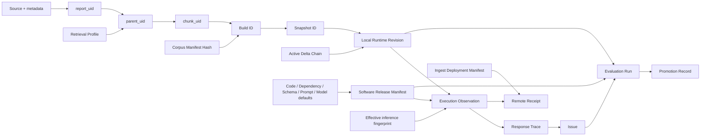

# 버전과 계보 정책

| 항목 | 값 |
| --- | --- |
| 상태 | 운영판 기획 초안 |
| 문서 버전 | 0.1.0 |
| 기획 책임자 | 기획자 / 개발자 공동 |
| 기술 검토자 | 지정 필요 |
| 최종 갱신일 | 2026-08-09 |

> 현재 PoC/MVP 저장소에 이미 구현된 식별 방식은 현황으로 설명하고, 프로그램 배포·서버 수집·승인 기록까지 포함한 규칙은 별도로 개발할 운영판의 검토안으로 다룬다. 운영판 저장소에서 승인되기 전에는 확정 계약이 아니다.

## 1. 결정 요약

`디버깅에 영향을 주는 요소만 버전업`이라는 표현은 범위가 주관적이므로 다음 규칙으로 바꾼다.

> 동작, 호환성, 재현성, 안전성 또는 운영 판단을 바꿀 수 있는 요소는 해당 식별자가 바뀌어야 한다.

반대로 문구 교정, Figma 정렬, 설명 보강처럼 runtime 결과와 계약을 바꾸지 않는 변경은 문서 버전만 올리고 application SemVer나 data revision은 올리지 않는다.

하나의 `전체 버전` 숫자나 manifest에 서로 다른 lifecycle을 섞지 않는다. production trace는 다음 네 축을 연결한다.

1. 중앙에서 배포한 `SoftwareReleaseManifest`.
2. 각 설치본에서 실제 사용한 `LocalRuntimeRevision`.
3. 요청을 받은 서버의 `IngestDeploymentManifest`.
4. 평가·승격 근거인 `EvaluationSuiteRevision`과 `PromotionRecord`.

### VER-001 — 실행 관측 튜플

모든 production response, issue, event, evaluation run은 `software_release_manifest_hash`와 exact `local_runtime_revision`을 분리해 기록한다. 원격 접수 row에는 서버가 `ingest_deployment_manifest_hash`를 추가한다.

### VER-002 — 자동 식별 우선

content로 결정 가능한 code/build, data, profile, prompt, config, dependency, suite는 수동 이름보다 canonical serialization의 hash를 기준으로 식별한다. publication generation처럼 순서를 나타내는 값은 별도 monotonic field로 함께 기록한다.

### VER-003 — 불변 이력

이미 사용된 manifest, revision, artifact, promotion record를 수정하지 않는다. 변경은 새 identity 또는 append-only record로 남기고 이전 항목의 상태는 registry event로 전개한다.

### VER-004 — Domain별 롤백

software rollback과 local data/index rollback을 하나의 원격 명령으로 합치지 않는다. software는 이전 compatible installer/package로, data/index는 각 설치본의 retrieval publication predecessor로 복구한다. 평가와 이슈는 두 revision의 조합을 기록한다.

## 2. 버전 종류

| Domain | 식별자 | 종류 | 생성/변경 규칙 | 현재 기반 |
| --- | --- | --- | --- | --- |
| Software | `app_version` | 수동 SemVer | 사용자에게 배포되는 기능·동작·계약 변화 | 현재 README 기반이라 보강 필요 |
| Software | `build_digest` | 자동 hash | package 입력/산출물이 달라지면 변경 | 신규 보강 필요 |
| Software | `code_revision` | Git + 자동 hash | source, GUI, launcher, script가 달라지면 변경 | reproduction manifest에 부분 구현 |
| Software | `dependency_lock_hash` | 자동 hash | lock/packaging/runtime dependency 변경 | 신규 보강 필요 |
| Persistence | `catalog_schema_version` | 수동 정수/range | retrieval DB read/write 호환성 변경 | `src/retrieval/schema.py` |
| Persistence | `conversation_schema_version` | 수동 정수/range | conversation DB persisted contract 변경 | 명시적 version ledger 필요 |
| Persistence | `outbox_schema_version` | 수동 정수/range | outbox persisted contract 변경 | 신규 필요 |
| Contract | `event_contract_version` | 수동 정수 | 원격 event 의미·필수 필드·호환성 변경 | 신규 필요 |
| Contract | `redaction_version` | 수동 정수/hash | outbound allowlist/redaction 동작 변경 | issue report에 일부 기반 존재 |
| Software | `software_release_manifest_hash` | 자동 hash | software/package 호환 튜플 변경 | 신규 필요 |
| Local runtime | `corpus_manifest_hash` | 자동 hash | source, metadata, 포함·제외 판단 변경 | `src/retrieval/manifest.py` |
| Local runtime | `retrieval_profile_hash` | 자동 hash | extractor, chunk/overlap, embedding, metric 변경 | `src/retrieval/identity.py` |
| Local runtime | `snapshot_id` | content-addressed ID | build membership/vector payload 변경 | `src/retrieval/build_service.py` |
| Local runtime | `composite_revision` | 자동 hash | base snapshot 또는 활성 delta chain 변경 | delta provenance 보강 필요 |
| Local runtime | `publication_generation` | monotonic local ID | 로컬 활성 pointer 전환마다 증가 | retrieval publication에 존재 |
| Inference | `prompt_revision` | 자동 hash | packaged/effective prompt 변경 | reproduction manifest 기반 존재 |
| Inference | `model_revision` | 명시값 + hash | provider/model/parameters/routing 변경 | reproduction manifest 기반 존재 |
| Inference | `config_revision` | 자동 hash | 결과에 영향을 주는 non-secret effective config 변경 | reproduction manifest 기반 존재 |
| Evaluation | `evaluation_suite_revision` | 자동 hash | case/scorer/threshold/evaluator 변경 | 신규 보강 필요 |
| Evidence | `promotion_record_id` | content hash/append-only ID | qualification/publish/withdraw/rollback 결정마다 생성 | 신규 필요 |
| Server | `ingest_deployment_manifest_hash` | 자동 hash | Edge code, validation/redaction/rate policy, DB migration 변경 | 신규 필요 |

### VER-008 — Persistence domain 분리

DB version을 하나로 묶지 않는다. catalog, conversation, outbox, remote DB migration은 독립 lifecycle과 migration ledger를 가진다. SoftwareReleaseManifest는 자신이 지원하는 local read/write range와 event contract range를 선언한다. Supabase DB migration revision은 server ingest manifest에 속한다.

## 3. Identity 계약

### 3.1 SoftwareReleaseManifest

공개 배포 package마다 하나 생성하며 corpus/snapshot/delta처럼 설치별로 바뀌는 값을 넣지 않는다.

```yaml
manifest_schema_version: 1
software_release_manifest_hash: sha256-of-canonical-body
app_version: 0.0.0
build:
  digest: sha256
  git_revision: commit
  dirty: false
  code_fingerprint: sha256
  dependency_lock_hash: sha256
compatibility:
  catalog_schema_read: { min: 3, max: 3 }
  catalog_schema_write: { min: 3, max: 3 }
  conversation_schema_read_write: { min: 1, max: 1 }
  outbox_schema_read_write: { min: 1, max: 1 }
  event_contracts: [1]
inference_defaults:
  prompt_revision: sha256
  model_revision: provider-model-id-or-alias
  config_revision: sha256
retrieval_capability:
  identity_namespace: finance-llm-retrieval-v2
  supported_profile_contracts: [1]
```

외부 provider의 model alias가 backend model을 고정하지 않는 경우 `model_revision`만으로 bit-for-bit 재현을 주장하지 않는다. 요청한 provider/model ID, provider가 돌려준 resolved model/version metadata, generation parameters와 관측 시각을 함께 기록하고 `provider_model_not_immutable` limitation을 표시한다.

### 3.2 LocalRuntimeRevision

각 설치본이 content hash와 monotonic publication state를 함께 canonicalize한 exact local-state snapshot이다. 중앙 registry에 처음 보는 hash라는 이유만으로 비정상 release로 취급하지 않는다.

```yaml
local_runtime_revision_schema: 1
revision_hash: sha256-of-canonical-body
catalog_schema_version: 3
corpus_manifest_hash: sha256
profile_hash: sha256
build_id: id
base_snapshot_id: id
publication_generation: 0
write_epoch: 0
delta_generation: 0
ordered_active_segments:
  - segment_id: sha256
    file_sha256: sha256-or-null
    ntotal: 0
composite_revision: sha256
```

`file_sha256`는 vector artifact가 있는 upsert segment에서만 필수다. delete-only 또는 zero-vector segment는 `NULL`일 수 있어도 검색 가시성을 바꾸므로 ordered chain에서 빠지면 안 된다. 현재 `segment_id` 계산은 base publication/snapshot, sequence, 정렬된 upsert/delete/failed action descriptors, chunk UIDs와 vector payload hash를 포함한다. production contract test는 이 action-pinning 규칙과 nullable artifact를 고정한다.

### 3.3 ExecutionObservation

```yaml
software_release_manifest_hash: sha256
local_runtime_revision_hash: sha256
local_runtime_guard:
  publication_generation: 0
  write_epoch: 0
  delta_generation: 0
effective_inference:
  prompt_revision: sha256
  model_revision: observed-provider-model
  config_revision: sha256
trust_level: anonymous | operator_verified
```

사용자가 허용된 runtime override를 사용하면 packaged default와 exact effective fingerprint를 모두 기록한다. unsupported override는 별도 cohort로 분리하고 qualifying evidence로 사용하지 않는다.

### 3.4 PromotionRecord

Manifest는 평가 전에 고정한다. run ID와 승인 정보를 manifest body에 넣지 않아 순환 identity를 막는다.

```yaml
promotion_record_version: 1
promotion_record_id: sha256-of-canonical-record
previous_promotion_record_id: sha256-or-null
sequence: 1
software_release_manifest_hash: sha256
tested_local_runtime_revision_hashes: [sha256]
action: qualify | publish | withdraw | supersede | declare_rollback
suite_revision: sha256
qualifying_run_ids: [id]
predecessor_software_manifest_hash: sha256-or-null
decision_record: path-or-id
approved_by: operator-id
reason: bounded-text
recorded_at: server-timestamp
```

각 row는 mutable status snapshot이 아니라 하나의 결정 event다. `(software_release_manifest_hash, sequence)`를 unique로 두고 `previous_promotion_record_id`에 대한 compare-and-swap과 허용 transition을 검증한다. 현재 registry 상태는 검증된 event chain에서 파생한다.

### 3.5 IngestDeploymentManifest

서버는 자신이 어떤 정책으로 요청을 처리했는지 receipt에 남긴다.

```yaml
ingest_manifest_schema_version: 1
edge_code_revision: commit-or-digest
supported_event_contracts: [1]
validation_policy_revision: sha256
redaction_policy_revision: sha256
rate_limit_policy_revision: sha256
remote_db_migration_revision: id
```

### VER-009 — Server receipt provenance

서버가 accepted/duplicate/sampled_out/quarantined/rejected를 결정한 모든 receipt와 저장 row 또는 bounded disposition record에는 `ingest_deployment_manifest_hash`를 기록한다. server policy만 바뀐 경우 client SoftwareReleaseManifest나 LocalRuntimeRevision을 바꾸지 않는다.

**[Engineering extension]** canonical serialization, hash algorithm, optional signature, 네 contract의 JSON Schema, 생성·검증 CLI와 artifact location을 정의한다. secret 값은 manifest나 config hash 입력에 포함하지 않고 결과에 영향을 주는 비밀 아닌 의미값만 fingerprint한다.

## 4. Chunk 및 overlap 정책

### VER-005 — Retrieval profile에 포함할 항목

다음 항목 중 하나라도 바뀌면 `retrieval_profile_hash`가 바뀐다.

- extractor 종류·버전·normalization
- parent/child splitter 알고리즘과 library version
- separator 목록과 우선순위
- parent/child target size 및 단위
- overlap 값과 계산 방식(고정 길이, 비율, 반올림 규칙)
- header/table/page boundary 처리
- embedding text prefix/template
- embedding provider/model/dimension
- normalization과 distance metric
- metadata 포함 정책

profile이 바뀌면 기존 vector를 재사용 가능한 것으로 가정하지 않는다. 새 build/snapshot/local runtime revision을 생성하고 reference data에서 평가한 뒤 software qualification과 별도로 기록한다.

### 현재 overlap 계약

Native V2는 parent·child·single chunk 크기의 10%를 overlap으로 계산합니다. 별도 `CHUNK_OVERLAP` 환경 설정은 제거했으며, 계산된 effective overlap은 embedding profile의 chunk policy에 기록합니다. 이 비율이나 계산 방식을 바꾸면 기존 vector를 재사용하지 않고 검증된 full-corpus successor를 만들어야 합니다.

## 5. 변경 영향 매트릭스

| 변경 | 반드시 변경할 식별자 | 필요한 작업 | App SemVer |
| --- | --- | --- | --- |
| 오류 수정으로 답변 동작 변화 | code/build, SoftwareReleaseManifest | regression + canary | Patch |
| 호환 가능한 기능 추가 | code/build, SoftwareReleaseManifest | suite + release note | Minor |
| local persisted contract 비호환 변경 | 해당 schema, code/build, SoftwareReleaseManifest | migration/backup/rollback 검증 | Major 원칙 |
| source PDF 추가·교체 | corpus, build/snapshot/composite, LocalRuntimeRevision | data evaluation | 유지 가능 |
| 포함·제외 규칙 변경 | corpus manifest, snapshot/composite, LocalRuntimeRevision | data audit | 유지 가능 |
| chunk size/overlap 변경 | profile, build/snapshot/composite, LocalRuntimeRevision | full re-embed + evaluation | software default도 바뀌면 Patch/Minor |
| extractor 변경 | profile, build/snapshot, LocalRuntimeRevision | full comparison | software 구현도 바뀌면 Patch/Minor |
| embedding model/dimension 변경 | profile, snapshot, LocalRuntimeRevision | rebuild + compatibility test | packaged default 변화 시 Minor 권장 |
| packaged prompt/tool instruction 변경 | prompt, code/build, SoftwareReleaseManifest | fixed suite + safety test | Patch/Minor |
| packaged generation model/default 변경 | model/config, SoftwareReleaseManifest | repeated evaluation | Patch/Minor |
| 허용된 local runtime override | effective inference fingerprint/observation | 별도 cohort, qualification 제외 기본값 | 불필요 |
| active delta segment 변경 | delta generation/segment set/composite, LocalRuntimeRevision | 필요 시 targeted evaluation | 불필요 |
| scorer/threshold/case 변경 | evaluation suite, 새 PromotionRecord | baseline 재계산 | 불필요 |
| client telemetry contract 변경 | event/redaction contract, SoftwareReleaseManifest | compatibility test | Patch/Minor |
| Edge validation/rate/redaction 변경 | IngestDeploymentManifest | hostile/compatibility test | client SemVer 불필요 |
| Supabase DDL/RLS migration | remote DB migration, IngestDeploymentManifest | migration/RLS/restore test | client SemVer 불필요 |
| retention 숫자 변경 | policy + IngestDeploymentManifest 또는 policy revision | deletion dry run | 불필요 |
| README/Figma 문구·정렬만 변경 | 문서/Figma revision | 링크 확인 | 불필요 |

`App SemVer 불필요`는 변경을 숨긴다는 뜻이 아니다. LocalRuntimeRevision, IngestDeploymentManifest, suite 또는 PromotionRecord에서 해당 변화를 식별한다.

## 6. SemVer 규칙

- **Major**: 지원 중인 로컬 데이터/API/설정의 비호환 변경, 필수 사용자 migration, 핵심 개인정보 계약의 비호환 변경.
- **Minor**: 호환 가능한 기능·운영 capability 추가 또는 사용자가 인지하는 의미 있는 동작 변화.
- **Patch**: 호환 가능한 결함·안전·성능 수정. 결과가 달라질 수 있어도 계약은 유지되는 경우.
- **Build metadata / digest**: 같은 SemVer라도 모든 빌드 산출물을 유일하게 구분한다. 동일 SemVer 재빌드를 같은 상태로 간주하지 않는다.

정식 빌드는 clean Git tree에서 생성한다. 예외적으로 dirty build를 만들 수 있으나 `dirty=true`를 기록하고 stable 승격을 금지한다.

## 7. 계보



### VER-006 — Effective index identity

평가와 이슈에는 base `snapshot_id`만 기록해서는 안 된다. 활성 delta가 검색에 보이는 경우 `delta_generation`, 정렬된 segment ID/hash와 이들의 `composite_revision`을 기록한다.

### VER-007 — 평가 suite identity

case 파일뿐 아니라 scorer 구현, threshold, evaluator version, 반복 조건을 canonicalize하여 `evaluation_suite_revision`을 만든다. suite revision이 없는 run은 production 승격 근거로 사용할 수 없다.

## 8. 승격과 롤백 규칙

1. candidate SoftwareReleaseManifest를 clean build에서 생성한다.
2. 평가용 reference LocalRuntimeRevision과 모든 참조 artifact에 hold를 건다.
3. local schema compatibility와 package integrity를 검증한다.
4. exact local runtime revision에 고정된 suite를 실행한다.
5. qualifying run, tested local revision, predecessor software와 승인 기록을 immutable PromotionRecord에 연결한다.
6. `qualified`는 배포 승인이고 설치본 활성화가 아니다. 수동 installer를 게시하면 별도 `published` record를 남긴다.
7. 사용자가 installer를 수동 적용하고 local migration/activation이 성공해야 해당 설치본에서 active가 된다.
8. software 문제는 이전 compatible installer로 수동 복구하고, retrieval 문제는 local publication predecessor로 복구한다.
9. 관측은 SoftwareReleaseManifest와 LocalRuntimeRevision 조합별로 분리한다.

중앙에서 공개 설치본을 강제로 바꾸는 전역 활성 지시자는 초기 범위에 없다. 비교 후 교체 방식의 활성 지시자는 현재처럼 각 설치본의 로컬 검색 자료 게시에만 사용한다. 향후 서명된 자동 갱신을 도입하면 배포·다운로드·검증·마이그레이션·원자적 활성화·복구를 운영판 저장소의 별도 ADR로 정의한다.

## 9. 현재 코드 기반과 production gap

| 영역 | 현재 기반 | Gap / 후속 요구 |
| --- | --- | --- |
| Catalog schema | [`src/retrieval/schema.py`](../../src/retrieval/schema.py) `SCHEMA_VERSION` | schema별 read/write 호환 범위 |
| Profile identity | [`src/retrieval/identity.py`](../../src/retrieval/identity.py) `EmbeddingProfile.profile_hash` | splitter 구현/library까지 완전한 effective spec 확인 |
| Corpus manifest | [`src/retrieval/manifest.py`](../../src/retrieval/manifest.py) | LocalRuntimeRevision 연결 |
| Build/snapshot | [`src/retrieval/build_service.py`](../../src/retrieval/build_service.py) | exact local runtime tuple 연결 |
| Publication | [`src/retrieval/publication.py`](../../src/retrieval/publication.py) | local data activation/rollback에 유지 |
| Composite state | [`src/retrieval/repository.py`](../../src/retrieval/repository.py) `SnapshotRevision` | write epoch와 ordered delta action chain을 평가/관측 provenance에 포함 |
| Reproduction | [`src/core/reproduction_manifest.py`](../../src/core/reproduction_manifest.py) | GUI/scripts/dependency 포함, data/index 누락 금지 |
| App version | [`src/core/app_version.py`](../../src/core/app_version.py) | README 파싱 대신 build artifact 권위화 |
| Evaluation | [`src/core/monitoring.py`](../../src/core/monitoring.py) | approved suite, artifact hold, authenticated PromotionRecord |
| Software/package manifest | 없음 | clean build manifest, integrity, manual install/rollback |
| Server ingest manifest | 없음 | Edge/validation/rate/remote schema receipt provenance |

## 10. 검증 기준

| Requirement | 통과 증거 |
| --- | --- |
| VER-001 | 모든 response/issue/eval의 software manifest + exact local runtime revision |
| VER-002 | 동일 입력 canonicalization의 deterministic hash test |
| VER-003 | 사용 중 artifact update/delete가 거부되는 constraint test |
| VER-004 | software installer rollback과 local retrieval rollback의 독립 rehearsal |
| VER-005 | chunk policy 변경 시 profile/snapshot/local runtime revision이 달라지는 test |
| VER-006 | write epoch/delta action/delete-only segment 변화에 따라 composite와 provenance가 달라지는 test |
| VER-007 | scorer/threshold만 바꿔도 suite revision이 달라지는 test |
| VER-008 | catalog/conversation/outbox/remote DB migration의 독립 compatibility test |
| VER-009 | server policy deploy 전후 receipt ingest hash가 달라지는 test |
