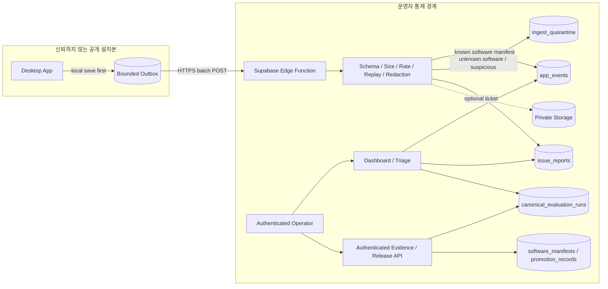

# 관측과 이슈 수집

| 항목 | 값 |
| --- | --- |
| 상태 | 미래 관측 기획안 · 신고 ingest와 운영자 재현 화면은 현재 구현에 포함됨 |
| 문서 버전 | 0.1.0 |
| 기획 책임자 | 기획자 / 운영자 |
| 기술 검토자 | 지정 필요 |
| 최종 갱신일 | 2026-08-30 |

> 이 문서는 일반 관측 event와 장기 운영 목표를 설명한다. 현재 구현의 신고 ingest, authenticated operator UI, Issue lifecycle, 재현·비교 계약은 [사용자 신고 기반 개선 루프](../IMPROVEMENT_LOOP.md)를 기준으로 한다. 실제 hosted 프로젝트가 최신 migration·Function을 사용한다는 사실은 배포 smoke evidence로 별도 확인한다.

## 1. 목표와 비목표

목표는 운영자가 어떤 배포본에서 무엇이 얼마나 실패하는지 알고, 사용자가 동의해 제출한 문제를 재현 가능한 이슈로 다루는 것이다.

다음은 목표가 아니다.

- 모든 사용자 행동과 대화를 수집하는 이용 분석
- 공개 클라이언트를 신뢰 가능한 관리 주체로 인증
- Supabase infrastructure log를 application event database 대신 사용
- 원격 이벤트에 따라 자동으로 로컬 앱 상태를 변경

## 2. 권장 경계

### OBS-001 — Edge Function 단일 쓰기 경계

공개 설치본은 application table에 직접 insert하지 않는다. 모든 공개 write는 Edge Function에서 schema, size, idempotency, software release, quota, redaction 검사를 통과한 뒤 서버 권한으로 저장한다.

**현재 구현 범위(2026-08-09):** `issue-report-ingest`는 named publishable key를 `apikey`로 검증하고, exact issue schema·본문 크기·timestamp·동의 일치·IP/설치/global quota·`event_id` 멱등성을 검사한 뒤 `private.issue_reports`에 service-role 전용 RPC로 저장한다. 원문 IP는 저장하지 않고 salt를 사용한 SHA-256 해시만 남긴다. 로컬 report/thread/message/job 식별자와 report 내부의 중복 생성 시각은 기존 outbox 호환을 위해 입력 단계에서만 검증한 뒤 저장 전에 제거하며, DB trigger와 check constraint가 기존 행과 신규 행 모두에 최소 저장 계약을 적용한다. `app_version`은 릴리스별 회귀 구분을 위해 유지한다. Hosted 검증에서 최초 접수와 동일 이벤트 중복 영수증 일치, 잘못된 키 차단, 익명·인증 역할의 테이블/RPC 접근 차단, 강제 RLS, 일일 보존 Cron 활성화를 확인했다. 재현 절차는 [이슈 접수 배포 문서](05_ISSUE_REPORT_INGEST_DEPLOYMENT.md)를 따른다.

### OBS-002 — 공개 키와 비밀 구분

클라이언트에 포함 가능한 값:

- Supabase project URL
- publishable key
- public ingest endpoint identifier
- 무작위 `installation_id`

클라이언트에 포함 금지:

- secret key 또는 legacy `service_role`
- DB password/connection string
- 공개 배포 artifact에 사전 발급된 운영자 access/refresh token
- Storage service credential

publishable key는 공개 application component와 project를 식별하는 API key이지만 비밀이 아니며, 사용자·device·genuine installation의 신원을 증명하지 않는다. 따라서 key 소지만으로 민감 데이터 접근이나 신뢰 상승을 허용하지 않는다. `installation_id`도 인증이 아니라 resettable correlation ID다.

초기 공개 ingest는 user JWT를 요구하지 않는다. publishable key를 요구하는 권장안은 Function을 `verify_jwt=false`로 배포하고 handler에서 `auth: 'publishable:<name>'` 모드로 `apikey`를 검증한다. 완전 공개 경로를 선택하면 `auth: 'none'`을 명시한다. 새 `sb_publishable_...` key는 JWT가 아니며 두 방식 모두 caller/device authenticity를 제공하지 않는다. 어느 방식을 선택해도 payload는 untrusted이고 읽기 권한은 없다.

### OBS-003 — 운영자 인증 분리

대시보드, triage, release 등록, quarantine 조회, 삭제·보존 변경은 Supabase Auth를 거친 단일 운영자만 수행한다. operator allowlist와 RLS/grant를 적용하고 공개 ingest 경로와 endpoint/role을 분리한다.

## 3. 이벤트 분류

초기에는 운영 판단에 직접 쓰이는 낮은 cardinality 이벤트만 수집한다.

| Event | 시점 | 핵심 필드 | 우선순위 |
| --- | --- | --- | --- |
| `app_session_started` | 유효한 local runtime 준비 후 | software manifest, local runtime, OS/runtime coarse class | Low / sample 가능 |
| `interaction_completed` | local response 저장 후 | route, latency, result/citation counts | Normal |
| `interaction_failed` | local failure 저장 후 | stage, stable error code, exception type/hash | High |
| `retrieval_no_result` | 검색 결과 0건 | scope, profile/composite revision | Normal |
| `runtime_validation_failed` | schema/artifact/profile 검증 실패 | stable validation code | High |
| `issue_submitted` | redaction된 신고의 SQLite outbox durable enqueue 성공 후 | issue ID, category, consent flags | High |
| `evaluation_run_observed` | 공개 설치본의 local run artifact 확정 후 | claimed suite/software/local runtime, verdict | Normal / 절대 qualifying 아님 |
| `software_release_observed` | 설치본에서 새 software manifest 최초 확인 | current/previous software manifest | Low |
| `outbox_health` | 주기적 집계 | queued/retry count, oldest age | Normal / bounded |

자유 형식 `log_message`를 대량 전송하지 않는다. 새로운 event type을 추가할 때는 사용 목적, 필드 allowlist, 보존, cardinality와 dashboard consumer를 함께 정의한다.

### OBS-008 — 평가 증거의 인증 경계

anonymous public ingest로 받은 `evaluation_run_observed`는 telemetry일 뿐 promotion 근거가 아니다. canonical evaluation run은 운영자/release tool이 인증된 별도 endpoint로 등록하며 다음을 모두 가져야 한다.

- authenticated operator actor와 server timestamp
- immutable run artifact hash/location
- SoftwareReleaseManifest와 exact LocalRuntimeRevision reference
- evaluation suite foreign key/revision
- `trust_level=operator_verified`
- append-only 등록 및 중복 hash constraint

공개 endpoint가 `canonical_evaluation_runs`, `promotion_records`, `software_release_manifests`에 쓰는 경로는 없다.

## 4. Outbox 정책

### OBS-004 — 사용자 경로 비차단

- 이벤트 생성은 local transaction 완료 후 수행한다.
- enqueue는 빠른 local write이며 원격 HTTP는 background worker에서 처리한다.
- batch에는 lease를 걸어 중복 worker를 방지한다.
- 최초 전송 실패 후 retry는 최대 3회로 제한하며 exponential backoff + jitter와 서버 `Retry-After`를 따른다.
- `400/401/403/413/422`처럼 계약상 비재시도 오류와 `408/429/5xx/network` 재시도 오류를 구분한다.
- 모든 재시도는 같은 `event_id`를 유지한다.
- queue는 byte/count/age 상한을 가지며 high-priority issue/event를 먼저 보존한다.
- 사용자의 local opt-out/client kill switch는 네트워크 전송을 중단한다. server ingest kill switch는 접수를 거부하거나 폐기하고 bounded receipt를 반환하며, 클라이언트는 장기 backoff한다. 이를 위해 원격 config가 local runtime을 변경할 필요는 없다.

이슈 UI는 제출 클릭을 사용자 접수 완료로 즉시 확인하고 원격 전송 상태를 노출하지 않는다. HTTP POST와 재시도는 background worker가 처리하며, 영구 거절 또는 재시도 만료는 사용자 흐름에 오류를 표시하지 않고 해당 outbox payload를 삭제하는 terminal failure로 처리한다.

## 5. Ingest 검증

### OBS-005 — 서버 측 필수 gate

Edge Function은 저장 전에 다음을 모두 적용한다.

1. method/content-type/body byte limit
2. batch count와 event별 크기 limit
3. exact JSON schema 및 version support
4. 허용된 event type/field/value enum
5. `event_id` 형식 및 unique idempotency
6. client timestamp 허용 창과 server receipt timestamp
7. 알려진 SoftwareReleaseManifest allowlist
8. IP + installation ID + endpoint별 rate/quota
9. depth/string/array/cardinality 제한
10. allowlist 기반 redaction 재검사
11. sampling 및 비용 kill switch
12. accepted/duplicate/sampled_out/quarantined/rejected disposition과 reason의 bounded 기록
13. current `ingest_deployment_manifest_hash`와 server receipt timestamp stamp

현재 1단계 이슈 endpoint는 1~6의 issue 계약 범위, 본문을 읽기 전의 IP·global quota와 저장 전 설치 quota, 9의 구조 제한, 잔존 credential·개인식별 패턴 거부, `accepted`·`duplicate`·`rate_limited`의 제한된 결과를 구현한다. 알려진 software manifest 확인, sampling·global kill switch, quarantine, `sampled_out`, `ingest_deployment_manifest_hash`, 일반 event batch는 후속 범위다. 따라서 위 13개 항목 전체가 완료된 것으로 표시하지 않는다.

알려지지 않은 software manifest, 미래 timestamp, 과도한 cardinality, schema 불일치는 정상 지표에 섞지 않는다. 처음 보는 LocalRuntimeRevision은 설치별 정상 차이일 수 있으므로 형식·지원 schema가 유효하면 `unverified_claim` cohort로 받고, 그 이유만으로 quarantine하지 않는다. raw 공격 payload 자체를 장기 로그에 남기지 않는다.

client timestamp 허용 창은 승인된 outbox TTL과 clock skew보다 짧게 설정하지 않는다. 지연 전달 event의 운영 latency는 `received_at`과 `occurred_at`을 분리해 계산하고, replay 방지의 1차 수단은 event ID idempotency다.

Supabase Auth rate limit은 Auth endpoint용이며 일반 ingest endpoint 보호로 간주하지 않는다. 공개 Function의 body/depth/batch/rate/quota 제한은 handler와 선택한 application-owned rate-limit 저장소에서 직접 구현하고 hostile test로 검증한다.

### 초기 용량 후보

[데이터 생애주기 문서](02_DATA_DEFINITIONS_AND_LIFECYCLE.md)의 후보 상한을 클라이언트와 서버에 동일하게 적용하되 서버 구성이 최종 권위다. 실제 rate limit 수치는 canary 부하와 비용을 본 뒤 확정한다.

## 6. 이슈 제출 계약

### OBS-006 — Preview와 동의

제출 화면은 세 그룹을 분리해 보여준다.

1. 항상 포함: issue/trace/software manifest/local runtime ID, stable error/route, timestamp, schema/profile revision.
2. 선택 포함: 현재 질문·답변, 이전 turn, 사용자 코멘트, screenshot.
3. 항상 제외: 전체 대화, raw chunk/PDF, prompt/context, key/token, 절대 경로.

선택값은 기본 unchecked로 시작한다. 제출 artifact에는 `consent_version`, 각 include flag, `redaction_version`과 실제로 제거한 field 목록을 기록한다.

### OBS-007 — 첨부는 두 번째 단계

초기 release에서는 attachment를 비활성화한다. 도입할 때는:

- 먼저 issue metadata를 검증하고 좁은 upload capability를 발급한다.
- private bucket, 무작위 object path, MIME allowlist, 5 MiB 후보 상한을 적용한다.
- Supabase signed upload URL은 현재 2시간 동안 유효하고 추가 인증 없이 사용할 수 있는 bearer capability이므로 로그에 남기지 않는다.
- 2시간보다 짧은 유효기간이나 one-time semantics가 필수라면 Function-proxied upload 또는 별도 ticket 검증을 설계한다.
- malware/content 검사 정책과 DB row/object 삭제 일관성을 정의한다.

## 7. 원격 테이블의 논리 역할

현재 1단계 물리 구현은 `private.issue_reports`, `private.issue_ingest_rate_counters`, `public.preflight_issue_ingest_v1`, `public.ingest_issue_report_v1`에 한정된다. 아래 나머지 객체는 운영판 목표 모델이다.

| 객체 | 목적 | 공개 client 권한 | 운영자 권한 |
| --- | --- | --- | --- |
| `software_release_manifests` | 알려진 immutable software/package tuple | 없음 | authenticated register/read |
| `promotion_records` | manifest의 평가·승격·롤백 이력 | 없음 | append/read 승인 경로 |
| `ingest_deployment_manifests` | 서버 Edge/policy/DB migration revision | 없음 | deploy workflow append/read |
| `app_events` | 정규화된 운영 event | 직접 접근 없음 | read/aggregate/delete 정책 |
| `issue_reports` | 동의된 이슈와 triage 상태 | 직접 접근 없음 | read/triage/close |
| `canonical_evaluation_runs` | operator-verified immutable run summary | 공개 ingest 경로 없음 | authenticated register/read |
| `ingest_quarantine` | unknown/suspicious metadata | 없음 | 제한된 read/delete |
| private Storage | opt-in attachment | 직접 list/read 없음 | signed access / delete |

**[Engineering extension]** 물리 설계는 다음 중 하나를 선택해 ADR로 고정한다.

- **A — Data API 사용:** 최소 API schema만 expose하고 Supabase `anon` 및 PostgreSQL `PUBLIC` 권한을 revoke한다. Edge Function의 secret/service-role 경로는 RLS를 우회하므로 모든 입력 검증 후에만 사용한다. 운영자 직접 접근은 `authenticated` grant + operator allowlist RLS로 제한한다.
- **B — Data API 미사용:** Data API를 비활성화하고 Edge/operator server 경로가 server-only DB connection과 전용 Postgres role을 사용한다. 이 경우 Supabase service client/PostgREST를 DB write 경로로 사용하지 않는다.

두 안을 섞어 `private/unexposed table을 service client가 PostgREST로 접근한다`고 가정하지 않는다. 권한 테스트는 PostgreSQL `PUBLIC`, Supabase `anon`, non-operator `authenticated`, operator `authenticated`, `service_role`을 각각 이름으로 구분한다.

## 8. 신뢰와 악용 모델

| 위협 | 결과 | 필수 완화 |
| --- | --- | --- |
| publishable key 추출 | 누구나 endpoint 호출 가능 | caller/device 인증 또는 신뢰 근거로 사용하지 않음, server validation/rate limit |
| installation ID 위조/회전 | quota 우회, 지표 오염 | IP/behavior/release 다중 제한, ID를 신뢰 점수로 사용하지 않음 |
| event replay | 중복 row/비용 증가 | stable event ID, unique constraint, timestamp window |
| 임의 app version 주장 | software release별 지표 오염 | software manifest registry, unknown quarantine |
| 임의 local runtime 주장 | data cohort 오염 | unverified claim 표시, artifact 근거 없는 qualification 금지 |
| 거대/중첩 payload | 비용·메모리 공격 | gateway/function byte/depth/count limits |
| content/secret 주입 | 개인정보·키 유출 | client allowlist + server redaction + no raw payload log |
| 악성 issue가 평가 기준으로 승격 | 품질 오염 | operator expectation approval, trust gate |
| endpoint 장애/429 | 사용자 요청 지연 | bounded async outbox, backoff, expiry, kill switch |
| service credential 유출 | 전체 DB 접근 | Edge secret store only, rotation, least privilege |

## 9. 운영 dashboard

### 필수 화면

- **Release health**: software manifest × local runtime cohort별 observed installations, failure/no-result, latency 분포.
- **Error explorer**: stable error code → affected software/profile/composite/ingest revision → trace count.
- **Issue inbox**: new/triaged/needs-expectation/ready/verified/closed, consent/attachment 표시.
- **Ingest health**: accepted/duplicate/sampled_out/rejected/quarantined/429, function latency, DB errors.
- **Outbox signal**: client가 보고한 queue age/dead letter 추이. 민감 payload는 표시하지 않는다.
- **Evaluation/release**: authenticated candidate run별 software/local runtime/suite, correctness/citation/latency/cost, promotion/배포 상태.

### 경보 정책

처음 2주는 경보가 아니라 baseline 측정 기간으로 사용한다. 이후 다음 형태로 임계값을 확정한다.

- 최근 stable software manifest의 comparable local-runtime cohort 대비 `interaction_failed` 비율 급증
- 특정 software/local runtime 조합의 `runtime_validation_failed` 발생
- quarantine/rejection/429 또는 Edge 5xx 급증
- high-priority issue 미처리 시간 초과
- canary의 correctness/citation 하락 또는 latency/cost 상한 초과

분모가 작은 버전은 최소 sample 수 전까지 경보가 아니라 `insufficient_data`로 표시한다.

## 10. Supabase Logs의 역할

- Logs Explorer는 API/Auth/Postgres/Storage/Realtime/Edge network 및 Edge Function 내부 `console` 로그를 조회·디버깅하는 plan-retained 운영 기능이다.
- Log Drains는 Supabase stack 로그를 외부 observability/archive destination으로 내보내는 현재 Pro/Team/Enterprise 기능이며 desktop application event ingest나 Postgres/Storage backup이 아니다.
- application event와 issue는 Postgres application table에 구조화해 저장한다.
- 동일 `request_id/correlation_id`로 application row와 Edge/API log를 연결한다.
- plan별 log/backup 보존 기간을 application retention으로 착각하지 않는다.

공식 근거:

- [Supabase API keys](https://supabase.com/docs/guides/getting-started/api-keys)
- [Securing Edge Functions](https://supabase.com/docs/guides/functions/auth)
- [Edge Function authorization headers](https://supabase.com/docs/guides/functions/auth-headers)
- [Securing the Data API](https://supabase.com/docs/guides/api/securing-your-api)
- [Row Level Security](https://supabase.com/docs/guides/database/postgres/row-level-security)
- [Edge Function rate limiting example](https://supabase.com/docs/guides/functions/examples/rate-limiting)
- [Auth rate limits](https://supabase.com/docs/guides/auth/rate-limits)
- [Logs Explorer](https://supabase.com/docs/guides/monitoring-and-debugging/logs)
- [Log Drains](https://supabase.com/docs/guides/monitoring-and-debugging/log-drains)
- [Database backups](https://supabase.com/docs/guides/platform/backups)
- [Storage access control](https://supabase.com/docs/guides/storage/security/access-control)
- [Signed upload URL](https://supabase.com/docs/reference/python/storage-from-createsigneduploadurl)

## 11. 검증 기준

| Requirement | 통과 증거 |
| --- | --- |
| OBS-001 | `PUBLIC`/`anon`/각 `authenticated`/`service_role`별 table 기대 권한과 Function write 검증 |
| OBS-002 | 빌드 산출물 secret scan과 credential rotation rehearsal |
| OBS-003 | 비운영자 read/write가 RLS/grant로 거부되는 test |
| OBS-004 | Supabase timeout/429/5xx에서도 chat/issue local save 성공 |
| OBS-005 | malformed/replayed/oversize/unknown-release hostile contract suite |
| OBS-006 | 모든 선택 content가 unchecked 기본값이고 consent evidence 저장 |
| OBS-007 | 만료 URL·잘못된 MIME·초과 크기 거부, object/row 삭제 audit |
| OBS-008 | anonymous observed run의 promotion FK 거부와 authenticated canonical run 등록 test |
