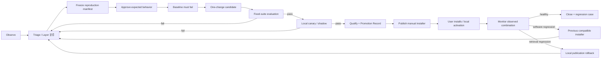

# 개선·평가·배포 과정 기획안

| 항목 | 값 |
| --- | --- |
| 상태 | 운영판 기획 초안 · 전체 과정 미완성 |
| 문서 버전 | 0.2.0 |
| 기획 책임자 | 기획자 / 운영자 |
| 기술 검토자 | 지정 필요 |
| 최종 갱신일 | 2026-08-09 |

> 아래 전체 과정은 별도로 개발할 운영판의 목표 흐름이다. 현재 PoC/MVP 저장소에 있는 로컬 신고·회귀 후보·평가 기능과 같지 않으며, 전체 과정이 구현되었다는 뜻이 아니다.

## 1. 현재 상태

| 구간 | 현재 PoC/MVP 상태 | 운영판 상태 |
| --- | --- | --- |
| 문제 신고 | 화면 입력, 최소정보 동의, retry-only SQLite outbox, 익명 원격 접수 hosted 검증 | 운영자 인증·처리 화면 미완료 |
| 회귀 후보 관리 | 상태 전이, 기대 결과 승인, 재현 근거 확인, 평가 실행 계약 구현 | 운영판 자료 모델과 권한 경계 미승인 |
| 기준 질문 평가 | 실행 코드와 시험은 있음 | 승인된 `tests/fixtures/evaluation_dataset.json` 파일이 없어 기획자 입력 필요 |
| 다중 대화 평가 | 실행 코드와 시험은 있음 | 승인된 `tests/fixtures/multiturn_evaluation_dataset.json` 파일이 없어 기획자 입력 필요 |
| 원격 관측·전송 | `issue-report-ingest` Edge Function·private DDL·입력 검증·hosted 권한 감사와 신고 outbox 구현 | 일반 관측 이벤트, 운영자 경계 미완료 |
| 시험 운영·배포 승인 | 일부 로컬 평가 도구만 있음 | 시험 운영, 승인 기록, 설치 파일 게시, 실제 설치 확인 미구현 |
| 복구·보존·삭제 | 로컬 검색 자료 복구 기능 일부 존재 | 운영판 배포 복구, 원격 보존·삭제 절차 미구현 |

현재 코드는 로컬 개선 과정의 일부 계약과 익명 이슈 접수의 서버/클라이언트 1단계 계약을 검증하며 hosted 운영 근거도 확보했다. 운영자 처리 경계와 승인된 질문·기대 결과가 아직 없으므로 **닫힌 운영판 개선 과정이 완성된 것으로 판단하지 않는다.**

## 2. 기획자가 채우거나 승인해야 할 내용

| 항목 | 필요한 입력 |
| --- | --- |
| 기준 질문 | 실제로 중요하게 보는 대표 질문, 질문별 대상 회사·기간·자료 범위 |
| 기대 결과 | 반드시 포함할 내용, 허용 가능한 차이, 금지할 답변, 필요한 출처 |
| 품질 우선순위 | 정확성·출처·검색 누락·응답 시간 중 사례별 우선순위 |
| 수동 판정 기준 | 자동 판정이 어려운 답변을 사람이 통과·실패로 나누는 기준 |
| 이슈 분류 | 중요도, 담당 영역, 중복·의도된 동작·정보 부족 종료 기준 |
| 시험 운영 기준 | 비교 기간, 최소 표본, 즉시 중단 조건, 복구 판단 기준 |
| 배포 승인 | 누가 어떤 근거를 보고 승인하며 어디에 기록할지 |
| 개인정보·보존 | 자동 수집 기본값, 보존 기간, 삭제 요청과 첨부 처리 원칙 |

이 값이 채워지기 전에는 평가 사례가 없다는 사실을 오류로 숨기지 않고 화면과 문서에 `기획자 입력 필요`로 표시한다.

## 3. 원칙

개선 과정의 목적은 변경 횟수를 늘리는 것이 아니라, 관측된 문제를 재현하고 한 가지 원인을 검증한 뒤 안전하게 반영하는 것이다.

- 빈도가 높다고 자동으로 중요한 문제는 아니다. 심각도, 영향 범위, 신뢰 수준을 함께 본다.
- 사용자 이슈는 관측 사실이며 기대 정답이 아니다.
- 기준 상태와 변경 후보는 같은 평가 묶음과 비교 조건을 사용한다.
- 변경 후보가 프로그램과 로컬 실행 자료 중 무엇을 바꿨는지 두 버전의 차이로 설명할 수 있어야 한다.
- 정확도뿐 아니라 출처 충족, 검색 누락, 응답 시간, 비용, 운영 안전성을 함께 본다.
- 배포 승인은 검증 조합을 배포해도 좋다는 결정이며, 프로그램 설치와 로컬 검색 자료 활성화는 별도 단계다.

## 4. 목표 과정

아래 도식은 **운영판 목표 상태**다. 현재 PoC/MVP에서 처음부터 끝까지 실행 가능한 흐름으로 읽지 않는다.



## 5. 단계별 계약

### IMP-001 — Observe

입력은 구조화된 운영 지표, 사용자가 제출한 이슈, 운영자 재현, 평가 결과다. raw popularity만으로 우선순위를 정하지 않는다.

필수 산출물:

- affected SoftwareReleaseManifest, LocalRuntimeRevision, ingest deployment/profile/composite revision
- event/issue count와 기간
- 심각도와 사용자 영향
- 데이터 신뢰 수준(`anonymous`, `operator_verified`)

### IMP-002 — Failure layer 분류

최소 다음 중 하나의 1차 원인을 지정한다.

| Layer | 예시 | 1차 담당 |
| --- | --- | --- |
| Input/UX | 질문 입력, 상태 표시, 동의 UI | Product / Frontend |
| Source data | 문서 누락·오류·시점 | Data / Product |
| Extraction | PDF parsing/table/header 손실 | Retrieval |
| Chunking | 경계·overlap·metadata 문제 | Retrieval |
| Retrieval/index | 검색 누락·delta/snapshot 문제 | Retrieval |
| Ranking | 잘못된 우선순위 | Retrieval/ML |
| Prompt/model | 지시 불이행·hallucination | LLM |
| Citation | 근거 매핑·표시 오류 | LLM/Frontend |
| Runtime/network | provider/Supabase/local DB 실패 | Platform |
| Evaluation | 잘못된 fixture/scorer/threshold | Product / QA |

분류는 원인 확정이 아니라 조사 시작점이다. 근거가 바뀌면 history를 남기고 재분류한다.

### IMP-003 — Reproduction freeze

수정 전에 다음을 고정한다.

- issue/event IDs와 redacted evidence
- 정확한 SoftwareReleaseManifest hash
- exact LocalRuntimeRevision, publication generation/write epoch, data/index composite revision과 ordered active delta action chain
- model/prompt/config/dependency fingerprints
- 입력 fixture와 실행 방법
- 실제 결과와 승인 대기 중인 기대 결과

필수 provenance가 없으면 `ready`로 이동하지 않는다. 고정한 baseline/candidate artifact에는 hold를 걸어 평가·canary·audit가 끝나기 전에 GC되지 않게 하고, ID뿐 아니라 실제 file 존재와 checksum을 검증한다.

### IMP-004 — 기대 결과 승인

단일 운영자가 제품 의미를 검토해 다음 중 하나로 처리한다.

- 정확한 기대 결과와 허용 범위 승인
- 중복 이슈에 연결
- 재현 정보 부족으로 보류
- 의도된 동작/범위 밖으로 종료

공개 사용자 텍스트를 그대로 정답 fixture로 사용하지 않는다. 필요한 경우 비식별화·최소화한 operator-authored fixture를 새로 만든다.

### IMP-005 — Baseline fail gate

고정된 current software/local-runtime 조합에서 fixture가 실제로 실패한다는 증거가 있어야 수정 단계로 간다. 재현되지 않으면 원인을 추가 조사하거나 환경 의존성을 명시한다.

### IMP-006 — One-change candidate

한 변경 후보는 하나의 주요 가설을 검증한다. 불가분한 변경 묶음이면 프로그램 배포 정보의 차이와 로컬 실행 자료의 차이를 각각 표시하고 변경 기록에 이유를 남긴다. 운영판 구조 결정까지 바뀌는 경우에는 운영판 저장소의 의사결정 기록을 함께 갱신한다.

예:

- chunk overlap만 변경
- extractor만 변경
- prompt instruction만 변경
- source exclusion policy만 변경

여러 층을 동시에 바꾸면 어떤 요소가 개선·악화를 만들었는지 판단할 수 없으므로 기본적으로 허용하지 않는다.

### IMP-007 — Fixed-suite evaluation

candidate와 baseline은 동일한 `evaluation_suite_revision`에서 비교하고, 각 run은 exact SoftwareReleaseManifest와 LocalRuntimeRevision을 참조한다.

최소 평가 축:

- correctness / expected behavior
- source·citation coverage 및 잘못된 citation
- retrieval recall/no-result
- latency 분포와 timeout
- provider/API cost 또는 token proxy
- crash, schema, artifact integrity
- 기존 critical regression case

stochastic 동작은 한 번의 결과가 아니라 승인된 반복 횟수와 통계 규칙으로 평가한다. 평가 suite와 threshold 변경은 candidate 성능 변경과 같은 run에서 섞지 않는다.

### IMP-008 — Canary와 qualification

초기 단일 운영자 모델에서는 운영자 설치본을 canary로 사용한다. 가능하면 같은 입력을 production과 candidate에 shadow 실행하되 사용자 응답은 production 결과만 보여준다.

qualification 필수 조건:

- clean build와 immutable SoftwareReleaseManifest
- exact reference LocalRuntimeRevision과 artifact hold/hash 검증
- schema/data/index compatibility 검증
- approved suite revision과 authenticated operator-verified qualifying run
- critical regression 0건
- 개인정보·secret scan 통과
- Supabase outage와 model provider failure test 통과
- predecessor software package와 local data rollback rehearsal
- release note와 known limitation
- 운영자 승인 시각과 근거를 event ID·이전 record·단조 sequence로 연결한 append-only PromotionRecord로 기록

anonymous `evaluation_run_observed`는 trend 참고용이며 위 qualifying run이 될 수 없다.

### IMP-009 — Post-promotion monitor와 rollback

새 software/local-runtime 조합의 지표를 비교 가능한 이전 cohort와 분리해 비교한다. 다음 중 하나면 자동 알림과 수동 rollback 검토를 시작한다.

- runtime validation 또는 startup failure
- 기존 critical case 재발
- 충분한 sample에서 오류/no-result의 유의미한 증가
- latency/cost의 승인 상한 초과
- 데이터·privacy contract 위반
- ingest 비용/악용으로 운영 한도 초과

privacy/secret 노출과 startup-blocking 오류는 sample 수를 기다리지 않는 즉시 게시 중단 조건이다. software 문제는 이전 compatible installer를 다시 배포하고, retrieval 문제는 local predecessor publication으로 복구한다. 중앙에서 공개 설치본을 강제 변경하는 자동 rollback은 초기 범위에 없다.

### IMP-010 — Close와 학습 보존

검증된 이슈를 닫을 때 다음 중 하나를 남긴다.

- version-controlled regression case
- 기존 case 링크
- case로 남기지 않는 명시적 이유와 승인자

닫힌 이슈의 raw 사용자 content는 retention에 따라 삭제할 수 있지만, 비식별화된 최소 regression fixture와 decision record는 유지한다.

### IMP-011 — 배포와 설치 활성화

초기 production은 manual installer workflow다.

```text
candidate -> qualified -> published
                          -> downloaded -> integrity verified
                          -> installed/migrated -> locally active
                          -> activation_failed -> previous compatible install/recovery
```

- `qualified`: 평가와 운영자 승인이 완료된 상태.
- `published`: installer가 승인된 배포 채널에 올라간 상태.
- `observed active`: 공개 설치본이 보내온 untrusted observation이며 중앙 강제 활성화를 뜻하지 않는다.
- installer는 package digest와 SoftwareReleaseManifest를 포함한다.
- local DB migration 전에 backup/compatibility를 검사하고 실패 시 기존 데이터를 보존한다.
- Windows code signing의 적용 여부는 공개 GA 전 Security/Product gate에서 확정한다. 최소한 authenticated distribution channel과 독립적으로 확인 가능한 package checksum은 필수다.

## 6. 상태 모델

기존 monitoring lifecycle과 맞추는 목표 상태는 다음과 같다.

```text
new
 -> triaged
 -> needs_expectation
 -> ready
 -> reproduced
 -> fixing
 -> verified
 -> closed
```

현재 코드와 맞춘 조기 종료 상태는 `duplicate`, `rejected`, `not_reproducible`이다. `new`, `triaged`, `needs_expectation`, `ready`에서 guard를 만족하면 `duplicate` 또는 `rejected`로 종료할 수 있고, `not_reproducible`은 `ready`에서만 허용한다. `closed` candidate는 재오픈 사유와 contract revision 증가를 동반해 `triaged`로 돌아간다. `intended_behavior`, `out_of_scope`, `insufficient_information` 같은 값은 새로운 상태를 임의로 만들지 않고 rejection/closure reason taxonomy로 관리한다. 상태 변경마다 actor, server timestamp, reason, evidence reference를 남긴다.

## 7. 역할과 승인

| 활동 | Product/운영자 | Engineering | QA/Evaluation |
| --- | --- | --- | --- |
| 문제 우선순위·기대 결과 | Accountable | Consulted | Consulted |
| 원인 분석·candidate 설계 | Consulted | Accountable | Consulted |
| fixture/scorer/threshold 승인 | Accountable | Consulted | Responsible |
| 구현·migration·rollback | Informed | Accountable/Responsible | Consulted |
| evaluation 실행·증거 | Informed | Consulted | Responsible |
| promotion 결정 | Accountable | Responsible for readiness | Provides evidence |
| post-release 관찰·issue close | Accountable | Consulted | Consulted |

단일 운영자라 역할을 한 사람이 겸할 수 있지만, `제품 기대 결과 승인`과 `코드가 테스트를 통과했다는 증거`를 문서상 분리한다.

## 8. 실험 기록

모든 candidate는 다음을 가진다.

```yaml
hypothesis: 무엇이 왜 개선될 것으로 보는가
affected_requirements: [IMP-..., VER-...]
baseline_software_manifest_hash: sha256
candidate_software_manifest_hash: sha256
baseline_local_runtime_revision_hash: sha256
candidate_local_runtime_revision_hash: sha256
intentional_diff: [정확히 바꾼 요소]
evaluation_suite_revision: sha256
qualifying_runs: [run-id]
decision: promote | reject | revise
decision_reason: bounded text
rollback_software_manifest_hash: sha256
rollback_local_runtime_revision_hash: sha256
```

## 9. 운영판 전환 완료 조건

현재는 아래 조건을 충족하지 않는다. 운영판 배포가 검증 완료되었다고 부르려면 다음이 모두 참이어야 한다.

- SoftwareReleaseManifest와 LocalRuntimeRevision 생성·검증이 재현 가능하다.
- 필수 artifact와 migration이 준비되어 있다.
- approved suite에서 품질 gate를 통과했다.
- telemetry가 비차단이고 redaction contract를 통과했다.
- 공개 client에 privileged credential이 없다.
- malformed ingest, 429, Supabase outage와 model provider failure를 각각 검증했다.
- canary 증거와 운영자 승인이 있다.
- predecessor software installer와 local retrieval rollback이 각각 리허설되었다.
- package 게시와 실제 설치/활성화 상태가 구분된다.
- Figma 시각적 기획 지식베이스와 정확한 기획 문서가 해당 Git revision에 동기화되었다.
- 남은 위험과 known limitation이 release note에 있다.

## 10. 초기 운영 주기

| 주기 | 활동 |
| --- | --- |
| 매일 | high severity error/issue, ingest 실패, unknown software manifest 확인 |
| 매주 | error/no-result top pattern triage, issue SLA, outbox/quarantine 추이 |
| 릴리스 후보마다 | fixed suite, privacy/security contract, Supabase/provider failure test, 두 rollback rehearsal |
| 월간 | retention/delete audit, 비용/quota, version fragmentation, 오래된 release 지원 범위 검토 |
| 분기 | 데이터·동의 정책, threat model, 평가 suite 편향, disaster recovery 검토 |

## 11. 검증 기준

| Requirement | 통과 증거 |
| --- | --- |
| IMP-001/002 | 모든 active candidate에 영향·layer·trust 분류 존재 |
| IMP-003 | candidate의 software/local runtime/prompt/model/config provenance와 artifact hold check |
| IMP-004 | 기대 결과 승인 전 `ready` 전이 거부 |
| IMP-005 | failing baseline evidence 없이는 `reproduced` 전이 거부 |
| IMP-006 | software/local runtime diff와 declared diff 불일치 시 gate 실패 |
| IMP-007 | 동일 suite 비교 및 threshold/scorer revision audit |
| IMP-008 | authenticated qualifying run과 immutable PromotionRecord |
| IMP-009 | canary regression simulation으로 경보/rollback runbook 확인 |
| IMP-010 | close 시 regression case 또는 exclusion reason constraint |
| IMP-011 | qualified/published/installed/active 분리와 manual rollback E2E |
