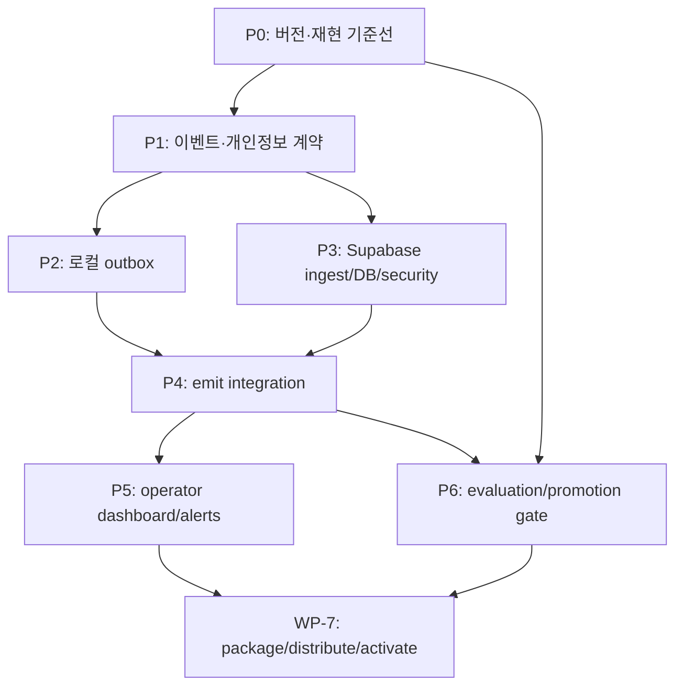

# 개발 인계 명세

| 항목 | 값 |
| --- | --- |
| 상태 | 운영판 개발 인계 초안 · 기술 검토 필요 |
| 문서 버전 | 0.1.1 |
| 기획 책임자 | 기획자 |
| 개발 책임자 | 지정 필요 |
| 최종 갱신일 | 2026-08-09 |

> 현재 PoC/MVP 저장소의 개발 완료 목록이 아니다. 별도 운영판을 착수할 때 검토할 구현 후보와 검증 근거를 정리한 인계 초안이다.

## 1. 인계 목적

이 문서는 기획 정책을 구현 가능한 작업과 검증 증거로 연결한다. Supabase 이슈 접수의 구현된 서버·outbox 조각과 아직 구현되지 않은 operator/release-manifest 항목을 분리해 표현한다.

개발자는 다음 원칙으로 내용을 보강한다.

- 기획 요구사항의 의미·수집 범위·동의·승인 기준을 변경하려면 변경 기록을 남긴다. 운영판에서 승인된 구조 결정을 바꾸는 경우에는 운영판 저장소의 ADR을 추가한다.
- DDL, JSON Schema, 함수 인터페이스, migration, retry 알고리즘, 성능 측정 방식은 `[Engineering extension]` 아래에서 기술 책임자가 확정한다.
- 각 작업은 requirement ID, 구현 경로, 테스트 경로, 운영 증거를 연결한다.
- 불완전한 항목은 `TBD`를 유지하고 구현된 것처럼 체크하지 않는다.

## 2. 현재 상태 요약

| 기능 영역 | 현재 상태 | 근거 | 운영판에서 필요한 보강 |
| --- | --- | --- | --- |
| 검색 자료 목록 구조 | 구현됨 | [`src/retrieval/schema.py`](../../src/retrieval/schema.py) | 구조 호환 범위와 변경 이력 보강 |
| 검색 설정 해시 | 구현됨 | [`src/retrieval/identity.py`](../../src/retrieval/identity.py) `EmbeddingProfile` | 실제 분할·겹침 유효 명세 단일화 |
| 원문 묶음 명세 | 구현됨 | [`src/retrieval/manifest.py`](../../src/retrieval/manifest.py) | `LocalRuntimeRevision`에 연결 |
| 빌드·스냅숏 식별 | 구현됨 | [`src/retrieval/build_service.py`](../../src/retrieval/build_service.py) | 정확한 로컬 실행 조합에 연결 |
| 원자적 게시·복구 | 로컬 검색 자료에 구현됨 | [`src/retrieval/publication.py`](../../src/retrieval/publication.py) | 프로그램 설치 복구와 구분 |
| 증분 자료를 포함한 실행 식별 | 일부 구현됨 | [`src/retrieval/repository.py`](../../src/retrieval/repository.py) `SnapshotRevision` | 응답·평가·재현 근거에 전파 |
| 재현 명세 | 일부 구현됨 | [`src/core/reproduction_manifest.py`](../../src/core/reproduction_manifest.py) | 데이터·색인 필수화, 화면·의존성·빌드 포함 |
| 평가·후보 생애주기 | 일부 구현됨 | [`src/core/monitoring.py`](../../src/core/monitoring.py) | 버전이 있는 평가 묶음과 승인 조건 |
| 이슈 신고·동의 자료 | 무파일 원격 접수까지 1단계 구현됨 | [`src/core/issue_report_store.py`](../../src/core/issue_report_store.py), [`src/core/issue_report_outbox.py`](../../src/core/issue_report_outbox.py) | 운영자 처리 연결 |
| 대화 상태 저장 | 로컬에 구현됨 | [`src/core/conversation_store.py`](../../src/core/conversation_store.py) | 명시적 구조 버전·변경·보존 정책 |
| 질문 임베딩·생성 제공자 | 원격 의존 방식으로 구현됨 | [`src/llms/embeddings.py`](../../src/llms/embeddings.py), [`src/llms/factory.py`](../../src/llms/factory.py) | 완전한 오프라인이 아님; 제공자 장애 경험과 상태 보존 검증 |
| Supabase 이슈 수집 | 서버/클라이언트 1단계 hosted 검증 완료 | [`supabase/functions/issue-report-ingest`](../../supabase/functions/issue-report-ingest), [`supabase/migrations/202608090001_issue_report_ingest.sql`](../../supabase/migrations/202608090001_issue_report_ingest.sql), [`supabase/migrations/202608090002_schedule_issue_report_retention.sql`](../../supabase/migrations/202608090002_schedule_issue_report_retention.sql), [`supabase/migrations/202608090003_minimize_issue_report_payload.sql`](../../supabase/migrations/202608090003_minimize_issue_report_payload.sql), [`src/core/issue_report_outbox.py`](../../src/core/issue_report_outbox.py) | 일반 사건 수집, 운영자 경계 |
| retry-only 신고 전송 대기함 | 1단계 구현 | [`src/core/issue_report_outbox.py`](../../src/core/issue_report_outbox.py), [`tests/test_issue_report_outbox.py`](../../tests/test_issue_report_outbox.py) | hosted soak, 운영자용 queue health, 일반 관측 이벤트 확장 |
| 운영자 원격 화면 | 미구현 | 로컬 관측 화면만 존재 | 인증된 Supabase 조회·분류 |
| 프로그램·수집 배포 명세 | 미구현 | 저장소에 정규 계약 없음 | 클라이언트 설치 파일과 서버 배포 식별 분리 |
| 공개 설치·활성화·복구 | 미정의 | 중앙 원격 제어 경로 없음 | 수동 배포·설치·복구 계약 |

## 3. 우선순위와 의존성

P0를 먼저 하는 이유는 원격 이벤트를 수집해도 software/local runtime/server ingest identity가 불완전하면 원인을 비교할 수 없기 때문이다.

## 4. Work packages

### ENG-001 / WP-0 — Production identity와 test fixture 고정

**관련 요구사항:** PROD-007/008, DATA-007/008, VER-001~009, IMP-003/007/011

산출물:

- machine-readable `SoftwareReleaseManifest`, `LocalRuntimeRevision`, `IngestDeploymentManifest`, `PromotionRecord` schema와 canonical hash 규칙
- app/build/code/dependency fingerprint 생성기
- exact local revision(base + publication generation + write epoch + ordered active delta action chain)
- approved evaluation suite manifest/hash
- artifact hold/retention lease와 hash-presence verifier
- production contract test fixture

현재 gap을 반드시 처리한다.

- app version이 README text에만 의존하지 않게 release artifact를 권위로 만든다.
- code fingerprint 범위를 `src/**/*.py`에 한정하지 않고 실제 배포 입력 전체로 확장한다.
- automatic reproduction manifest 생성 시 `data_revision`과 `index_revision`을 누락하지 않는다.
- evaluation provenance에 write epoch와 delta generation/segment action chain을 포함하고 delete-only segment의 nullable artifact를 허용한다.

완료 증거:

- 동일 clean tree/input에서 같은 manifest hash
- 코드·dependency·prompt·chunk·write epoch·upsert/delete delta 각각 변경 시 예상 field/hash만 변화
- provenance가 불완전한 candidate/run의 promotion 거부
- software installer rollback과 local retrieval rollback의 독립 E2E
- 평가/미해결 이슈가 참조한 artifact의 GC 거부

### ENG-002 / WP-1 — Event·issue privacy contract

**관련 요구사항:** PROD-003~006, DATA-002/005/006, OBS-002/005/006

산출물:

- event envelope와 event type별 JSON Schema
- issue contract와 consent contract
- allowlist redactor 및 `redaction_version`
- stable error-code registry
- payload byte/count/depth budgets
- random/resettable installation ID lifecycle
- content preview UI contract

설계 기준:

- 자유 형식 context blob을 기본으로 허용하지 않는다.
- raw question/answer/chunk/prompt/stack/path는 automatic schema에 필드 자체가 없어야 한다.
- exception은 bounded class/code와 stack hash로 변환한다.
- config fingerprint는 secret 원문을 hash하지 않는다. secret은 입력 집합에서 제외한다.

완료 증거:

- golden payload와 거부 payload contract test
- secret/PII/path fuzz fixture에서 outbound 노출 0건
- 선택 content가 동의 없이 serialize되지 않는 UI/unit test
- 이전 지원 contract version과 compatibility test

### ENG-003 / WP-2 — Local durable outbox

**관련 요구사항:** PROD-001/002, DATA-003/006, OBS-004

권장 구조:

- 전용 SQLite DB 또는 명확히 분리된 table
- event ID unique, payload schema version, priority, status, attempt count
- `available_at`, lease owner/expiry, created/updated/expiry timestamps
- last bounded error code, payload byte count
- enqueue, lease batch, retry, ack/reject/expiry 즉시 payload 삭제
- 한 process가 죽어도 만료 lease 회수

HTTP POST만 필요하므로 기존 HTTP stack으로 요구를 충족할 수 있으면 Supabase Python SDK를 새로 추가하지 않는다. SDK는 Auth/Storage 등 명확한 추가 이점과 dependency 검토가 있을 때 별도 결정한다.

완료 증거:

- process kill/restart 후 유실·영구 lease 없음
- duplicate enqueue/POST 멱등성
- queue 최대 재시도 3회·50MB·7일 후보 한도 및 priority eviction
- Supabase offline/DNS/timeout, 429 `Retry-After`, 5xx backoff test
- foreground chat latency가 network timeout에 영향받지 않음

### ENG-004 / WP-3 — Supabase ingest와 data plane

**관련 요구사항:** OBS-001~003/005/007/008, DATA-002/005/006/009, VER-009

저장소에 version-controlled로 추가할 항목:

- Supabase migration/DDL
- Edge Function source와 deployment config
- `software_release_manifests`, `promotion_records`, `ingest_deployment_manifests`, `app_events`, `issue_reports`, `canonical_evaluation_runs`, `ingest_quarantine`
- private schema/exposed schema 결정
- operator RLS/grants와 public denial tests
- idempotency constraints, retention indexes/jobs
- per-endpoint/IP/installation/release quotas와 global kill switch
- correlation/request ID logging
- 모든 receipt/row에 current `ingest_deployment_manifest_hash` stamp
- public event/issue write와 authenticated evaluation/release evidence write의 endpoint/role 분리

공개 event/issue endpoint는 user JWT나 device credential이 없다. publishable key는 공개 application/project API key이지만 user/device/genuine installation 신원을 증명하지 않는다. 권장안은 `verify_jwt=false` + handler의 `auth: 'publishable:<name>'` 검증이며, 완전 공개 `auth: 'none'`을 택하면 그 결정을 ADR에 남긴다. 어느 경우든 inbound rate/quota/validation은 application-owned이고 privileged key는 Function secret store에만 둔다.

**현재 구현된 1단계 조각(2026-08-09):** named `desktop_ingest` publishable key, 128 KiB bounded streaming 본문 상한, body parse 전 IP·global quota, exact issue envelope, consent 일치, timestamp window, installation quota, client redaction과 server 잔존 민감정보 거부, stable `event_id` 멱등성, HMAC IP hash, private tables와 service-role 전용 RPC, 제한된 webhook notification이 소스와 migration으로 추가됐다. `validation_test.ts`와 `index_test.ts`는 계약 및 hostile body 경계의 단위 시험을 제공한다. Hosted smoke test에서 accepted/duplicate 영수증 일치, 잘못된 키 차단, 익명·인증 역할 권한 차단, 강제 RLS와 보존 Cron 활성화를 확인했다.

**아직 남은 범위:** 일반 event batch, known software manifest와 ingest deployment manifest, quarantine·sampling·kill switch, 운영자 Auth/RLS 화면, authenticated evaluation/release evidence endpoint다. Desktop issue outbox/HTTP 연결, server-side 잔존 민감정보 검사와 hosted retention schedule은 1단계 범위에 구현되어 있다.

DB 접근은 서로 배타적인 두 안 중 하나를 ADR로 선택한다.

- Data API 사용: 최소 schema만 expose하고 PostgreSQL `PUBLIC`/Supabase `anon`을 revoke한다. Function service-role path의 RLS bypass를 전제로 handler validation을 강제하고, operator는 `authenticated` grant + allowlist RLS를 사용한다.
- Data API 미사용: Edge/operator server가 server-only DB connection과 전용 Postgres role을 사용하며 service client/PostgREST를 write path로 사용하지 않는다.

완료 증거:

- PostgreSQL `PUBLIC`, `anon`, non-operator/ operator `authenticated`, `service_role` 각각의 grant/RLS 기대값 검증
- operator 외 계정의 dashboard table 접근 거부
- known software manifest 정상 접수, unknown software quarantine, 처음 보는 valid local runtime은 `unverified_claim`로 접수
- replay duplicate, oversize, malformed, future timestamp, quota 초과 처리
- raw 공격 payload/secret이 function log에 남지 않음
- retention/delete dry run과 DB/Storage 분리 audit

### ENG-005 / WP-4 — Emit point 연결

**관련 요구사항:** DATA-003, OBS-004/006, VER-001/006

현재 코드의 연결 후보:

| Event | 권장 연결 지점 | 원칙 |
| --- | --- | --- |
| interaction success/failure | [`apps/gui/chat_jobs.py`](../../apps/gui/chat_jobs.py) `conversation_store.update_message` 성공 후 | local message 상태가 먼저 확정 |
| issue submitted | [`apps/gui/chat_views.py`](../../apps/gui/chat_views.py) `issue_report_outbox.queue_report`의 durable enqueue 성공 후 | 메모리에서 구성·redaction한 동의 범위만 전송 |
| candidate changed | [`src/core/monitoring.py`](../../src/core/monitoring.py) `_persist_candidate` 성공 후 | public issue와 operator candidate 구분 |
| evaluation observed | 같은 파일 `_persist_evaluation_run` 성공 후 | public event는 non-qualifying; authenticated canonical 등록과 분리 |
| candidate run attached | 같은 파일 `record_candidate_run` 성공 후 | 관계 성공 후 emit |
| reproduction identity | [`src/core/reproduction_manifest.py`](../../src/core/reproduction_manifest.py) `build_runtime_reproduction_manifest` | complete tuple을 참조 |

[`src/core/artifact_io.py`](../../src/core/artifact_io.py)의 atomic write와 sensitive-pattern 검사는 재사용 후보이나, outbound allowlist 계약을 대신하지 않는다. [`src/llms/embeddings.py`](../../src/llms/embeddings.py)의 retry/backoff는 참고 패턴일 뿐 telemetry worker와 결합하지 않는다.

완료 증거:

- local persistence가 실패하면 event가 생성되지 않음
- local persistence 성공 후 enqueue 실패는 bounded local warning만 남기고 사용자 기능은 성공 유지
- 모든 emit payload가 exact software manifest와 LocalRuntimeRevision을 가짐
- 동일 business operation retry가 중복 논리 event를 만들지 않음

### ENG-006 / WP-5 — Operator dashboard와 triage

**관련 요구사항:** OBS-003, IMP-001/002/004/009/010

산출물:

- release health, error explorer, issue inbox, ingest health, evaluation/release 화면
- filter/share용 URL에는 raw user content를 넣지 않음
- issue state transition API와 audit history
- baseline 기간·minimum sample·`insufficient_data` 처리
- alert route와 runbook 링크
- retention/delete/operator export 기능

완료 증거:

- 비운영자 접근 거부
- software manifest × local runtime × ingest revision → error → issue → candidate/authenticated run까지 추적 가능
- 기대 결과 승인 전 `ready` 이동 불가
- 삭제 요청과 retention job 결과 audit 가능

### ENG-007 / WP-6 — Evaluation과 qualification gate

**관련 요구사항:** IMP-003~010, DATA-007, VER-004/006/007, OBS-008

산출물:

- suite manifest/scorer/threshold versioning
- baseline/candidate 비교 report
- canary/shadow 실행 계약
- authenticated canonical evaluation artifact registration
- PromotionRecord와 qualification/publish checklist
- PromotionRecord event chain의 unique sequence, predecessor compare-and-swap, 허용 transition 검증
- reference LocalRuntimeRevision artifact holds
- predecessor software와 local retrieval rollback runbook/rehearsal

완료 증거:

- baseline fail 없이 reproduced 전이 거부
- verification pass 없이 verified/promotion 거부
- anonymous observed run의 qualification FK 거부
- 같은 software release에 대한 동시 promotion 결정 중 하나만 compare-and-swap에 성공
- 다른 suite revision 간 직접 pass/fail 비교 거부
- active delta가 다른 run을 동일 revision으로 취급하지 않음
- rollback 후 software package identity와 local retrieval predecessor를 각각 검증

### ENG-008 / WP-7 — Manual package 배포와 local activation

**관련 요구사항:** PROD-008, IMP-011, VER-004

초기 production은 automatic updater가 아니라 manual installer workflow로 구현한다.

산출물:

- clean build package, SoftwareReleaseManifest, package checksum
- candidate → qualified → published registry transition/PromotionRecord
- 승인된 download/distribution channel과 release note
- install 전 package integrity와 supported local schema 검사
- local DB backup, forward migration, activation failure recovery
- 이전 compatible installer를 이용한 software rollback runbook
- local retrieval publication rollback과의 역할 분리
- public GA 전 Windows code signing 적용 여부 결정 기록

완료 증거:

- `qualified`만으로 공개 설치본이 바뀌지 않음
- tampered package 설치 거부
- migration 실패 시 기존 local DB/artifact 보존
- 이전 installer 복구와 local retrieval rollback을 각각 리허설
- downloaded/installed/locally active observation을 중앙 강제 상태와 혼동하지 않음

## 5. 논리 API 초안

실제 route 이름은 개발자가 확정하되 역할은 분리한다.

| API | Caller | 인증/신뢰 | 목적 |
| --- | --- | --- | --- |
| `POST /ingest/events` | public app | anonymous/untrusted | bounded event batch |
| `POST /ingest/issues` | public app | anonymous/untrusted + explicit consent | issue metadata/content |
| `POST /ingest/issues/{id}/upload-ticket` | public app | 초기 비활성 | 검증 후 Supabase 2시간 bearer 또는 custom one-time capability |
| `GET /operator/*` | operator UI | Supabase Auth + allowlist | read/triage/audit |
| `POST /operator/evaluation-runs` | release tool/operator | authenticated privileged workflow | canonical immutable run 등록 |
| `POST /operator/software-releases` | release tool/operator | authenticated privileged workflow | software manifest 등록 |
| `POST /operator/promotions` | release tool/operator | authenticated privileged workflow | qualification/publish/withdraw record append |

공개 API 응답은 내부 schema, policy, quota 세부를 과도하게 노출하지 않는 stable error code를 사용한다. `accepted`, `duplicate`, `sampled_out`, `quarantined`, `rejected`를 클라이언트가 구분할 수 있는 최소 receipt를 제공한다. `duplicate`와 `sampled_out`은 outbox 재시도를 끝내는 성공 계열 disposition이다.

## 6. 개발자가 채울 물리 명세

아래 표는 Engineering Review에서 실제 링크로 교체한다.

| 항목 | 예정 위치 | Owner | Status |
| --- | --- | --- | --- |
| Software/LocalRuntime/Ingest/Promotion schemas | `TBD` | Platform | Planned |
| Event/Issue JSON Schema | `supabase/functions/issue-report-ingest/validation.ts` | Platform | Issue v1 implemented; broader events planned |
| Local outbox migration | `src/core/issue_report_outbox.py` | Client | Issue v1 implemented |
| Edge Function | `supabase/functions/issue-report-ingest/index.ts` | Platform | Issue v1 deployed; hosted smoke and permission audit passed |
| Supabase migrations/RLS tests | `TBD` | Platform | Planned |
| Error-code registry | `TBD` | Client/Platform | Planned |
| Evaluation suite manifest | `TBD` | QA/Product | Planned |
| Promotion/rollback CLI | `TBD` | Release | Planned |
| Manual installer/activation runbook | `TBD` | Release/Client | Planned |
| Operator dashboard | `TBD` | Product/Frontend | Planned |
| Retention/deletion runbook | `TBD` | Operations | Planned |

## 7. 테스트 전략

| 레벨 | 필수 검증 |
| --- | --- |
| Unit | canonical hash, redaction allowlist, size accounting, retry classification, state transitions |
| Contract | supported/unsupported schema version, optional/forbidden field, stable receipts/error codes |
| DB | unique/FK/check constraint, RLS/grant denial, retention query, migration up/down or forward recovery |
| Client integration | local-save-first, crash-safe outbox, Supabase outage/429/5xx, opt-out, queue limits |
| Server integration | Edge validation, unknown software quarantine, valid unknown local revision cohort, idempotency, sampled-out ack, rate limit, log redaction |
| E2E | public event/issue → operator view → candidate → authenticated run → qualification → manual install observation |
| Security | binary secret scan, hostile payload, replay, quota bypass attempts, expired upload ticket |
| Release | software/local/ingest identity validation, dirty build rejection, canary, manual software + local data rollback rehearsal |

문서 변경만으로 test가 생긴 것으로 간주하지 않는다. 각 `Verified` 표시는 CI artifact, run ID, dashboard query 또는 rehearsal 기록을 링크해야 한다.

## 8. 단계적 rollout

| 단계 | 대상 | 활성 기능 | 다음 단계 gate |
| --- | --- | --- | --- |
| 0 | 개발자 로컬 | software/local/ingest manifests, schema, redaction, outbox dry-run | deterministic contract tests |
| 1 | 운영자 설치본 | 실제 ingest, dashboard, no user content | WP-7 package integrity·migration·software/local rollback rehearsal + 2주 baseline·outage·retention 검증 |
| 2 | 제한된 외부 beta | WP-7을 통과한 manual installer + anonymous operational events + opt-out | abuse/cost/privacy review |
| 3 | 공개 배포 | operational events + explicit issue content | issue workflow/SLA 안정화 |
| 4 | 선택 | private attachment | upload/delete/security gate |

각 단계는 이전 단계의 evidence가 없으면 열지 않는다. remote kill switch와 client-side opt-out은 외부 beta 전에 검증한다.

## 9. 추적성 매트릭스

`TBD` 세 칸은 Engineering Review에서 실제 code/DDL, automated test, CI/run/dashboard evidence 링크로 각각 교체한다. group 단위가 아니라 requirement 단위로 상태를 관리한다.

| ID | 기준 문서 | 의사결정 검토안 | 작업 묶음 | 적용 단계 | 구현 | 시험 | 증거 | 상태 |
| --- | --- | --- | --- | --- | --- | --- | --- | --- |
| PROD-001 | Product §3 | 0001 | WP-0/4 | 0 | TBD | TBD | TBD | Planned |
| PROD-002 | Product §3 | 0001 | WP-2/4 | 1 | TBD | TBD | TBD | Planned |
| PROD-003 | Product §3 | 0001 | WP-1/3 | 2 | TBD | TBD | TBD | Planned |
| PROD-004 | Product §3 | 0001 | WP-1/3 | 2 | TBD | TBD | TBD | Planned |
| PROD-005 | Product §3 | 0001 | WP-1/4 | 2/3 | TBD | TBD | TBD | Planned |
| PROD-006 | Product §3 | 0001 | WP-5/6 | 3 | TBD | TBD | TBD | Planned |
| PROD-007 | Product §3 | 0002 | WP-0/4/6 | 0 | TBD | TBD | TBD | Planned |
| PROD-008 | Product §3 | 0002 | WP-6/7 | 2 | TBD | TBD | TBD | Planned |
| DATA-001 | Data §3 | 0001 | WP-0 | 0 | TBD | TBD | TBD | Planned |
| DATA-002 | Data §3 | 0001 | WP-3 | 1 | TBD | TBD | TBD | Planned |
| DATA-003 | Data §3 | 0001 | WP-2/4 | 0 | TBD | TBD | TBD | Planned |
| DATA-004 | Data §3 | 0001 | WP-3 | 1 | TBD | TBD | TBD | Planned |
| DATA-005 | Data §7 | 0001 | WP-3 | 1/4 | TBD | TBD | TBD | Planned |
| DATA-006 | Data §7 | 0001 | WP-1/2/3 | 1 | TBD | TBD | TBD | Planned |
| DATA-007 | Data §6.1 | 0002 | WP-0/6 | 0 | TBD | TBD | TBD | Planned |
| DATA-008 | Data §6 | 0002 | WP-0 | 0 | TBD | TBD | TBD | Planned |
| DATA-009 | Data §7 | 0001 | WP-3/5 | 1 | TBD | TBD | TBD | Planned |
| VER-001 | Version §1 | 0002 | WP-0/4 | 0 | TBD | TBD | TBD | Planned |
| VER-002 | Version §1 | 0002 | WP-0 | 0 | TBD | TBD | TBD | Planned |
| VER-003 | Version §1 | 0002 | WP-0/6 | 0 | TBD | TBD | TBD | Planned |
| VER-004 | Version §1 | 0002 | WP-6/7 | 2 | TBD | TBD | TBD | Planned |
| VER-005 | Version §4 | 0002 | WP-0 | 0 | TBD | TBD | TBD | Planned |
| VER-006 | Version §7 | 0002 | WP-0/4 | 0 | TBD | TBD | TBD | Planned |
| VER-007 | Version §7 | 0002 | WP-0/6 | 0 | TBD | TBD | TBD | Planned |
| VER-008 | Version §2 | 0002 | WP-0 | 0 | TBD | TBD | TBD | Planned |
| VER-009 | Version §3.5 | 0001/0002 | WP-3 | 1 | TBD | TBD | TBD | Planned |
| OBS-001 | Observability §2 | 0001 | WP-3 | 1 | TBD | TBD | TBD | Planned |
| OBS-002 | Observability §2 | 0001 | WP-1/3 | 1 | TBD | TBD | TBD | Planned |
| OBS-003 | Observability §2 | 0001 | WP-3/5 | 1 | TBD | TBD | TBD | Planned |
| OBS-004 | Observability §4 | 0001 | WP-2/4 | 1 | TBD | TBD | TBD | Planned |
| OBS-005 | Observability §5 | 0001 | WP-3 | 1 | TBD | TBD | TBD | Planned |
| OBS-006 | Observability §6 | 0001 | WP-1/4 | 3 | TBD | TBD | TBD | Planned |
| OBS-007 | Observability §6 | 0001 | WP-3 | 4 | TBD | TBD | TBD | Planned |
| OBS-008 | Observability §3 | 0001/0002 | WP-3/6 | 1 | TBD | TBD | TBD | Planned |
| IMP-001 | Improvement §3 | — | WP-5 | 1 | TBD | TBD | TBD | Planned |
| IMP-002 | Improvement §3 | — | WP-5 | 1 | TBD | TBD | TBD | Planned |
| IMP-003 | Improvement §3 | 0002 | WP-0/6 | 0 | TBD | TBD | TBD | Planned |
| IMP-004 | Improvement §3 | 0001 | WP-5/6 | 1 | TBD | TBD | TBD | Planned |
| IMP-005 | Improvement §3 | 0002 | WP-6 | 0 | TBD | TBD | TBD | Planned |
| IMP-006 | Improvement §3 | 0002 | WP-0/6 | 0 | TBD | TBD | TBD | Planned |
| IMP-007 | Improvement §3 | 0002 | WP-6 | 0 | TBD | TBD | TBD | Planned |
| IMP-008 | Improvement §3 | 0002 | WP-6 | 1 | TBD | TBD | TBD | Planned |
| IMP-009 | Improvement §3 | 0001/0002 | WP-5/7 | 2/3 | TBD | TBD | TBD | Planned |
| IMP-010 | Improvement §3 | — | WP-5/6 | 1 | TBD | TBD | TBD | Planned |
| IMP-011 | Improvement §3 | 0002 | WP-7 | 2 | TBD | TBD | TBD | Planned |
| ENG-001 | Handoff WP-0 | 0002 | WP-0 | 0 | TBD | TBD | TBD | Planned |
| ENG-002 | Handoff WP-1 | 0001 | WP-1 | 0 | TBD | TBD | TBD | Planned |
| ENG-003 | Handoff WP-2 | 0001 | WP-2 | 0 | TBD | TBD | TBD | Planned |
| ENG-004 | Handoff WP-3 | 0001 | WP-3 | 1 | Edge/validation/private DDL 1단계 | validation unit test, hosted smoke·권한 감사 | 일반 event·운영자 경계 필요 | Partial |
| ENG-005 | Handoff WP-4 | 0001/0002 | WP-4 | 1 | TBD | TBD | TBD | Planned |
| ENG-006 | Handoff WP-5 | 0001 | WP-5 | 1 | TBD | TBD | TBD | Planned |
| ENG-007 | Handoff WP-6 | 0002 | WP-6 | 1 | TBD | TBD | TBD | Planned |
| ENG-008 | Handoff WP-7 | 0002 | WP-7 | 2 | TBD | TBD | TBD | Planned |

## 10. Engineering Review에서 답할 질문

| ID | 질문 | 권장 방향 |
| --- | --- | --- |
| ER-001 | 네 identity/record schema와 generator 위치 | core contract + CLI; client/server/release artifact별 분리 |
| ER-002 | outbox를 conversation DB와 분리할지 | 전용 SQLite 권장, 독립 retention/failure domain |
| ER-003 | HTTP client | 단일 POST라면 기존 stack 재사용, 신규 SDK 보류 |
| ER-004 | Edge Function 공개 호출 설정 | `verify_jwt=false` + `auth: publishable:<name>` 권장; `auth: none`은 운영판 승인 전 별도 검토 필요 |
| ER-005 | private schema/Data API 구성 | Data API 최소 노출안 또는 server-only DB connection안 중 하나를 ADR로 선택 |
| ER-006 | 사용량 제한 저장소·원가 | 후보 비교 후 의사결정 검토안 작성; 로컬/IP/DB 기반 한계 기록 |
| ER-007 | alert provider | 초기 Supabase/dashboard 중심, 외부 비용 발생 시 승인 |
| ER-008 | evaluation fixture 저장 위치 | Git tracked 또는 immutable reviewed artifact; 현재 ignore 정책 해소 |
| ER-009 | conversation DB migration/retention | explicit schema version과 forward migration 추가 |
| ER-010 | packaging secret scan/build identity | CI/release script에서 자동 생성·검증 |
| ER-011 | 초기 설치·복구 방식 | 수동 설치 파일을 우선 검토; 자동 갱신은 운영판 저장소의 별도 ADR 대상 |
| ER-012 | Windows package authenticity | GA 전 code signing 여부 확정, checksum은 필수 |

## 11. 알려진 위험

- 공개 anonymous endpoint는 device credential이 없어도 가능하지만 악용을 완전히 막을 수 없다. 비용 cap, rate limit, quarantine, kill switch가 출시 조건이다.
- 현재 composite evaluation provenance가 active delta를 완전히 식별하지 못할 가능성이 있어 수집 전 P0 수정이 필요하다.
- chunk overlap의 설정값과 실행값이 다를 수 있어 profile version의 신뢰성이 떨어진다.
- 현재 reproduction code fingerprint와 app version source가 전체 배포 artifact를 대표하지 못한다.
- 평가 fixture가 승인·version-control되지 않으면 promotion gate가 형식적이 된다.
- software release와 설치별 local runtime을 합치면 정상 local update가 unknown release로 오분류된다.
- 중앙 promotion과 실제 public install/activation을 구분하지 않으면 배포 상태를 과대평가한다.
- Supabase backup, Logs Explorer, Storage object는 보존 범위가 서로 다르므로 하나의 backup 정책으로 취급할 수 없다.
